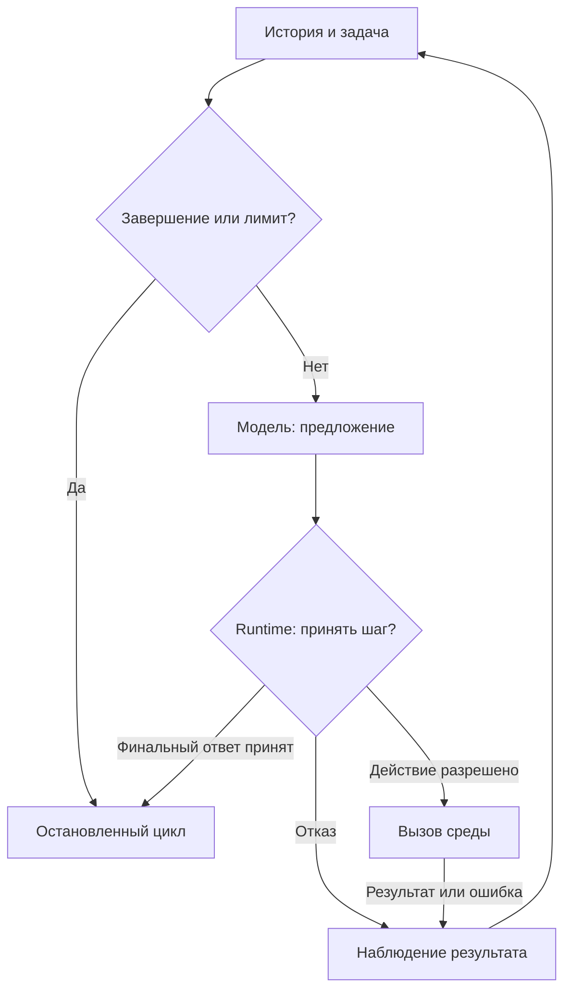

# 00 — Агентная система: agency, reasoning и среда

## Цель и место в курсе

Эта лекция объясняет, что меняется, когда языковая модель становится частью
системы, которая выбирает действия и получает обратную связь. После неё важно
уметь различать предложение, исполнение и наблюдение, а также объяснять,
почему убедительное рассуждение ещё не означает достижения цели.

Предварительных требований нет. Примером служит наша Agentic Data Platform, но определения
не зависят от конкретного LLM-провайдера. Организация команды относится к
[лекции 01](../modules/module-01-organization/README.md); здесь рассматривается
одна единица взаимодействия со средой, а не устройство управления командой.

## От генерации текста к выбору действия

Обычный вызов LLM преобразует предоставленный контекст в ответ. Например,
модель получает описание таблицы и предлагает объяснение поля `refund_amount`.
Из самого ответа не следует, что модель читала базу данных: описание могло
быть устаревшим, а объяснение — правдоподобной догадкой.

Для этой лекции **agency** означает ограниченную способность системы
выбирать следующий шаг ради заданной цели с учётом доступной информации.
Это рабочее инженерное определение, а не утверждение о сознании модели.
Нужно назвать цель, доступные альтернативы, условия их выбора и границу
допустимого поведения. Фраза «модель умеет пользоваться инструментами»
описывает лишь одну из возможностей, но ещё не всю систему.

В статье Anthropic *Building effective agents* отмечается неоднозначность
термина «агент». Авторы различают заранее определённое управление в workflows
и более самостоятельный выбор моделью способов выполнения задачи. Мы
заимствуем эту оговорку, но не вводим здесь полный каталог архитектур:
его границы разобраны в планах
[15](../modules/module-15-strict-workflow/README.md) и
[16](../modules/module-16-agent-orchestrator/README.md).
[Источник: Anthropic](https://www.anthropic.com/engineering/building-effective-agents).

При анализе системы полезнее спросить «какие решения она может менять?»
вместо «достаточно ли она агентная?». Выбор между двумя разрешёнными запросами
уже является локальной самостоятельностью. Право создавать новые процессы,
изменять данные или обходить ограничения из этого не следует.

| Единица анализа | Что нужно увидеть | Чего недостаточно для вывода |
| --- | --- | --- |
| LLM-вызов | Контекст на входе и сгенерированный ответ | Названия роли в prompt |
| Tool-using agent | Выбор действия, исполнение и использование наблюдения в последующем решении | Списка tools без фактической обратной связи |
| Multi-agent system | Несколько взаимодействующих единиц с различимыми задачами или ответственностью | Нескольких последовательных вызовов одной модели |

Это аналитическое различение, не универсальный стандарт терминологии.
Одна модель может обслуживать несколько ролей; несколько моделей могут быть
частями одной единицы. Число API-запросов само по себе не определяет число
агентов. Подробную модель ответственности оставим лекции 01.

## Reasoning, действие и наблюдение

**Reasoning**, или рассуждение, — обработка доступной информации для выбора
или объяснения решения. В инженерном анализе нас интересуют проверяемые
предпосылки и результат выбора, а не публикация скрытого внутреннего процесса
модели. Краткое обоснование ответа полезно для обсуждения, но не является
полной записью вычислений, породивших ответ.

**Действие** — выполненная операция на границе системы и выбранной среды.
Запрос метаданных является действием даже без изменения бизнес-данных:
он может дать новую информацию. Предложение «прочитать метаданные» пока
остаётся предложением. Для различения важен факт исполнения, а не
грамматическая форма команды.

**Наблюдение**, или observation, — полученный сигнал о результате взаимодействия.
Им может быть ответ инструмента, отказ в доступе, ошибка или сообщение
пользователя. Наблюдение не обязательно подтверждает гипотезу и не обязательно
полно описывает среду. Здесь слово «внешний» означает «не придуманный самой
моделью в текущем рассуждении»: инструмент может работать локально, в том же
процессе или репозитории.

В ReAct Yao и соавторы исследуют сочетание рассуждений с действиями, дающими
информацию из среды. В разделе 2 различаются операции со средой и языковые
шаги, которые обновляют контекст, но не дают такого внешнего наблюдения.
Для курса берём связь выбора с обратной связью, не копируем reasoning traces
из статьи и не утверждаем, что этот паттерн гарантирует правильность.
[Источник: ReAct, раздел 2](https://arxiv.org/abs/2210.03629).

Следующее рассуждение — наше инженерное обобщение этой связи. Если два
возможных состояния источника совместимы с одинаковым доступным описанием,
модель не может установить, какое состояние действительно имеет место,
только переписывая объяснение. Например, одно и то же имя поля совместимо
и с возвратом денег покупателю, и с отменой начисления до оплаты. Для выбора
нужна различающая информация либо явно принятая предпосылка.

Отсюда различие между улучшением вывода и расширением оснований для вывода.
Дополнительное рассуждение может найти противоречие в уже известных фактах.
Дополнительное действие может получить ранее неизвестный факт. Эти механизмы
дополняют друг друга, но не заменяют один другой.

**Agent loop**, или агентный цикл, — ограниченная последовательность выбора
шага, его исполнения и использования наблюдения для следующего решения
до условия остановки. **Agent runtime** — исполняющая обвязка, которая
организует эти шаги; модель здесь является компонентом выбора, а не всей
системой. Это определения уровня нашей концептуальной модели, не требования
к названию класса или количеству процессов.

## Среда видна частично

Средой будем называть то, с чем система взаимодействует в пределах задачи:
каталог данных, SQL-интерфейс, файлы, человека, а также результаты проверок.
Граница зависит от вопроса анализа. Для модели ответ локального инструмента
приходит извне её генерации; для владельца платформы модель и инструмент
могут быть частями одного приложения.

Чтобы описать цикл, достаточно условной модели:

```text
История h_t: задача, полученные наблюдения и уже выполненные действия.
Решение d_t: предложение следующего действия или предложение завершить задачу.
Исполнение: среда вызывается только после принятия действия runtime.
Наблюдение o_(t+1): полученный результат, ошибка либо отказ.
Новая история h_(t+1): прежняя история и зафиксированный исход текущего шага.
```

Это абстракция, а не формат хранения или точное описание контекста SDK.
Она предполагает, что результаты можно связать с породившими их шагами.
Здесь не предполагается доступ к полной истории в каждом запросе модели;
механизм отбора контекста — тема
[лекции 04](../modules/module-04-harness-context/README.md).

Частичная видимость имеет два разных следствия. Во-первых, наблюдение может
быть корректным, но недостаточным: описание столбца не объясняет весь процесс
возврата. Во-вторых, даже полученный текст может быть ненадёжным: документ
устарел, инструмент вернул выборку, пользователь ошибся. Поэтому получение
ответа уменьшает некоторую неопределённость только относительно конкретного
вопроса и при подходящих предпосылках о качестве источника.

Нельзя автоматически превращать отсутствие подтверждения в отрицание.
Если запрос к каталогу завершился ошибкой доступа, известно, что чтение
не удалось, а не что таблица отсутствует. Если поле не найдено в ограниченной
выборке, вывод относится к этой выборке, пока полнота поиска не установлена.
Отдельная теория происхождения evidence находится в
[лекции 11](../modules/module-11-analyst-provenance/README.md).

## Диаграмма: где возникает обратная связь

Как отделить сгенерированное предложение от исполненного действия и нового
наблюдения, не показывая внутреннее рассуждение модели?



Рисунок 1. Концептуальный цикл одной единицы, не схема нашего конкретного
executor. Все стрелки обозначают последовательность обработки; метки ветвей
объясняют исход решения. Узел модели не исполняет запрос к среде.

Текстовый эквивалент: runtime проверяет условия продолжения; модель предлагает
шаг; разрешённое действие исполняется; результат, ошибка или отказ фиксируются
как наблюдение; следующее решение учитывает обновлённую историю. Принятый
финальный ответ или установленный лимит прекращает цикл. Остановка сама по
себе не означает успех: причина и результат должны быть различимы.

Схема предполагает последовательные ходы. Проверка лимита изображена перед
ходом, но это не отменяет ограничений времени отдельного вызова: зависший
инструмент нельзя ограничить только проверкой между итерациями. Повтор после
отказа в проектируемом здесь цикле допускается лишь пока есть бюджет и
изменившееся основание для выбора; это правило проектирования, не свойство
любого SDK.

## Ограниченная рациональность и остановка

Для наших целей **ограниченная рациональность** означает выбор при неполной
информации и конечных ресурсах, а не обещание найти глобально оптимальный
план. Даже полезное наблюдение имеет цену: время, токены, нагрузку и иногда
риск нежелательного эффекта. Лучшее следующее действие определяется не
только тем, сколько информации оно потенциально даёт, но и тем, нужна ли
эта информация для принимаемого решения.

Например, запрос ещё десяти похожих описаний может увеличить объём текста,
не разрешив противоречие о смысле метрики. Уточняющий вопрос владельцу
требования иногда полезнее. Если уточнение невозможно в текущем процессе,
разумный итог — явно обозначенная неопределённость, а не выдуманное решение.
Это нормативное правило проектирования, не измеренный вывод о нашей модели.

Критерий успеха и критерий прекращения различаются. Успех связан с задачей:
получены достаточные основания для ответа или выполнен принятый результат.
Прекращение связано также с ресурсами и допустимостью продолжения. Возможные
причины остановки:

- результат принят по заданным условиям;
- необходим факт, который не удалось получить допустимым способом;
- исчерпан бюджет ходов, времени или токенов;
- выполнение столкнулось с ошибкой, после которой продолжение не предусмотрено.

Нужен внешний по отношению к генерации контроль этих условий. Обещание в
prompt «не более пяти шагов» не эквивалентно счётчику, который действительно
прекращает дальнейшие вызовы. Однако конечность числа шагов тоже не
гарантирует завершение по времени, если один шаг не ограничен по длительности.

Ещё одна ошибка — приравнять активность к прогрессу. Повторное действие может
не добавить оснований для решения. Для осмысленного продолжения нужно
объяснить, что теперь изменилось: аргумент запроса, источник, доступная
информация или проверяемая гипотеза. Здесь речь об одном цикле; сходимость
и rework всего workflow оставим лекции 15.

## Контрпример: инструменты есть, знания не прибавилось

Представим систему, которая спрашивает модель о происхождении отрицательного
Net Revenue. Модель составляет SQL-запрос; инструмент возвращает ошибку
доступа. Затем модель сообщает: «Данных о возвратах нет, поэтому причина
в скидках». У системы есть tool call и второй LLM-вызов, но связь с наблюдением
использована неверно.

Ошибка доступа подтверждает невозможность данного чтения, а не отсутствие
возвратов. Подстановка версии о скидках расширяет утверждение без новых
оснований. Даже идеально оформленное объяснение не исправляет этот разрыв.
Корректный итог должен сохранить неизвестность причины или запросить иной
разрешённый источник. Это гипотетический контрпример, не инцидент нашей платформы.

Другой предел обратной связи: успешное выполнение SQL подтверждает исполнение
конкретного запроса, но не правильность выбранного бизнес-определения.
Проверка результата должна соответствовать исходному вопросу. Подробности
спецификации метрик относятся к
[лекции 10](../modules/module-10-pm-specification/README.md), а не к общему agent loop.

## Иллюстрация: tool-free PM в нашей системе

Граница примера — **offline-proven** для проверяемого кодом поведения и
**historical-live** для отдельно сохранённого запроса STEP-0007. Это не
утверждение о свежей оценке качества или полном автономном выполнении команды.

В текущем [runtime/agent_runtime.py](../../runtime/agent_runtime.py)
`SpecificationExecutor.specify` вызывает `provider.generate` для получения
структурированного `SpecificationDraft`. Сам executor не организует tool loop.
Он получает ранее подготовленный Analyst handoff: такая роль использует
переданную информацию, а не исследует источник самостоятельно.

Затем `accept_specification_draft` проверяет границу принятия результата.
Если handoff содержит нерешённые вопросы, draft с решением `READY`
отклоняется; сами вопросы должны быть сохранены. Значит, текстовое намерение
модели «спецификация готова» не равнозначно принятой готовности.
В этой иллюстрации важно разделение генерации и принятия; typed contracts
подробно объясняет [лекция 03](../modules/module-03-contracts/README.md).

[Evidence STEP-0007](../../plan/evidence/STEP-0007-local-agent-runtime.md)
фиксирует исторический live-запрос проверки интеграции с blocked-спецификацией.
Этот ограниченный результат подтверждает конкретный проход того этапа,
но не качество модели на всех требованиях и не сегодняшнюю доступность gateway.
Текущий код и исторический sample относятся к разным срезам развития проекта.

Вывод не в том, что роль PM «недостаточно агентная». Её обязанность в данном
срезе — обработать handoff с ограниченным выбором результата. Собственный
инструментальный цикл нужен там, где выбор следующего действия действительно
требует получения новых наблюдений; название роли не обязывает создавать его.

## Резюме

Agency анализируется через доступные решения и их границы, а не через
антропоморфные названия. Reasoning работает с доступными основаниями;
действие взаимодействует со средой; observation сообщает ограниченный исход.
Предложение, исполнение и подтверждение результата — разные события.

Agent loop полезен, когда следующее решение должно учитывать обратную связь.
Он требует осмысленных условий продолжения и принудительных ограничений.
Ни наличие tools, ни число ходов, ни остановка сами по себе не доказывают
достижение цели. Роль внутри команды может оставаться tool-free.

## Вопросы для самопроверки

1. Почему несколько LLM-вызовов не являются достаточным доказательством наличия нескольких агентов?
2. Какое наблюдение позволяет отличить «таблица отсутствует» от «прочитать таблицу не удалось»?
3. В каких условиях дополнительное рассуждение полезно без нового действия, а в каких требуется внешний источник?
4. Почему лимит числа ходов не гарантирует завершение по времени и не является критерием успеха?
5. Что в примере PM отделяет сгенерированный draft от принятой готовности спецификации?

## Что дальше

[Лекция 01](../modules/module-01-organization/README.md) переводит анализ
от одной единицы к разделению ответственности в команде. Сравнение жёсткого
workflow и управления агентом-оркестратором появится в соответствующих
лекциях и [архитектурном сопоставлении 26](../modules/module-26-orchestration-comparison/README.md).
Ссылки ведут к страницам тем: там находится опубликованный текст либо план;
статус указан на странице.

## Источники и границы заимствования

- Yao et al. [ReAct: Synergizing Reasoning and Acting in Language Models](https://arxiv.org/abs/2210.03629), ICLR 2023, раздел 2: связь reasoning/action/observation. Не переносим benchmark-результаты на наш проект и не воспроизводим reasoning traces.
- Anthropic. [Building effective agents](https://www.anthropic.com/engineering/building-effective-agents): неоднозначность термина agent и различная самостоятельность выбора. Не копируем каталог архитектурных паттернов.
- [Текущий PM runtime](../../runtime/agent_runtime.py), `SpecificationExecutor.specify` и `accept_specification_draft`: локальная граница генерации и принятия.
- [STEP-0007 evidence](../../plan/evidence/STEP-0007-local-agent-runtime.md): датированный historical-live пример, не новый эксперимент.

Внешние источники проверены 2026-09-15. Условная модель цикла, таблица,
диаграмма и контрпример — авторский синтез для курса, не цитаты или точные
схемы из статей.
