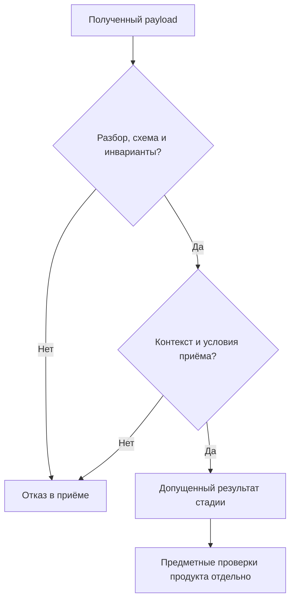

# 02 — Контракты, артефакты и границы доверия

## Цель и предварительные знания

В [лекции 01](LECTURE-0001-organization.md) мы разделили ответственность
участников команды. Теперь рассмотрим границу между их результатами: что
получатель вправе заключить из переданного сообщения и какие основания
должен проверить прежде, чем использовать его?

Цель — понять устройство контрактов обмена, внутренние инварианты и привязку
артефакта к текущей задаче. Наша платформа иллюстрирует эти различия, но
полный граф workflow, алгоритмы PM/DE и аутентификация остаются отдельными темами.

## Артефакт превращает ответ в предмет проверки

**Артефакт** в этой лекции — идентифицируемый результат работы, который можно
передать, проверить и соотнести с конкретной задачей. Это может быть спецификация,
отчёт об изменении или запись наблюдения. Артефакт не обязательно является
файлом: файл может хранить его сериализованное представление.

**Контракт** — проверяемая схема и инварианты обмена. Схема описывает форму
допустимого результата; инварианты задают отношения, которые должны сохраняться
между его частями или между результатом и контекстом получения.
Эти определения согласованы с glossary курса.

Сообщение «всё готово» не указывает, что изменилось и к какой задаче относится
результат. Структурированный отчёт позволяет поставить более точные вопросы:
какой тип результата передан, кто указан автором, какие проверки приложены
и соответствует ли отчёт текущей работе. Это делает утверждение проверяемым,
но ещё не делает его истинным.

Контракт входа описывает основания, которые получает исполнитель; контракт
выхода — сведения, которые он обязан вернуть. Совместимость этих границ
означает, что получатель умеет интерпретировать переданное представление.
Она не означает, что любой совместимый результат можно принять без проверки.

## Четыре разных вопроса о корректности

Полезно различать четыре уровня. Это рабочая модель лекции, не универсальный
стандарт классификации ошибок.

| Уровень | Что проверяется | Чего проверка не доказывает |
| --- | --- | --- |
| Синтаксис | Представление можно разобрать, например как JSON | Что поля образуют допустимый артефакт |
| Схема | Тип, версия, обязательные поля и ограничения значений | Что связанные поля согласованы |
| Инварианты и контекст | Отношения полей, связь с задачей и условия приёма | Что заявленное изменение действительно выполнено правильно |
| Предметный результат | Требуемое свойство реализации или среды | Что контракт подходит для всех будущих задач |

Например, корректный JSON с неизвестным `artifact_type` проходит разбор,
но не схему. Знакомый тип с датой evidence после создания отчёта нарушает
внутреннюю временную согласованность. Согласованный отчёт от другой задачи
нарушает контекст приёма. Наконец, отчёт текущей задачи может описывать
синтаксически корректную, но неверную реализацию метрики.

Термин «валидация» поэтому требует уточнения объекта. Проверка payload
не равна запуску deterministic Validator над продуктом. Если система
сообщает просто «валидно», не называя проверенные условия, получатель
может приписать этому статусу более сильный смысл, чем он имеет.

## Схема: закрытые поля и явные различия

**Artifact schema** задаёт допустимое представление артефакта: поля, типы,
обязательность и ограничения. Разные виды результата должны различаться
явно, а не угадываться по содержимому `summary`.

В нашем [Artifact union](../../contracts/artifacts.py) поле `artifact_type`
служит discriminator — признаком выбора конкретной модели. Так отчёт
об реализации не становится спецификацией только потому, что в тексте
встречается слово «требование». Поле `schema_version` отдельно определяет
версию предметного представления.

Закрытая схема отклоняет неизвестные поля. Дополнительный `approved: true`
в отчёте DE не становится новым правом на принятие: это поле вне контракта.
Такой выбор уменьшает неоднозначность, но требует дисциплины эволюции:
отправитель не может незаметно расширить интерфейс и ожидать, что получатель
поймёт новые значения.

В *Writing effective tools for agents — with agents* Ken Aizawa рекомендует
явно описывать входы и выходы и устранять неоднозначность параметров.
Переносим только принцип ясного интерфейса на обмен результатами ролей,
не заявляя, что удачное описание гарантирует правильный ответ модели.
[Источник: Anthropic](https://www.anthropic.com/engineering/writing-tools-for-agents).

Важна и политика преобразования типов. «Поле имеет тип integer» ещё не
объясняет, принимаются ли числовые строки или логические значения. В нашем
коде, например, `exit_code` — `StrictInt`, но это не означает, что все поля
всех моделей используют глобальный strict mode. Нужно проверять конкретное
ограничение, а не выводить поведение из названия библиотеки.

## Инвариант связывает поля, а не украшает схему

**Contract invariant** — условие согласованности, которое должно выполняться
для допустимого результата в заданной области. Оно сильнее перечисления
полей: проверяет отношение между ними.

В [ArtifactBase](../../contracts/artifacts.py) evidence должна принадлежать
той же задаче, что и артефакт; её идентификаторы не должны повторяться,
а время наблюдения не может быть позже времени создания отчёта.
Это три разных отношения: область, однозначность ссылок и хронология.
Одного наличия `evidence` недостаточно для выполнения любого из них.

Другой пример — согласованность решения спецификации. `ready` требует
определения метрики, необходимых списков и критериев принятия и запрещает
открытые вопросы; `blocked` требует причины `needs_user` и вопросов.
Контракт отсекает противоречивую комбинацию полей. Он не доказывает, что
написанное определение метрики соответствует намерению бизнеса — это
предмет [лекции 13](../modules/module-13-pm-specification/README.md).

Инварианты имеют область действия. Условие «все приложенные evidence относятся
к задаче отчёта» не доказывает, что файл по ссылке существует. Равенство
идентификаторов не доказывает, что наблюдение получено доверенным инструментом.
Требование успешного exit code не доказывает достаточность выбранной проверки.
Каждое условие нужно читать буквально, без расширения его гарантии.

## Cross-task binding: правильный отчёт в неправильном месте

**Cross-task binding** — проверяемое соответствие результата текущему контексту
задачи. Артефакт может быть внутренне допустим и всё же оказаться чужим
для получателя. Причиной бывает ошибочная маршрутизация, устаревший ответ
или повторное использование ранее принятого результата.

В [reducer gate](../../orchestrator/transitions.py) `artifact.task_id`
сопоставляется с `state.task_id` и `command.task_id`. `producer_id`
должен совпадать с `actor_id` команды, а ранее принятый `artifact_id`
не принимается второй раз в том же workflow state. Время принятия
не может предшествовать созданию артефакта.

Это контекстные проверки: сам отчёт не знает, какой workflow сейчас его
принимает. Поэтому их нельзя заменить одной проверкой JSON Schema.
Напротив, внутренняя модель артефакта может проверить отношения полей
без доступа к workflow. Разделение помогает понять, где должно находиться
основание для конкретного решения.

Совпадение `producer_id` и `actor_id` — согласованность заявленных
идентификаторов, не аутентификация отправителя. Если недоверенный участник
сам назначает оба значения, равенство не подтверждает его личность.
Архитектура предполагает, что reducer получает созданную доверенным слоем
`TransitionCommand`; сама модель команды эту provenance не доказывает.
Доверие к создающему её слою нельзя получить из payload. Механизмы identity/authorization —
[лекция 19](../modules/module-19-security-authority/README.md).

Не следует выводить из `task_id` проверку всех возможных привязок.
Задача, попытка выполнения и версия candidate — разные контексты.
Указанные базовые gates не сопоставляют автоматически отчёт с произвольной
версией каждого файла. Если свойство зависит от версии продукта, нужны
дополнительные основания именно для этой версии; теория её жизненного
цикла раскрывается в [лекции 14](../modules/module-14-data-engineer/README.md)
и [лекции 17](../modules/module-17-recovery-idempotency/README.md).

## Диаграмма: что проходит границу приёма

Почему разобранный ответ ещё нельзя считать принятым результатом?

Рисунок 1. Логические уровни приёма. Стрелки обозначают зависимость проверок,
не точную последовательность runtime-вызовов и не полный граф workflow.
Предметные проверки могут использовать приложенные наблюдения или выполняться
другим компонентом; последний узел не означает обязательный немедленный вызов.

Текстовый эквивалент: payload должен быть разбираемым, соответствовать схеме
и внутренним отношениям, затем совпасть с текущим контекстом и условиями приёма.
Отказ не позволяет использовать его как допущенный результат стадии.
Прохождение границы не отменяет проверки предметного свойства реализации.
Это не утверждение об отсутствии любых транспортных или диагностических эффектов.

Схема показывает границу доверия к результату обмена. **Граница доверия**
здесь — место, где сведения из одного контекста получают ограниченное право
использования в другом после проверок. Она не равна автоматически сетевой
границе или изоляции процесса.

## Версия схемы и неизменяемость результата

**Versioning** делает интерпретацию представления явной. В наших предметных
моделях `schema_version: Literal[1]` — версия контракта, не Pydantic V1.
Код использует API Pydantic 2; смешение этих двух номеров создаёт неверные
ожидания относительно методов и конфигурации.

Совместимость зависит не только от набора полей. Если смысл существующего
поля изменился при прежнем имени, получатель может успешно разобрать сообщение
и применить старое толкование. Поэтому эволюция требует явного решения,
какие версии принимаются и как сохраняется смысл при преобразовании.
[ADR-0014](../../plan/decisions/ADR-0014-domain-contracts-and-workflow-events.md)
задаёт новую literal version/adapter вместо молчаливой переработки v1.
Автоматические миграции всех будущих версий этим не реализованы.

**Неизменяемость артефакта** означает, что принятый результат не редактируется
на месте так, чтобы прежние ссылки незаметно обозначали другую работу.
Исправленный результат должен различаться с прежним. Это требование к
жизненному циклу, а не обещание абсолютной защиты Python-объекта от изменения.

В [FrozenModel](../../contracts/common.py) используется `frozen=True`;
коллекции рассматриваемых артефактов представлены tuples, вложенные value
objects — frozen models. Однако одна настройка `frozen` не обеспечивает
глубокую неизменяемость произвольного mutable содержимого и не защищает
от кода с полным доступом к процессу. Это ограничение прямо показано в
[Pydantic models, Faux immutability](https://docs.pydantic.dev/latest/concepts/models/#faux-immutability).
Хранение и recovery — отдельная тема [04](../modules/module-04-state-memory/README.md).

## Evidence: ссылка на наблюдение, не сертификат истины

**Evidence** в контракте — структурированная запись наблюдения, связанная
с источником, вызовом и сохранённым результатом. Полная теория provenance
принадлежит [лекции 12](../modules/module-12-analyst-provenance/README.md);
здесь рассматриваем лишь свойства обмена такой записью.

Наша [Evidence](../../contracts/evidence.py) содержит `evidence_id`, `task_id`,
`producer_id`, вид наблюдения, `source`, `invocation`, `exit_code`, UTC timestamp
и `ArtifactReference`. Последняя задаёт относительный путь, SHA256, media type
и размер сохранённого output. `succeeded` означает ровно `exit_code == 0`.

Такая запись позволяет связать утверждение с конкретным наблюдением, но
схема проверяет представление, а не читает файл. Правильная длина SHA256
не означает совпадения с байтами; безопасный относительный путь не означает
существования output или безопасного разрешения symlink в реальном filesystem.
Это обязанности слоя получения и проверки сохранённого результата.

Даже проверенное совпадение hash подтверждает только соответствие заданным
байтам. Если автор может подменить и output, и ожидаемый hash, такое совпадение
не подтверждает происхождение. Нужны доверенные основания для ожидания,
а не больше полей с красивыми идентификаторами.

В *Demystifying evals for AI agents* Anthropic различает финальную запись
агента и outcome — фактическое состояние среды после попытки. Используем
эту идею как ограничение силы отчёта: наличие сообщения о действии не
заменяет проверку требуемого эффекта. Методологию evaluation здесь не повторяем.
[Источник: Anthropic](https://www.anthropic.com/engineering/demystifying-evals-for-ai-agents).

## Иллюстрация нашей системой: три различных результата

Область примера — **offline-proven** для читаемого текущего code/config
и проверяемых тестами инвариантов. **Historical-live** относится только
к датированным integration checks в STEP-0006; свежего запуска платформы
или измерения качества модели эта лекция не заявляет.

`TaskSpecification` формулирует решение о готовности требований и необходимые
части спецификации. `ImplementationResult` описывает исход работы DE,
изменённые файлы и ссылки на выполненные проверки. `Evidence` передаёт
наблюдение, на которое могут ссылаться эти результаты. Типы не взаимозаменяемы:
список наблюдений не становится спецификацией, а summary не становится тестом.

В `ImplementationResult` значение `completed` требует непустого `changed_files`,
а `tests_executed` должно ссылаться на приложенные evidence. При этом
этот контракт не требует, чтобы все такие evidence имели exit code 0,
и не доказывает существование перечисленных изменений. Следующий отдельный
`ValidationResult` запрещает `pass` при приложенных неуспешных evidence.
Различие важно: завершение работы автора — не итог независимой проверки продукта.

[Тесты contracts](../../tests/unit/test_contracts.py) проверяют, например,
extra fields, frozen assignment, UTC и связи evidence. [Reducer](../../orchestrator/transitions.py)
дополнительно проверяет тип артефакта и условия его текущего приёма.
[Evidence STEP-0006](../../plan/evidence/STEP-0006-contracts-state-machine.md)
сохраняет исторические результаты. ADR фиксирует замысел, тест — ограниченное
наблюдение поведения, historical evidence — результат с датой; их нельзя
считать одним доказательством полной работоспособности команды.

Внешние payload должны проходить обычную валидацию. `model_construct`
создаёт модель без её выполнения и потому не заменяет проверку trust boundary.
Это объясняется в [Pydantic models](https://docs.pydantic.dev/latest/concepts/models/#creating-models-without-validation)
и запрещено в production contracts/orchestrator/runtime отдельным
[regression test](../../tests/adversarial/test_workflow_guards.py).

## Контрпример и разные классы отказа

Представим отчёт с корректной схемой и успешным test evidence. Все ссылки
внутри согласованы, но `task_id` соответствует предыдущему заказу на изменение.
Приём текущим workflow должен отказать независимо от убедительности summary.
Это гипотетический пример, не описанный инцидент репозитория.

Если вместо этого переписать `task_id` во всех полях, форма снова может быть
согласована. Однако историческая проверка не становится наблюдением новой
реализации. Этот второй вариант показывает предел равенства идентификаторов:
без доверенного получения evidence нельзя вывести соответствие реальной работе.

Полезно разбирать отказы по нарушенному условию, а не возвращать одинаковое
«неправильный ответ» для всех случаев:

- Повреждённый payload нельзя разобрать как ожидаемое представление.
- Лишнее поле разбирается, но нарушает закрытую схему.
- Несогласованные поля нарушают конкретный инвариант.
- Чужой артефакт нарушает привязку к контексту приёма.
- Ложное completion может пройти предыдущие проверки и требовать наблюдения
  продукта или среды для опровержения.

Последний случай не всегда обнаружим по тексту отчёта. Поэтому контракт
полезен как точная граница допустимого обмена, но опасен как замена всей
системы проверки. С другой стороны, излишне узкая схема может отклонять
полезные допустимые варианты; ограничения должны соответствовать реальному
инварианту, а не случайной форме одного удачного ответа.

## Резюме

Контракт делает результат интерпретируемым и проверяемым, но не гарантирует
его истинность. Схема, внутренние отношения и контекст приёма отвечают
на разные вопросы. Task/actor binding требует внешнего контекста;
совпадение заявленных identities не заменяет аутентификацию.

Версия схемы сохраняет явную интерпретацию, неизменяемость — различимость
результатов во времени. Evidence связывает наблюдение с сохранённым output,
но её поля и hash не заменяют доверенное происхождение и предметную проверку.
Завершение автором, допуск отчёта и принятие продукта — разные утверждения.

## Вопросы для самопроверки

1. Чем различаются синтаксически корректный payload и допустимый контрактный результат?
2. Какие инварианты можно проверить внутри артефакта, а какие требуют текущего workflow context?
3. Почему одинаковые `producer_id` и `actor_id` не доказывают личность отправителя?
4. Что именно подтверждает сверенный SHA256 output и какие основания нужны дополнительно?
5. Как отчёт с `completed` может пройти контракт и всё же не доказать правильность реализации?

## Что дальше

[Лекция 03](../modules/module-03-harness-context/README.md) рассматривает harness
и контекст одного вызова. Контракт описывает передаваемый результат;
следующая тема объяснит, какая информация доступна модели при его подготовке
и где проходит граница между transport adapter и предметной логикой.

## Источники и границы переноса

- Ken Aizawa, Anthropic. [Writing effective tools for agents — with agents](https://www.anthropic.com/engineering/writing-tools-for-agents): ясность входов/выходов, ограниченный перенос на role handoffs, без performance claims.
- Anthropic. [Demystifying evals for AI agents](https://www.anthropic.com/engineering/demystifying-evals-for-ai-agents): различие сообщения и outcome, без пересказа всей evaluation methodology.
- [Pydantic models](https://docs.pydantic.dev/latest/concepts/models/): дополнительная первичная документация для frozen и создания без валидации; не обещание совместимости всех SDK версий.
- Локальные contracts, reducer, tests, ADR-0014 и STEP-0006 приведены возле соответствующих утверждений.

Внешние источники проверены 2026-09-15. Четыре уровня проверки, диаграмма
и контрпример — авторская модель курса, не чужой стандарт или схема.
