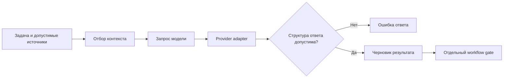

# 03 — Harness и инженерия контекста одного вызова

## Цель и предварительные знания

В [лекции 02](LECTURE-0002-contracts.md) мы разобрали, как проверять
передаваемый результат. Теперь рассмотрим предшествующий момент: из какой
информации формируется конкретный запрос модели и кто проверяет её ответ?

Цель лекции — разделить harness, контекст одного вызова и provider adapter.
Наша Agentic Data Platform служит проверяемым примером. Здесь не обсуждаются
жизненный цикл всей памяти, восстановление после crash, устройство MCP или
экономический выбор модели: у этих вопросов отдельные владельцы.

## Harness — код вокруг модели

**Harness** в этой лекции — кодовая оболочка, которая получает задачу,
собирает допустимый вход модели, вызывает provider, интерпретирует ответ и
передаёт проверенный результат дальше. Модель генерирует предложение; harness
определяет, в каком формате оно запрашивается и как обрабатываются ошибки.
Внешний workflow отдельно решает, допустимо ли принять артефакт и изменить
состояние. Это рабочее разграничение компонентов, не название конкретного SDK.

Одна и та же модель может вести себя по-разному при ином наборе документов,
инструментов или инструкции. Следовательно, воспроизводимый анализ поведения
нельзя сводить к одному model ID: нужно понимать, что ей было доступно в
каждом ходе. В то же время harness не становится владельцем бизнес-смысла
спецификации лишь потому, что формирует запрос.

В [PM executor](../../runtime/agent_runtime.py) виден один пример: перед
вызовом provider код проверяет принятую связь задачи и Analyst handoff;
после ответа превращает `SpecificationDraft` в кодом оформленный артефакт
и передаёт его reducer. Эта граница не утверждает, что все роли используют
одинаковый одноходовый режим. Модель цикла одной роли уже введена в
[лекции 00](LECTURE-0000-agentic-baseline.md), а управление переходами
принадлежит [лекции 06](../modules/module-06-strict-workflow/README.md).

## Что такое контекст одного хода

**Контекст** — информация, доступная модели при конкретном вызове:
инструкции, текущая задача, выбранные документы, описания разрешённых
инструментов и наблюдения предыдущих действий, если они включены.
Это не синоним всей истории workflow или всего, что хранится на диске.
Такое определение согласовано с [glossary](../glossary.md).

Anthropic в статье *Effective context engineering for AI agents* предлагает
рассматривать подбор информации шире формулировки system prompt: важны
также данные, инструменты и история, попадающие в очередной вызов.
Заимствуем вопрос «что доступно модели именно сейчас», а не продуктовые
рекомендации как доказательство качества нашей системы.
[Источник: Anthropic](https://www.anthropic.com/engineering/effective-context-engineering-for-ai-agents).

Полезно различать три действия:

| Действие | Что меняется | Главный риск |
| --- | --- | --- |
| Отбор | Какие источники вообще войдут в запрос | Существенный источник пропущен |
| Представление | В каком порядке и с какими метками они войдут | Потеря происхождения или смешение инструкции с данными |
| Сжатие | Какую часть выбранной информации заменить кратким изложением | Нюанс, важный для решения, потерян |

В этой лекции нас интересует подготовка *одного* вызова. Сжатие длинной
истории между сессиями и согласованность durable state рассматриваются в
[лекции 04](../modules/module-04-state-memory/README.md). Сжатое изложение
по определению не сохраняет все исходные байты; утверждать сохранение всех
существенных решений без отдельной проверки нельзя.

## Релевантность не равна длине

Ограничение размера запроса мотивирует отбор, но «меньше» само по себе не
означает «лучше». Для задачи изменения Net Revenue одна точная оговорка
о периоде возврата может быть важнее десятка близких по названию файлов.
Если её исключить, краткий запрос станет дешевле по объёму, но менее
пригодным для правильного решения.

И наоборот, передача всей рабочей директории скрывает существенный сигнал
среди нерелевантного текста. Полезный контекст — не минимальный любой ценой,
а достаточный для конкретного вопроса при явной границе объёма и происхождения.
Эта формулировка — наш инженерный критерий; универсального численного порога
полезности статья не задаёт.

**Progressive disclosure**, или поэтапное раскрытие, означает, что на первом
шаге передаются ориентиры, а детали загружаются при необходимости. В статье
*Equipping agents for the real world with Agent Skills* Anthropic описывает
многоуровневую загрузку metadata, затем основного файла, затем ресурсов.
Для нас это ограниченная аналогия отбора сведений. Наличие этой статьи
не означает, что runtime нашей платформы реализует Agent Skills или
автоматическую загрузку материалов по решению модели.
[Источник: Anthropic](https://www.anthropic.com/engineering/equipping-agents-for-the-real-world-with-agent-skills).

Поэтапное раскрытие имеет предпосылку: участник должен иметь допустимый
способ запросить недостающий источник и распознать, что он нужен.
Если второго шанса на чтение нет, слишком короткий начальный контекст
может просто скрыть необходимое основание. Решение «дать ссылку сейчас,
содержимое потом» зависит от возможностей конкретной роли.

## Разный статус текста внутри запроса

System instruction, пользовательская задача, найденный документ и tool
observation могут одновременно присутствовать в запросе, но не имеют
одинакового статуса. Документ сообщает данные для анализа, а не получает
право менять границы задачи. Наблюдение инструмента относится к конкретному
вызову и не доказывает автоматически общую бизнес-семантику.

В [PM prompt assembly](../../runtime/agent_runtime.py) принятые сведения
Analyst сериализуются отдельно от доверенной инструкции и явно помечаются
как `untrusted_accepted_analysis`. Эта маркировка помогает сохранить
происхождение, но сама по себе не является security boundary: ограничения
действий определяются кодом и runtime policy. Полная теория косвенных
инструкций и полномочий принадлежит
[лекции 19](../modules/module-19-security-authority/README.md).

Другой возможный источник — поиск или чтение файла по требованию. Результат
поиска не становится достоверным только потому, что он найден. Нужно
сохранить связь с источником, версией и временем, если на этих свойствах
строится решение. Теория provenance —
[лекция 12](../modules/module-12-analyst-provenance/README.md).

## Диаграмма: от допустимого входа к проверяемому выходу

Что делает harness с информацией до и после model call, не присваивая себе
право workflow принимать результат?

Рисунок 1. Логические границы одного вызова. Стрелки показывают
зависимости данных и проверок, а не точные внутренние методы SDK.
`workflow gate` находится за пределом provider adapter; прохождение
структурной проверки не означает окончательного принятия.

Текстовый эквивалент: harness берёт задачу и разрешённые источники,
отбирает релевантную часть, собирает запрос и вызывает provider.
Ответ проверяется на требуемую структуру. Неуспех даёт ошибку,
успех — только черновик для дальнейшего решения workflow.
На рисунке не показаны tool loops, retries и durable persistence.

Схема не утверждает, что все допустимые сведения буквально вставлены
в prompt: часть может быть доступна через разрешённые tools в другом
режиме harness. Здесь показана одна абстрактная граница.

## Наш пример: bounded ContextBundle

В [runtime/context.py](../../runtime/context.py) `build_context_bundle`
читает явный список относительных путей из проверенного workspace.
Файлы упорядочиваются детерминированно, дубли путей запрещены;
проверяются защищённые имена, symlink, обычный UTF-8 файл, неизменность
его metadata во время чтения и лимиты числа файлов, размера файла и общего
числа байт.
`ContextDocument` связывает содержимое с размером и SHA256, а `as_prompt()`
разделяет документы маркерами пути. Маркеры помогают чтению, но не делают
содержимое доверенной инструкцией. `build_scenario_context` перед чтением
проверяет управляемый disposable workspace.

Граница доказательства — **offline-proven**: код и unit tests показывают
ограничения и детерминированный порядок. [STEP-0007 evidence](../../plan/evidence/STEP-0007-local-agent-runtime.md)
содержит датированный **historical-live** smoke, не свежую проверку
качества контекста или модели. Контекстный слой не реализует здесь
semantic retrieval, embedding index или compaction истории.

Важно не путать байты с токенами. `max_total_bytes` ограничивает
UTF-8 содержимое выбранных файлов; реальный provider request включает
также инструкции, обрамление и потенциально другие сообщения.
Из byte-лимита нельзя вывести точный token count или гарантировать,
что любой provider примет собранный запрос. Это предел текущей реализации,
а не дефект самой идеи bounded selection.

## Model-provider abstraction: стабильный внутренний результат

**Provider adapter** отделяет способ обращения к model API от предметного
кода. В нашей системе `StructuredModelProvider.generate` принимает тип
ожидаемого ответа, system и user prompt и возвращает `ModelInvocation`:
проверенное значение плюс model ID, usage, latency, finish reason и hashes
запроса/ответа. Секрет не является частью этого результата.

[MAFModelProvider](../../runtime/model_provider.py) использует GateLLM
через OpenAI-compatible client. В tool-free варианте в options передаётся
`response_format` для ожидаемой модели. В tool-enabled варианте путь иной:
schema прикладывается к prompt, а вызываемые tools передаются явно и
ограничиваются harness. Поэтому нельзя обещать одинаковые возможности
всех моделей или отождествлять abstraction с переносимостью поведения.
Проверка актуальной совместимости конкретной модели требует отдельного
capability/eval gate; датированный успешный smoke не гарантирует будущий.

Адаптер делает технические ошибки безопаснее для верхнего слоя:
transport/provider exception превращается в санитизированный
`ModelInvocationError`, а локальная неудача разбора ответа — в
`ModelOutputValidationError` с кодами ошибок и безопасной metadata.
Границы повторов и timeouts относятся к реализации transport/harness;
смысл повторения внешнего side effect — тема
[лекции 17](../modules/module-17-recovery-idempotency/README.md).
Экономику токенов и выбор бюджета рассматривает
[лекция 23](../modules/module-23-cost-performance/README.md).

## Structured response — не готовое решение

**Structured response boundary** отделяет текст модели от объекта,
допустимого для дальнейшей обработки. Сначала нужно получить
однозначно интерпретируемое представление, затем проверить его
по ожидаемой модели. Даже прошедшее это условие значение может
противоречить принятому handoff или предметным ограничениям.

В [текущем provider](../../runtime/model_provider.py) сначала пробуется
`model_validate_json`. Если прямой JSON не подходит, код допускает ровно
один валидный объект внутри текстового оформления; два подходящих объекта
считаются неоднозначностью. Это ограниченный приём для оформления ответа,
не разрешение доверять произвольному тексту вокруг него. Unit tests
проверяют один объект, неоднозначность и malformed/extra output.

После `SpecificationDraft` [PM boundary](../../runtime/agent_runtime.py)
отдельно запрещает `ready` при незакрытых Analyst questions и требует
точного сохранения этих вопросов. Workflow добавляет собственные IDs,
время и решает переход. Тем самым три проверки остаются различными:
формат ответа, смысловая совместимость с принятой задачей и разрешение
перехода. Полная теория контракта — [лекция 02](LECTURE-0002-contracts.md),
а бизнес-семантика готовности —
[лекция 13](../modules/module-13-pm-specification/README.md).

## Контрпример: точный формат, неверная опора

Представим, что в контекст DE передан только список файлов и старое
краткое описание Net Revenue. Существенная оговорка о периоде возврата
осталась в принятой спецификации, но в данный вызов не попала.
Модель возвращает корректный JSON с допустимыми полями и уверенным
объяснением. Структурная проверка проходит, однако реализация может
отвечать другой бизнес-семантике.

Это условный пример, не зарегистрированный инцидент системы. Он
показывает, что ошибка отбора входа не лечится улучшением parser.
Добавление всех файлов тоже не является универсальным решением:
важна релевантная версия решения, а не объём сам по себе.
Если нужное основание отсутствует, корректным может быть запрос
уточнения или прекращение работы, а не угадывание содержания.

В обратной ситуации в контекст можно включить корректный фрагмент,
но подать его как будто это авторитетная инструкция, хотя он был
недоверенным tool output. Тогда проблема уже в представлении и
границе authority, не в длине запроса. Эти два отказа требуют
разных исправлений.

## Резюме

Harness собирает вход, вызывает модель и проверяет её ответ, но не
заменяет workflow policy. Контекст конкретного хода — выбранная
информация, а не вся сохранённая история. Отбор, представление и
сжатие меняют разные свойства этого входа; размер не доказывает
релевантность, а summary не гарантирует сохранения нюансов.

Provider abstraction стабилизирует внутренний формат результата,
но не равняет возможности моделей. Structured response — необходимая
граница интерпретации, не доказательство предметной готовности.
Состав запроса нужно оценивать вместе с происхождением материалов
и с тем, какие проверки остаются за пределом model call.

## Вопросы для самопроверки

1. Чем harness отличается от модели и внешнего workflow?
2. Почему `ContextBundle` с byte-лимитом не доказывает допустимый token count?
3. Как различаются отбор, представление и сжатие контекста?
4. Почему корректный `SpecificationDraft` может не пройти PM boundary?
5. Какой сбой иллюстрирует пропущенная оговорка о периоде возврата и почему строгая JSON-схема его не исправит?

## Что дальше

Следующая по teaching order — [лекция 04](../modules/module-04-state-memory/README.md):
она разделит контекст текущего хода, состояние workflow, артефакты и
долговременное знание по жизненному циклу и видимости. Здесь мы
фиксировали только выбор информации для одного вызова.

## Источники и область переноса

- Anthropic. [Effective context engineering for AI agents](https://www.anthropic.com/engineering/effective-context-engineering-for-ai-agents): ограниченный набор сведений для каждого вызова и риск потери нюансов при compaction; не оценка качества нашей системы.
- Barry Zhang, Keith Lazuka, Mahesh Murag, Anthropic. [Equipping agents for the real world with Agent Skills](https://www.anthropic.com/engineering/equipping-agents-for-the-real-world-with-agent-skills): progressive disclosure как аналогия; runtime Skills не заявлены реализованными.
- Текущие `runtime/context.py`, `runtime/model_provider.py`, `runtime/agent_runtime.py`, unit tests и dated STEP-0007 указаны рядом с утверждениями.

Внешние статьи проверены 2026-09-16. Таблица, диаграмма,
контрпример и условия переноса — наш инженерный синтез.
