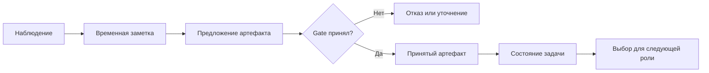

# 04 — Состояние и память мультиагентной системы

## Цель и предварительные знания

[Лекция 03](LECTURE-0003-harness-context.md) объяснила, как harness собирает
контекст *одного* вызова модели. Но система живёт дольше этого вызова: роль
передаёт результат следующей, процесс может быть перезапущен, а часть сведений
понадобится в будущем. Вопрос этой лекции — где живёт каждая информация,
кто вправе её увидеть и что означает её сохранность.

Мы разделим контекст разговора, состояние исполнения, рабочие записи,
принятые артефакты и долговременное знание. Это разные функции, а не пять
названий для «памяти агента». Предполагается понимание [контракта
артефакта](LECTURE-0002-contracts.md); здесь мы не повторяем его поля и
правила валидации.

## Почему «помнит» — опасно неточный глагол

Языковая модель получает данные очередного запроса. У неё нет автоматического
доступа ни к прошлому запросу, ни к файлу, ни к состоянию workflow. Приложение
может *снова предоставить* часть этих данных: включить сообщения в prompt,
прочитать сохранённую запись, выбрать артефакт или запросить внешний источник.
Поэтому «агент помнит решение» следует разворачивать в проверяемое утверждение:
решение где-то сохранено, новая роль вправе его прочитать, оно действительно
попало в нужный контекст и сохранило свой смысл.

Это различие становится особенно важным в команде. Если Analyst обнаружил
неоднозначность метрики, PM не узнает её только из факта последовательного
запуска двух ролей. Требуется явный канал передачи. Доступность информации
для runtime также не равна доступности для модели: код может хранить полный
снимок, но включить в текущий запрос лишь допустимую часть.

## Четыре времени жизни информации

**Conversation context** — сообщения и наблюдения, выбранные для текущего
или близких вызовов. Его граница — окно модели и политика формирования
запроса; подробности отбора принадлежат [лекции 03](LECTURE-0003-harness-context.md).

**Workflow state** — представление того, на каком этапе находится задача и
какие результаты уже приняты. Это состояние runtime, а не «внутреннее
убеждение» модели. Его можно сохранять между процессами, но сохранение
отдельного значения ещё не делает все внешние действия атомарными.

**Task artifact** — именованный результат конкретной задачи, прошедший
проверки на границе роли. У него есть предметное назначение: например,
зафиксировать требования, спецификацию или вердикт QA. Артефакт может быть
включён в состояние или храниться отдельно; важно не физическое место, а
условие принятия и последующего чтения.

**Long-term knowledge** — сведения, доступные за пределами одного workflow:
устойчивые правила домена, история решений, индекс документов. Их срок жизни
длиннее задачи, поэтому нужны версия, владелец, политика обновления и способ
отзыва устаревшего знания. Автоматический semantic memory layer в нашей
платформе *не реализован*; здесь это архитектурная альтернатива, а не
описание существующего компонента.

| Вид | Типичный срок | Кто выбирает видимость | Главный риск согласованности |
| --- | --- | --- | --- |
| Контекст вызова | Один ход или короткая сессия | Harness | Не включён важный факт или взята старая версия |
| Состояние workflow | Вся задача и возможное возобновление | Runtime/reducer | Снимок не соответствует принятой истории |
| Принятый артефакт | До завершения задачи и аудита | Gate + политика роли | Получатель видит черновик как утверждённый результат |
| Долговременное знание | Много задач | Владелец знания + retrieval policy | Старое правило применяется к новой задаче |

Срок жизни не определяет истинность. Сохранённый неверный вывод остаётся
неверным, а долго живущая запись может потерять применимость после изменения
бизнес-определения.

## Жизненный цикл: от наблюдения до принятых данных

Полезно мыслить не «общей памятью», а переходами статуса информации:
наблюдение ещё не факт; рабочая заметка ещё не артефакт; валидный артефакт
ещё не обязательно допустим для каждой роли. Для data-платформы это
существенно: найденная колонка `net_revenue` не отвечает сама по себе на
вопрос о периоде признания возвратов.

Какая информация переживает границу ролей, а какая должна остаться временной?

Рисунок 1. Это логический путь данных, не полная диаграмма методов нашего
runtime. Стрелка в состояние означает принятие результата, а не разрешение
модели писать в произвольное хранилище. Ветка отказа не пополняет принятые
артефакты. Отдельный поиск по долговременным знаниям здесь намеренно не
показан, поскольку он не реализован в примере.

Текстовый эквивалент: наблюдение может быть записано как временная заметка;
затем роль предлагает артефакт. Gate либо отклоняет его, либо принимает в
состояние задачи. Только после принятия runtime может выбрать его для
контекста следующей роли. Ни заметка, ни предложение автоматически не
становятся общим знанием.

## Видимость и согласованность между ролями

У **shared scratchpad** и **accepted artifact handoff** разные обещания.
Scratchpad помогает передавать черновые мысли или промежуточные результаты,
если нескольким исполнителям нужна общая рабочая область. Но у записи в
scratchpad обычно нет отдельного решения «принято», а две роли могут
изменить её исходя из несовместимых предпосылок. Чтобы применять scratchpad
к зависимым задачам, пришлось бы определить владельца записи, версии,
разрешённые записи/чтения и порядок разрешения конфликтов. Сам факт общего
доступа ничего из этого не обеспечивает.

Accepted handoff действует иначе: получатель получает не весь ход рассуждений
предшественника, а ограниченный результат с явной границей принятия.
Это снижает неопределённость статуса, но может скрыть неявное решение,
оставшееся только в рабочих действиях автора. Walden Yan в статье
*Don’t Build Multi-Agents* критикует именно риск несовпадающих неявных решений
при разделённой работе. Это аргумент о согласованности контекста, а не
универсальный запрет на команды агентов.
[Источник: Cognition](https://cognition.com/blog/dont-build-multi-agents).

Поэтому правильный вопрос к handoff: какие решения следующая роль обязана
знать? Если важны определение метрики, исключения, открытые вопросы и
источники, они должны быть выражены в передаваемом результате либо оставаться
явно неразрешёнными. Сохранить полный transcript может быть полезно для
аудита, но передача его целиком каждому исполнителю не заменяет статуса
решений. Теория структуры и проверок артефактов —
[лекция 02](LECTURE-0002-contracts.md), происхождение фактов —
[лекция 12](../modules/module-12-analyst-provenance/README.md).

## Сжатие истории и цена потери деталей

Когда история растёт, систему тянет заменить её кратким summary. Anthropic в
*Effective context engineering for AI agents* обсуждает compaction и внешние
структурированные записи как способы продолжить длительную задачу за пределом
одного окна. При этом авторы отдельно отмечают риск: агрессивное сжатие
может удалить нюанс, важность которого проявится позже.
[Источник: Anthropic](https://www.anthropic.com/engineering/effective-context-engineering-for-ai-agents).

Представим, что Analyst записал: «возвраты вычитать из Net Revenue в периоде
исходного заказа; для поздних возвратов правило пока не подтверждено».
Summary «возвраты вычитать» стирает и период, и неопределённость. PM может
получить текст, который выглядит уверенным, хотя исходная информация требовала
вопроса пользователю. Здесь потеря не просто количественная: меняется статус
знания. Даже хороший алгоритм summarization не может заранее знать все
будущие вопросы. Для существенных предпосылок разумнее сохранять
адресуемый исходный артефакт и отдельное краткое представление, а не
объявлять последнее эквивалентом первого.

Долговременная память усиливает этот риск: суммарная запись может перейти
между задачами и пережить исправление исходной ошибки. Поэтому запись в
такую память требовала бы верификации, области применимости, версий и
механизма invalidation. Это требования к возможному дизайну, не функции
текущего runtime.

## Что действительно реализовано в нашем примере

В [runtime/context.py](../../runtime/context.py) `ContextBundle` строится из
явно указанных файлов управляемого workspace. Он хранит путь, UTF-8
содержимое, размер и SHA-256 каждого выбранного документа; список
упорядочивается, защищённые пути и symlink отклоняются. Это механизм
ограниченного *ввода* в один запрос, не долговременная память и не semantic
retrieval. Более подробный разбор входных лимитов — [лекция 03](LECTURE-0003-harness-context.md).

В [contracts/artifacts.py](../../contracts/artifacts.py) результаты ролей
представлены типизированными артефактами. В
[runtime/role_pipeline.py](../../runtime/role_pipeline.py) `RolePipelineSnapshot`
несёт состояние, историю событий и принятые результаты между границами ролей;
он проверяет соответствие задаче, истории и этапу. Так становится видна
разница между «объект хранится» и «этот объект является допустимым следующим
входом». Подробности framework-edges будут в [лекции 05](../modules/module-05-maf-executors/README.md),
а crash windows и idempotency — в [лекции 17](../modules/module-17-recovery-idempotency/README.md).

Статус этой иллюстрации — **offline-proven**: код и изолированные тесты
проверяют границы состояния. [STEP-0019 evidence](../../plan/evidence/STEP-0019-checkpointable-role-pipeline.md)
фиксирует датированный локальный опыт с возобновлением процесса, но не
текущий live-прогон GateLLM и не доказательство fully-live six-role READY.
Автоматический long-term semantic memory layer здесь **not-implemented**.

## Типичные ошибочные представления

- «Всё, что записано на диск, модель помнит». Нет: ещё нужны разрешение на
  чтение, выбор для вызова и проверка актуальности.
- «Общий scratchpad решает координацию». Нет: конфликт версий и неявных
  решений остаётся, пока не определены ownership и acceptance.
- «Короткое summary эквивалентно истории». Нет: смысловая потеря возможна
  даже при грамматически точном изложении.
- «Checkpoint означает ровно одно внешнее действие». Нет: это отдельная
  проблема границы повторного исполнения, которую разбирает лекция 17.

## Резюме

Контекст даёт модели сведения *сейчас*; workflow state описывает принятую
позицию задачи; артефакт фиксирует проверяемый результат; долговременное
знание могло бы переиспользоваться между задачами. Их срок жизни,
видимость и условия согласованности различны. Надёжная передача не требует
показывать каждому агенту всё подряд, но требует не терять решения,
определяющие дальнейшие действия.

## Вопросы для самопроверки

1. Почему сохранённый `RolePipelineSnapshot` не равен контексту следующего вызова?
2. Когда shared scratchpad полезен, а когда нужен accepted artifact handoff?
3. Какая информация исчезла из примера с поздними возвратами после сжатия?
4. Какие дополнительные условия нужны для долговременного знания между задачами?
5. Почему успешная запись checkpoint не доказывает exactly-once внешнего действия?

## Что дальше

Теперь можно разобрать, как передача принятого состояния воплощается в
исполняемом графе: [лекция 05 — MAF executors и edges](../modules/module-05-maf-executors/README.md).

## Источники

- Anthropic Applied AI Team, [*Effective context engineering for AI agents*](https://www.anthropic.com/engineering/effective-context-engineering-for-ai-agents), 2025. Использованы идеи compaction и structured notes, не продуктовые утверждения о нашей платформе. Проверено 2026-09-17.
- Walden Yan / Cognition, [*Don’t Build Multi-Agents*](https://cognition.com/blog/dont-build-multi-agents), 2025. Использована постановка риска неявных решений; общий вывод автора не принят как универсальное правило. Проверено 2026-09-17.
- Локальная иллюстрация: [context](../../runtime/context.py), [artifacts](../../contracts/artifacts.py), [role pipeline](../../runtime/role_pipeline.py), [датированное evidence](../../plan/evidence/STEP-0019-checkpointable-role-pipeline.md).
