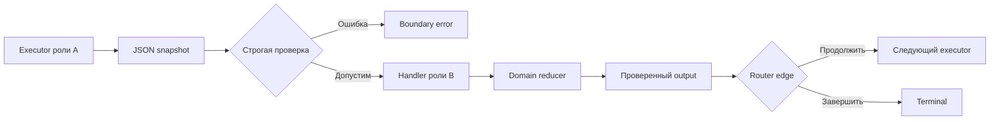

# 05 — MAF: executors, edges и runtime графа

## Цель и предварительные знания

[Лекция 04](LECTURE-0004-state-memory.md) разделила контекст модели,
состояние задачи и принятый артефакт. Теперь посмотрим, *как* исполняемая
система переносит это состояние от роли к роли. Нужны два прежних понятия:
результат пересекает [проверяемую границу](LECTURE-0002-contracts.md), а
долговременное состояние не тождественно сообщению на одном ребре графа.

Здесь предмет — механика runtime. Кто исполняет обработчик? Что означает
edge? Почему версия исполняемого графа важна при продолжении работы?
Решение, допустим ли бизнес-переход, остаётся темой [лекции 06](../modules/module-06-strict-workflow/README.md).

## Узел, executor и роль — не одно и то же

**Executor** — единица runtime, которой граф доставляет сообщение и вызывает
обработчик. Она может обслуживать агентную роль, проверку, маршрутизатор или
терминальный выход. **Роль** — область ответственности в предметном процессе,
описанная в [лекции 01](LECTURE-0001-organization.md). Имя `role_qa` в графе
не делает процесс отдельным контейнером, не выдаёт ему право записи и не
доказывает, что внутри обязательно есть LLM-вызов.

**Edge** — связь доставки результата одного executor к следующему. Наличие
ребра отвечает на вопрос «куда может попасть сообщение», но не на вопрос
«следует ли принять предлагаемый результат». Если узел QA связан с Reviewer,
это ещё не разрешает переход при QA FAIL. Routing predicate и предметный gate
должны согласоваться; иначе граф способен доставить неправильно помеченное
состояние получателю. Такая ошибка не исправляется новой формулировкой prompt.

Microsoft описывает в статье о Microsoft Agent Framework agent orchestration
и workflow orchestration как разные возможности одного набора средств.
Используем только это разграничение: runtime-граф не диктует, кто принимает
предметное решение. Мы не выводим из обзорной статьи гарантию надёжности
конкретной сборки нашей платформы.
[Источник: Microsoft](https://devblogs.microsoft.com/foundry/introducing-microsoft-agent-framework-the-open-source-engine-for-agentic-ai-apps/).

## Сообщение на ребре и состояние графа

В графовых runtimes возможны разные модели: передавать очередное сообщение,
обновлять общее состояние либо сочетать оба способа. LangChain в ранней
статье *LangGraph: Multi-Agent Workflows* объясняет архитектуру через узлы,
рёбра и graph state. Это полезная модель сравнения, но она не является
спецификацией Microsoft Agent Framework и не утверждает, что два SDK имеют
одинаковый формат сообщений.
[Источник: LangChain](https://www.langchain.com/blog/langgraph-multi-agent-workflows).

Для нашего случая важно три уровня:

| Уровень | Назначение | Что не следует из его наличия |
| --- | --- | --- |
| Payload ребра | Доставить представление текущего результата | Что payload корректен или принят |
| Snapshot задачи | Связать stage, history и артефакты | Что снимок следует показать модели целиком |
| Business reducer | Применить допустимый переход | Что внешний эффект можно безопасно повторить |

Эти уровни могут быть вложены в один Python call, но ответственность у них
разная. Изменение схемы сообщения может сломать доставку даже при неизменной
бизнес-логике. Изменение reducer может поменять допустимые переходы даже при
прежнем payload. Поэтому один «workflow test» не заменяет проверки обоих слоёв.

## Typed boundary вместо доверия к Python-объекту

В [runtime/role_pipeline.py](../../runtime/role_pipeline.py) каждое ребро
несёт JSON-представление `RolePipelineSnapshot`. `encode_role_snapshot`
сериализует snapshot с устойчивым порядком ключей и ограничением размера;
`decode_role_snapshot` строго восстанавливает типизированный объект. На входе
executor проверяет stage, а после handler снова делает JSON round-trip и
проверяет, что request, trace identity, история событий и ранее принятые
артефакты не были переписаны. Это локальная граница между доставленным
сообщением и допустимым состоянием задачи, не общая гарантия истинности
предметного результата.

Можно было бы передавать Python-объект напрямую. Это проще в одном процессе,
но состояние может незаметно зависеть от внутренних типов или mutable ссылок.
Сериализация делает границу наблюдаемой: то, что не удаётся восстановить из
канонического payload, не должно неявно пережить переход. Цена — размер
сообщения, стоимость кодирования и необходимость управлять изменением схемы.
В нашем коде размер явно ограничен; schema migration между произвольными
версиями из этого факта не следует.

## Как устроен путь шести ролей

В текущем `build_role_pipeline` шесть executor — Analyst, PM, Data Engineer,
Validator, QA и Reviewer — связаны с `TerminalExecutor`. Прямой путь
проходит все шесть. У PM, DE и проверяющих есть condition/default edges,
а у Validator, QA и Reviewer возможен возврат к DE при состоянии `REWORK`.
Это уже не просто линейная цепочка, хотя обычный успешный прогон выглядит
линейно.

Как одно сообщение проходит два независимых вопроса — *можно ли его принять*
и *кому его доставить*?

Рисунок 1. Схема иллюстрирует логическую границу; в конкретном коде часть
проверок выполняется внутри `advance`, а маршрутизация после него. Стрелки
показывают данные и вызовы, не право модели выбирать произвольный edge.
Ошибка декодирования не поступает в handler.

Текстовый эквивалент: executor A выдаёт JSON snapshot. Executor B строго
проверяет его до вызова handler. Handler формирует предложенный следующий
snapshot через domain reducer; результат снова проверяется. Router выбирает
допустимый путь к следующему executor или Terminal. Ошибка границы останавливает
этот путь, а наличие ребра не утверждает бизнес-принятие.

## Graph signature и изменение runtime

**Graph signature** здесь — проектное обозначение полного набора свойств,
от которых зависит интерпретация сохранённого исполнения: имена и состав
узлов, edge routing, формат сообщений, допустимые стадии, версия handler
contract и ограничения цикла. Это не обязательно один хеш. Если один из этих
элементов меняется, старый checkpoint может перестать означать то же самое
при новом коде; требуется проверенная совместимость либо отдельная миграция.
Точный протокол recovery и crash windows — [лекция 17](../modules/module-17-recovery-idempotency/README.md).

В текущем коде `ROLE_PIPELINE_NAME` имеет версионное имя `...-v3`, а builder
задаёт `max_iterations`, executor IDs и edges. `SecureCheckpointStorage`
фильтрует checkpoints по `workflow_name`. Это частичные элементы identity,
**не** криптографический graph signature и не автоматическая проверка
совместимости всех handlers/schema. Нельзя без дополнительного анализа
восстановить старую задачу под изменённым графом только потому, что файл
checkpoint читается.

## Границы framework abstraction и контрпример

Граф помогает видеть структуру исполнения, но не создаёт единый смысл
термина «agent». В одном узле может быть вызов модели, в другом — чистая
проверка, в третьем — адаптер к внешнему сервису. Следовательно, сравнивать
MAF и LangGraph по одному рисунку узлов недостаточно. Нужно проверить,
какие данные передаются, кто управляет переходами, как связаны checkpoints
и какие enforcement boundaries сохраняются при замене runtime.

Контрпример: инженер добавил edge `QA → Reviewer`, но оставил в snapshot
`QA FAIL` и рассчитывает, что Reviewer «сам разберётся». Если router смотрит
только на существование edge, получатель увидит состояние, на которое не
рассчитан. В нашем примере входной `Stage` и форма snapshot проверяются,
а текущие router predicates различают `QA_PASSED`, `REWORK` и terminal
результаты. Однако это доказывает лишь закодированные инварианты, не
семантическую правильность конкретного QA verdict.

## Что подтверждено нашей системой

[STEP-0019 evidence](../../plan/evidence/STEP-0019-checkpointable-role-pipeline.md)
фиксирует датированный **offline-proven** шестиролевой прогон: каждый edge
передавал JSON, snapshot восстанавливался на typed boundary, некорректная
история или stage отклонялись; процесс был перезапущен после checkpoint.
Это не live вызов GateLLM и не исполнение dbt/Airflow; более поздний код
добавил branching, receipts и tracing, поэтому STEP-0019 нельзя выдавать за
тест всех нынешних branches. Текущую topology мы проверяем по коду и
изолированным tests, а не по устаревшему одному run.

## Резюме

Executor выполняет handler, edge доставляет результат, snapshot описывает
состояние, а reducer определяет предметно допустимый переход. Typed JSON
boundary делает сообщения проверяемыми; сама graph topology не гарантирует
корректности решения. Версия и состав graph должны учитываться при работе
с сохранёнными исполнениями.

## Вопросы для самопроверки

1. Почему `role_qa` как executor не доказывает, что у QA отдельный процесс или LLM?
2. Что может сломаться при прямой передаче Python-объекта вместо typed boundary?
3. Почему edge `QA → Reviewer` не является самостоятельным acceptance gate?
4. Какие изменения входят в проектное понятие graph signature?
5. Что STEP-0019 подтверждает и чего не подтверждает для текущего кода?

## Что дальше

В [лекции 06 — жёсткий workflow](../modules/module-06-strict-workflow/README.md)
разберём именно предметную сторону графа: переходы, terminal outcomes и
ограниченный rework.

## Источники

- Microsoft Foundry Blog, [*Introducing Microsoft Agent Framework: The Open-Source Engine for Agentic AI Apps*](https://devblogs.microsoft.com/foundry/introducing-microsoft-agent-framework-the-open-source-engine-for-agentic-ai-apps/), 2025. Использовано различие agent/workflow orchestration; продуктовые заявления не перенесены на нашу реализацию. Проверено 2026-09-17.
- LangChain Team, [*LangGraph: Multi-Agent Workflows*](https://www.langchain.com/blog/langgraph-multi-agent-workflows), 2024. Использована графовая модель nodes/edges/state; это не спецификация MAF. Проверено 2026-09-17.
- Локальные anchors: [role pipeline](../../runtime/role_pipeline.py), [checkpoint adapter](../../runtime/checkpoints.py), [STEP-0019 evidence](../../plan/evidence/STEP-0019-checkpointable-role-pipeline.md).
