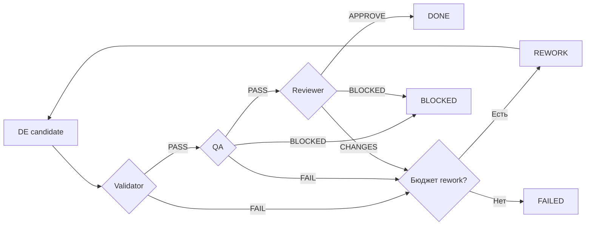

# 06 — Жёсткий workflow: reducer, branching и convergence

## Цель и предварительные знания

[Лекция 05](LECTURE-0005-maf-executors.md) показала executor и edge как
механику исполнения. Теперь главный вопрос иной: какая последовательность
состояний *разрешена* предметной политикой? Мы построим модель переходов,
разделим безопасность и достижение завершения, затем рассмотрим bounded
rework на примере нашей Agentic Data Platform.

«Жёсткий» означает, что набор допустимых переходов и условия принятия
задаются кодом до запуска задачи. Это не утверждение, что модель внутри
роли всегда отвечает одинаково, а граф должен быть линейным.

## Transition relation: кто владеет решением

Пусть `S` — множество состояний задачи, `C` — команды перехода, а
`T(s, c) → s'` — частичная функция: для недопустимой команды результата
нет, она отклоняется. `T` проверяет не только пару стадий, но и identity
задачи, тип и смысл решения артефакта, бюджет и допустимость автора.
**Reducer** — код, реализующий эту функцию и возвращающий новое состояние
без изменения исходного. Модель может предложить содержимое артефакта;
она не получает право напрямую присвоить `state.stage = DONE`.

Anthropic в *Building effective agents* различает workflow с заранее
определёнными code paths и агента, который сам динамически направляет
процесс. Используем это различие как архитектурный язык, а не оценку
качества конкретной платформы. У статьи есть собственная оговорка: часть
описанного ландшафта инструментов с момента публикации изменилась.
[Источник: Anthropic](https://www.anthropic.com/engineering/building-effective-agents).

Таблица переходов не обязана содержать все возможные ответы модели.
Неудачный результат можно направить в `BLOCKED`, `FAILED` или `REWORK`,
если политика заранее описывает условия. В отсутствие подходящего перехода
поведение должно быть отказом, а не просьбой к модели «угадать» следующий этап.

## Safety и liveness — разные требования

**Safety** отвечает: «ничего запрещённого не произошло». Например, нельзя
перейти к Reviewer после QA FAIL, принять артефакт другой задачи или объявить
`DONE` без положительного review. Это проверяется отрицательными тестами
на недопустимые переходы и изменённые сообщения.

**Liveness** отвечает: «исполнение когда-нибудь придёт к допустимому
результату». Одной таблицы allowed edges для этого мало: цикл может
повторяться бесконечно, инструмент может зависнуть, а решение может требовать
человеческого ответа. Нужны бюджеты попыток, timeout и явные terminal
outcomes. Даже с ними `BLOCKED` — корректное завершение процесса обработки,
но не успешное решение бизнес-задачи.

| Outcome | Смысл | Чего не утверждает |
| --- | --- | --- |
| `DONE` | Все требуемые gates приняли результат | Что измерено качество на новых задачах |
| `BLOCKED` | Дальше нужен внешний ответ или допустимое действие невозможно | Что задача выполнена |
| `FAILED` | Исполнение закончилось ошибкой или исчерпало разрешённый rework | Что его следует бесконечно повторять |

Таким образом, достижение terminal stage даёт **convergence процесса**, а
не обязательно convergence к правильному продукту.

## Жёсткий граф может ветвиться и содержать цикл

LangChain в статье *LangGraph: Multi-Agent Workflows* использует графовую
модель с возможными циклическими путями. Само наличие цикла не делает
систему model-managed. Важен владелец условия следующего перехода: заранее
написанный predicate или новая задача, которую динамически выбирает
планирующая модель.
[Источник: LangChain](https://www.langchain.com/blog/langgraph-multi-agent-workflows).

Жёсткий workflow допускает ветви по результату валидации, параллельные
независимые проверки и возврат на доработку. Параллельность здесь —
возможность дизайна, не свойство текущего шестиролевого маршрута. Для
параллельных ветвей дополнительно нужна политика соединения результатов:
чей отказ останавливает работу и что считать общей согласованной версией.
Наш текущий путь использует условную маршрутизацию и rework loop, но
не параллельное исполнение бизнес-ролей.

## Где сходятся ветви нашей системы

В [orchestrator/transitions.py](../../orchestrator/transitions.py)
`ALLOWED_TRANSITIONS` определяет допустимые пары стадий, а
`apply_transition` проверяет предметные gates. В
[runtime/role_pipeline.py](../../runtime/role_pipeline.py) predicates
маршрутизируют уже проверенный snapshot к следующему executor. Эти две
проверки не дублируют одну и ту же обязанность: reducer решает, какое
состояние можно принять; router доставляет его в нужную ветвь.

Что происходит после отказа Validator, QA или Reviewer?

Рисунок 1. Показана учебная проекция нескольких ветвей. PM `BLOCKED`, DE
`BLOCKED/FAILED`, ошибка Validator и другие случаи не изображены, чтобы не
подменять код неполной схемой. Стрелки обозначают *проверенный* outcome,
а не свободный выбор роли. Цвет для различения исходов не нужен.

Текстовый эквивалент: DE выдаёт candidate. Validator, затем QA и Reviewer
проверяют его. PASS/PASS/APPROVE ведёт к DONE. Подтверждённый FAIL или
REQUEST_CHANGES при оставшемся бюджете направляет в REWORK и обратно к DE;
без бюджета результат FAILED. Некоторые роли могут выдать BLOCKED. Эта
схема не показывает все terminal причины и не является новым API.

## Почему повторная проверка обязательна

После исправления DE прежний PASS Validator или QA больше не относится
автоматически к новой версии candidate. В `RolePipelineSnapshot` предыдущие
implementation/validation/QA/review результаты при rework переносятся в
историю попыток, а текущие downstream поля сбрасываются. Новый candidate
снова проходит Validator, QA и Reviewer. Иначе система могла бы совместить
«новую реализацию» со «старой проверкой», то есть получить формально
выглядящий, но причинно несогласованный `DONE`.

Это не означает, что новая проверка обязательно найдёт всякую семантическую
ошибку. Gate задаёт правила принятия известных evidence; качество этих
правил оценивается отдельно в [лекции 21](../modules/module-21-evaluation/README.md).

## Ограничение числа возвратов

В нашем reducer команда перехода в `REWORK` требует причины и расходует
одну попытку. Когда остаток равен нулю, запрос rework превращается в
terminal `FAILED` с причиной исчерпания. `WorkflowBuilder` также ограничивает
число итераций графа. Это две разные защиты: предметный бюджет возвратов
и верхняя граница работы runtime. Они не доказывают, что зависший внешний
инструмент сам завершится; для него нужен отдельный timeout и enforcement.

Датированное [STEP-0020 evidence](../../plan/evidence/STEP-0020-branching-rework-idempotency.md)
подтверждает **offline-proven** ветвление, общий rework budget и terminal
convergence на тогдашнем graph v2 без GateLLM и Data Platform mutations.
Текущий граф имеет имя v3; его поведение дополнительно сверено с кодом и
изолированными workflow tests. STEP-0020 не доказательство новой live
шестиролевой цепочки.

## Контрпример: «пусть QA просто попробует ещё раз»

Предположим, QA сообщил FAIL, а orchestration без reducer немедленно
повторно вызывает QA на том же неизменном candidate до получения PASS.
Даже если очередной stochastic verdict окажется положительным, дефект не
исправлен и причинного основания для принятия нет. Правильная ветка должна
связывать FAIL с новой попыткой DE, инвалидировать прежние downstream gates,
ограничить число возвратов и честно остановиться при исчерпании бюджета.
Это не рекомендация конкретного числа попыток; порог зависит от риска и
измерений, не от желания любой ценой получить `DONE`.

## Резюме

Жёсткий workflow — code-owned отношение переходов и gates, а не линейная
цепочка prompt. Safety не допускает запрещённых состояний; liveness требует
ограниченных циклов, timeout и terminal outcomes. Rework имеет смысл только
тогда, когда после изменения заново проверяется именно новая версия результата.

## Вопросы для самопроверки

1. Чем reducer отличается от router edge в шестиролевом графе?
2. Почему `BLOCKED` может быть terminal outcome, но не успехом задачи?
3. Что нарушится, если после DE rework оставить прежний QA PASS?
4. Почему конечный rework budget не гарантирует завершение зависшего tool call?
5. Когда цикл остаётся частью жёсткого workflow, а когда управление уже передано planner?

## Что дальше

[Лекция 07](../modules/module-07-agent-orchestrator/README.md) рассмотрит
альтернативную область управления: модель-планировщик сама выбирает подзадачи
и делегирование внутри внешних границ разрешений.

## Источники

- Anthropic, [*Building effective agents*](https://www.anthropic.com/engineering/building-effective-agents), 2024. Взято различие predefined workflows и dynamic agents; рекомендации статьи не выданы за доказательство качества нашей системы. Проверено 2026-09-17.
- LangChain Team, [*LangGraph: Multi-Agent Workflows*](https://www.langchain.com/blog/langgraph-multi-agent-workflows), 2024. Использована идея графа с циклами; не спецификация MAF. Проверено 2026-09-17.
- Локальная иллюстрация: [transition reducer](../../orchestrator/transitions.py), [runtime graph](../../runtime/role_pipeline.py), [dated evidence](../../plan/evidence/STEP-0020-branching-rework-idempotency.md).
