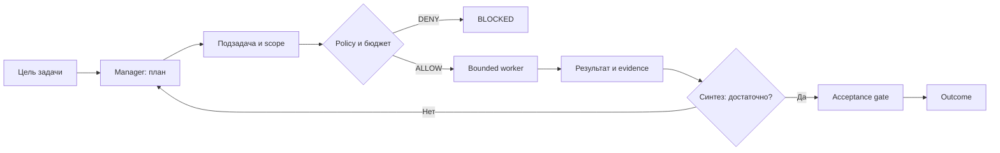

# 07 — Agent-orchestrator: планирование и делегирование

## Цель и предварительные знания

В [лекции 06](LECTURE-0006-strict-workflow.md) набор бизнес-переходов был
задан кодом. Здесь рассмотрим другого владельца решения: модель-оркестратор
выбирает, какую подзадачу исследовать дальше, кому её поручить и когда
изменить план. Это архитектурная теория и мысленный data-engineering пример.
В нашей Agentic Data Platform **нет** исполняемого model-directed manager;
текущий шестиролевой путь остаётся code-owned.

Цель — понять механику `manager → worker → synthesis → replanning`, не
решая пока, что «лучше» для каждой задачи. Сценарная матрица выбора
принадлежит [лекции 24](../modules/module-24-orchestration-comparison/README.md).

## Что именно решает orchestrator

**Agent-orchestrator**, или manager, получает цель и доступные ему
capabilities. В отличие от фиксированного маршрута, он может сформулировать
подзадачи по обнаруженным обстоятельствам, выбрать ограниченного worker,
оценить возвращённый результат и назначить дополнительное исследование.
Он не обязан передавать задачу по заранее известной последовательности
Analyst → PM → DE. Однако внешняя система всё равно должна определять,
что manager *может* видеть и какие действия ему разрешено запрашивать.

Важно отделить свободу **планирования** от свободы **эффекта**. Решение
«нужно посмотреть lineage возвратов» может быть model-directed. Решение
«можно перезаписать production table» не должно появляться из уверенного
текста модели: его проверяют policy и approval gates. Конкретные механизмы
authority разбираются в [лекции 19](../modules/module-19-security-authority/README.md).

## Задача, план и прогресс — разные записи

Microsoft Research описывает в Magentic-One два связанных цикла: task ledger
с фактами, предположениями и планом и progress ledger с текущей работой.
При недостаточном прогрессе orchestrator пересматривает план. Заимствуем
идею различать *зачем/что известно* и *что уже делается*, а не его
конкретную реализацию, модель или результаты benchmark.
[Источник: Microsoft Research](https://www.microsoft.com/en-us/research/articles/magentic-one-a-generalist-multi-agent-system-for-solving-complex-tasks/).

**Task ledger** отвечает за устойчивую формулировку цели, известные факты,
гипотезы, открытые вопросы и текущую декомпозицию. **Progress ledger**
отмечает назначение worker, результат попытки, препятствия и состояние
очереди. Их полезно разделять: неудача одного поиска не должна тихо менять
исходную цель, а новое доказательство может заставить изменить сразу
несколько будущих подзадач. Ledger — внешний носитель выбранных записей;
он не гарантирует истинность фактов и не является разрешением на действие.
Вопросы срока жизни и видимости записи уже рассмотрены в
[лекции 04](LECTURE-0004-state-memory.md).

## Контракт ограниченного worker

Manager должен передать worker достаточно определённую задачу: цель,
границы источников/инструментов, формат результата, критерий достаточности,
бюджет времени и способ сообщить неопределённость. Чем больше зависимость
между подзадачами, тем важнее передать уже принятые решения, иначе worker
может принять несовместимое предположение. Принятие результата остаётся
отдельным шагом; фраза worker «готово» не означает, что исходная цель закрыта.

Anthropic описывает исследовательскую систему, где lead agent создаёт
специализированных subagents, получает их находки и решает, нужно ли
продолжить поиск. Авторы прямо связывают неудачные early delegations с
расплывчатыми заданиями и повторением одной работы разными workers.
Этот вывод относится к их research setting, а не доказывает, что
динамическая команда улучшит наш DE pipeline.
[Источник: Anthropic](https://www.anthropic.com/engineering/multi-agent-research-system).

| Граница | Manager выбирает | Код и внешняя политика обеспечивают |
| --- | --- | --- |
| Декомпозиция | Какие вопросы исследовать | Максимум workers, бюджет и допустимые роли |
| Делегирование | Какому worker дать конкретный вопрос | Scope tools/files/network и identity |
| Синтез | Какие результаты ещё нужны | Проверка формата, provenance и acceptance |
| Завершение | Предложение «достаточно» | Обязательные gates и terminal policy |

Таблица — проектная модель, не описание работающих компонентов нашей платформы.

## Цикл manager → worker → synthesis

Где появляется перепланирование и где оно должно остановиться?

Рисунок 1. Это собственная теоретическая схема, не скопированная схема
Magentic-One/Anthropic и не реализованный runtime. Стрелка возврата означает
новую постановку подзадачи, не право model bypass проверки. Отказ policy
закрывает запрещённую ветку; `Outcome` может быть и неуспешным.

Текстовый эквивалент: из цели manager строит план и ограниченную подзадачу.
Код до вызова worker проверяет разрешения и бюджет. При отказе ветка
блокируется; при допуске worker возвращает результат и evidence. Manager
оценивает полноту и либо уточняет план, либо предлагает завершение, которое
проходит независимый acceptance gate.

## Перепланирование — не бесконечное повторение

Replanning полезен, если новое наблюдение действительно меняет выбор
следующего вопроса. Если поиск источника ничего не дал, manager может
попробовать другой путь; если несколько работников нашли противоречивые
определения метрики, он должен явно вынести конфликт, а не выбрать более
красивый ответ. Критерий «достаточно» зависит от исходной цели и проверяемых
условий: покрыты ли обязательные аспекты, приложены ли источники, остались
ли критические вопросы.

Без ограничения manager может бесконечно заказывать похожие поиски или
создать чрезмерное число workers. Лимит запросов/времени и stopping
conditions нужны даже там, где план выбирается моделью. Если данные
остались противоречивыми, допустимый outcome может быть `needs_user`, а
не выдуманное согласование. Здесь критерий достаточности описан как
дизайн-условие, не как реализованный evaluator нашей системы.

## Dynamic routing, workers-as-tools и transport

**Dynamic routing** означает, что manager выбирает следующий вид работы
по наблюдению. **Workers-as-tools** — частная форма интерфейса: вызвать
worker с заданием и получить ответ как результат инструмента. **Hierarchical
team** добавляет уровни manager/подгрупп; глубина повышает цену передачи
контекста и требования к ownership решений. Эти варианты могут сочетаться,
но не означают одинаковые права и не требуют единого сетевого протокола.

**A2A** — протокол взаимодействия независимых агентных систем, не
синоним supervisor или model-directed planning. Один процесс тоже может
реализовать dynamic orchestration, а два сервиса могут обмениваться
сообщениями без manager. Протоколы доступа к tools и data —
[лекция 09](../modules/module-09-mcp-interface/README.md); здесь важен
владелец плана и подзадачи.

## Мысленный пример для инженерии данных

Пусть цель — понять, почему две витрины дают разный Net Revenue за месяц.
Manager может назначить одному bounded read-only worker исследование
lineage первой витрины, другому — правил refunds во второй. Полученные
наблюдения могут обнаружить, что расхождение относится не к SQL, а к
периоду признания позднего возврата. Тогда manager переопределяет очередь:
нужно проверить бизнес-определение и спросить пользователя, а не поручать
DE немедленно менять модель.

Это **thought experiment**, не прогон нашей платформы. Наш действующий
[six-role graph](../../runtime/role_pipeline.py) использует заранее
описанные executors и route predicates; [ADR-0035](../../plan/decisions/ADR-0035-dual-orchestration-lecture-boundaries.md)
фиксирует альтернативу как план курса. Нет кода planner, task/progress
ledger или model-directed worker scheduling. `not-implemented` здесь
важнее красивой аналогии: нельзя выводить результат мысленного сценария из
тестов code-owned workflow.

## Контрпример: подробный план без authority boundary

Представим, manager аккуратно декомпозировал задачу, но назначил worker
с доступом к production credentials для «быстрой проверки гипотезы».
План может быть логичным, однако отсутствие внешней проверки scope делает
действие недопустимым. Обратный перекос тоже возможен: есть безопасный
read-only worker, но задано «найди всё про выручку» без периода, источника
и формата. Тогда высокая активность не доказывает прогресс. Следовательно,
качество orchestration требует одновременно осмысленного делегирования и
принудительных границ действий.

## Резюме

Agent-orchestrator выбирает подзадачи и может пересматривать план по
наблюдениям; workers выполняют ограниченную работу и возвращают evidence.
Task ledger хранит модель цели, progress ledger — ход попыток. Внешние
permission, budget и acceptance gates не заменяются интеллектом manager.
Для нашей платформы это пока **не реализованная архитектурная альтернатива**.

## Вопросы для самопроверки

1. Чем изменение task ledger отличается от обновления progress ledger?
2. Какие поля нужны bounded worker, чтобы избежать дублирующего исследования?
3. Почему manager может предложить завершение, но не должен сам разрешать write?
4. В каком случае replanning полезнее ещё одного одинакового поиска?
5. Почему A2A transport не доказывает существование agent-orchestrator?

## Что дальше

Даже теоретический manager нуждается в среде с принудительными границами.
[Лекция 08 — изоляция исполнения](../modules/module-08-isolation/README.md)
разберёт filesystem, network и process boundaries без смешения с планированием.

## Источники

- Microsoft Research, [*Magentic-One: A Generalist Multi-Agent System for Solving Complex Tasks*](https://www.microsoft.com/en-us/research/articles/magentic-one-a-generalist-multi-agent-system-for-solving-complex-tasks/), 2024. Заимствована идея task/progress ledgers и replanning; результаты benchmark не перенесены на нашу платформу. Проверено 2026-09-17.
- Anthropic, [*How we built our multi-agent research system*](https://www.anthropic.com/engineering/multi-agent-research-system), 2025. Заимствованы идеи bounded delegation и synthesis; внутренние performance claims не обобщены. Проверено 2026-09-17.
- A2A Project, [*Agent2Agent Protocol Specification*](https://a2a-protocol.org/latest/specification), проверено 2026-09-17. Упомянуто только назначение протокола, без version-specific API claims.
- Локальный статус: [current role graph](../../runtime/role_pipeline.py), [ADR-0035](../../plan/decisions/ADR-0035-dual-orchestration-lecture-boundaries.md).
