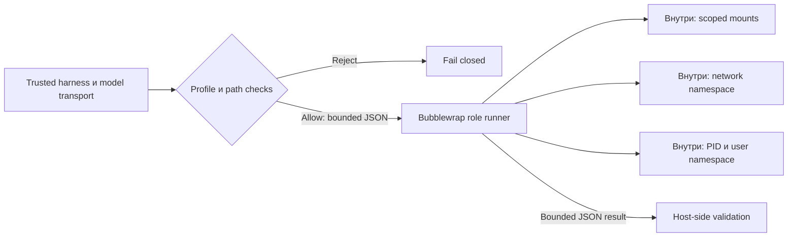

# 08 — Изоляция среды исполнения

## Цель и предварительные знания

В [лекции 02](LECTURE-0002-contracts.md) мы отделили доверенный контракт от
содержимого, которое приносит агент. Теперь вопрос другой: что помешает
процессу, выполняющему недоверенный код, прочитать чужой файл или выйти в
сеть, даже если инструкция запрещает это делать? Цель — построить модель
**изоляции исполнения**: границы видимых файлов, процессов и сети, момент их
установки и ограничения этих границ. Тема продолжает разговор о scoped
worker из [лекции 07](LECTURE-0007-agent-orchestrator.md), но не требует
model-directed manager: наш действующий маршрут остаётся code-owned.

## Инструкция не является границей процесса

Prompt «не открывай `.env`» влияет на поведение модели, но не меняет права
процесса. Если исполняемый инструмент наследует доступ к домашнему каталогу,
переменным окружения и сети, ошибочный или prompt-injected вызов может
использовать эти ресурсы. Проверка намерения и фактическое ограничение
среды решают разные задачи. **Containment** означает, что даже при ошибочном
действии внутри worker запрещённый ресурс недоступен на уровне операционной
системы или доверенного посредника.

Anthropic в статье о sandboxing Claude Code выделяет две необходимые
границы — файловую и сетевую; их пример допускает обращения к одобренным
адресам через внешний proxy. Мы заимствуем принцип совместного ограничения,
не приписывая нашему runner такой proxy и не переносим статистику продукта
на нашу платформу. [Источник: Anthropic](https://www.anthropic.com/engineering/claude-code-sandboxing).

## Четыре границы видимости

Linux namespace задаёт процессу собственное представление некоторого
системного ресурса. Для этой лекции важны не все типы namespace, а то,
какой наблюдаемый эффект они ограничивают. Их семантика описана в
[Linux man-pages: namespaces(7)](https://man7.org/linux/man-pages/man7/namespaces.7.html).

| Граница | Что меняется для worker | Чего она сама не решает |
| --- | --- | --- |
| Mount/filesystem | Какие пути смонтированы и какие из них доступны на запись | Верность содержимого разрешённого файла |
| Network | Какие интерфейсы и сетевой стек видит процесс | Политику доверенного proxy за границей worker |
| PID/process | Какие процессы видны в своём PID namespace | Экономию памяти или защиту от kernel bug |
| User identity | Каким UID и набором capabilities располагает процесс | Тождество UID глобальному host-пользователю |

`/workspace` — не просто имя каталога: безопасный смысл появляется только
после проверки исходных путей и построения mount table. Read-only bind
не даёт worker менять конкретный файл через этот mount; writable bind
создаёт намеренное исключение. Если весь workspace смонтировать на запись,
точечное ограничение роли исчезнет. Даже если путь скрыт, его содержимое
может прийти через разрешённый инструмент; namespace не заменяет проверку
данных на границе инструмента.

## Отдельные жизненные циклы harness и sandbox

Внешний **harness** выбирает профиль, готовит вход, вызывает модель и
инструменты, проверяет результат. **Sandbox** — среда, где выполняется
конкретная ограниченная работа. Их разделение позволяет не помещать ключ
модели и управляющую логику в недоверенный процесс. Anthropic в статье
*Scaling Managed Agents* описывает вынесение session, harness и sandbox в
разные интерфейсы: это пример архитектурной декомпозиции, а не доказательство
идентичной реализации или отказоустойчивости у нас.
[Источник: Anthropic](https://www.anthropic.com/engineering/managed-agents).

В нашей платформе путь к LLM остаётся на доверенной стороне control plane;
у role runner не должно быть raw-сетевого маршрута к GateLLM или токена
`API_TOKEN`. Изоляция worker, таким образом, не равна изоляции *всей*
платформы: доверенный процесс всё равно несёт ответственность за транспорт
модели, валидацию входа/выхода и хранение секретов.

## Схема границы исполнения

На схеме стрелка через границу — контролируемая передача JSON, а не
разрешение worker открыть host filesystem или выполнить сетевой вызов.

Рисунок 1. Собственная учебная схема локального runner; она сокращает детали
`setpriv`, resource limits и MCP gateway. `No raw egress` означает отсутствие
настроенного прямого сетевого пути из sandbox в показанной реализации, а не
доказанную невозможность всех каналов утечки в системе.

Текстовый эквивалент: доверенный harness проверяет профиль, расположение
workspace и размер входа. При ошибке запуск отклоняется. При допуске он
передаёт JSON процессу Bubblewrap с ограниченными mounts, UID и отдельными
сетевым/PID пространствами. Worker возвращает ограниченный JSON; harness
проверяет его отдельно. Модель и её транспорт находятся вне worker.

## Наши пять role identities

В [профилях](../../policies/runner_profiles/data_engineer_v1.json) и
[launcher](../../runtime/runner_isolation.py) для Analyst, PM, Data Engineer,
QA и Reviewer заданы различные runner/actor IDs и namespace UIDs. Это пять
изолированных **исполнительских** ролей; Validator в шестиролевом workflow
не становится шестым Bubblewrap runner от одного лишь счёта ролей.

Launcher требует `/usr/bin/bwrap` и `/usr/bin/setpriv`; отсутствие бинарника
или неподдерживаемые user namespaces приводят к ошибке, а не к выполнению
без sandbox. Он запускает доверенный argv, очищает окружение, отключает
вложенные user namespaces, сбрасывает capabilities, создаёт отдельные
network/PID и другие пространства, ограничивает время, адресное пространство,
размер входа/выхода и некоторые ресурсы процесса. PM не получает workspace;
Analyst, QA и Reviewer получают разрешённые чтения, но не persistent write;
DE имеет два writable корня для dbt models и tests. Это не право менять
любой файл проекта.

В ходе [STEP-0022](../../plan/evidence/STEP-0022-runner-and-mcp-isolation.md)
пять реальных namespace-процессов прошли локальные проверки разных UID,
невидимости корневого `.env` и Docker socket, отказа тестового внешнего соединения и
разрешённых/запрещённых записей. Это **датированное offline evidence**,
которое не доказывает устойчивость к kernel escape, все возможные пути
эксфильтрации или fully-live готовность шестиролевого pipeline. Актуальный
[integration test](../../tests/integration/test_runner_namespace_isolation.py)
показывает точный набор проверяемых наблюдений.

## Fail closed — свойство пути запуска

Недостаточно иметь файл профиля с красивыми списками путей. Нужен порядок:
проверить имя профиля и роль, убедиться, что workspace находится в управляемом
каталоге и путь не подменён symlink, собрать только нужные mounts, затем
запустить процесс. Ошибка на любом этапе не должна включать запасной запуск
в обычном host-процессе. Поэтому `fail closed` — утверждение о **всём пути**
от валидации профиля до исполнения, а не о наличии флага `--unshare-all`.

Ограничение argv важно по той же причине: если недоверенный текст может
сам выбрать произвольную host-команду до входа в sandbox, граница становится
декорацией. Наш launcher принимает только изолированный системный Python
entrypoint; недоверенные данные подаются как ограниченный JSON. Даже это
не отменяет необходимости проверять результаты и tool requests в host code.

## Контрпример: закрытый каталог, открытая сеть

Представим worker с read-only workspace и доступом к `.env`, который может
соединиться с произвольным внешним адресом. Запрет записи не препятствует
отправке прочитанного секрета. Обратная ошибка тоже опасна: network namespace
без внешнего маршрута не защищает от порчи доступного на запись проекта.
Поэтому файловую и сетевую границы проектируют **совместно** с принципом
минимальной видимости. Наш runner не монтирует корневой `.env`; это сильнее
одного запрета отправки, но не гарантирует, что секрет не попадёт в
разрешённый вход через ошибку доверенного harness.

## Где заканчивается гарантия namespace

Namespace не создаёт отдельное ядро и не является полной машинной
виртуализацией. Процессы всё ещё делят host kernel; ошибка ядра, неверно
разрешённый mount, небезопасный host tool или побочный канал требуют
дополнительных мер и отдельной оценки. Тест соединения с одним адресом
проверяет конкретное наблюдение, а не математически доказывает отсутствие
всех путей egress. Лимит памяти процесса не равен cgroup-изоляции всей
платформы.

Тема **кто вправе вызвать инструмент и как подписана identity** принадлежит
[лекции 19](../modules/module-19-security-authority/README.md). Тема
**tenant/pod deployment и Kubernetes** —
[лекции 26](../extensions/module-26-deployment-theory/README.md). Здесь
нас интересует непосредственно среда локального исполнения.

## Резюме

Prompt сообщает намерение, sandbox ограничивает фактическую возможность
процесса. Рабочая граница складывается из проверенного профиля, ограниченных
mounts, отдельных network/PID/user namespaces, вынесенных наружу секретов,
лимитов и fail-closed launcher. Каждый слой имеет область действия; ни один
не доказывает безопасность всей Agentic Data Platform сам по себе.

## Вопросы для самопроверки

1. Почему read-only mount не заменяет network isolation, а отдельная сеть —
   контроль writable paths?
2. Какие проверки должны пройти *до* запуска Bubblewrap и почему отказ
   нельзя заменить обычным Python subprocess?
3. Почему пять role runners не противоречат шести ролям workflow?
4. Что именно установил offline test внешнего соединения и чего он не доказал?
5. Чем локальная граница sandbox отличается от authority policy и tenant
   isolation?

## Что дальше

В [лекции 09](../modules/module-09-mcp-interface/README.md) разберём MCP как
интерфейс инструментов и границу координации: изолированный процесс может
запрашивать полезную работу, но физический sandbox сам по себе не задаёт
семантику и права такого запроса.

## Источники и статус утверждений

- [Anthropic, *Beyond permission prompts: making Claude Code more secure and autonomous*](https://www.anthropic.com/engineering/claude-code-sandboxing),
  раздел *Sandboxing: a safer and more autonomous approach*, проверено
  2026-09-17: идея совместных filesystem/network boundaries. Числа продукта
  и его proxy configuration не переносятся на наш runner.
- [Anthropic, *Scaling Managed Agents: Decoupling the brain from the hands*](https://www.anthropic.com/engineering/managed-agents),
  раздел *Decouple the brain from the hands*, проверено 2026-09-17:
  разделение harness, session и sandbox; чужие operational outcomes не
  считаются evidence нашей платформы.
- [Linux man-pages, namespaces(7)](https://man7.org/linux/man-pages/man7/namespaces.7.html),
  раздел *Namespace types*, проверено 2026-09-17: область действия mount,
  network, PID и user namespaces.
- [Наш launcher](../../runtime/runner_isolation.py),
  [offline evidence STEP-0022](../../plan/evidence/STEP-0022-runner-and-mcp-isolation.md)
  и [integration test](../../tests/integration/test_runner_namespace_isolation.py):
  граница фактических claims о нашей реализации, не доказательство
  production hardening.
