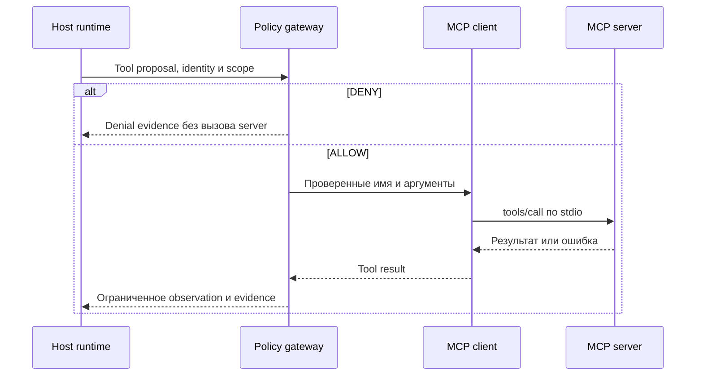

# 09 — MCP как интерфейс, а не политика координации

## Цель и предварительные знания

[Лекция 03](LECTURE-0003-harness-context.md) объяснила, как harness формирует
контекст вызова модели. [Лекция 08](LECTURE-0008-isolation.md) показала, что
ограничение процесса не определяет смысл разрешённого запроса. Теперь нужен
язык, на котором приложение обнаруживает и вызывает внешние инструменты.
Разберём Model Context Protocol (MCP): роли участников, transport, объявление
capabilities и проектирование tool surface. Цель — не научиться развёртывать
сервер, а понять, какие гарантии даёт протокол и что остаётся обязанностью
нашей Agentic Data Platform.

## Зачем нужен общий интерфейс

Без общего интерфейса каждый источник данных и каждое приложение должны
договариваться о собственных именах операций, формате входа и результате.
MCP стандартизует обмен между LLM-приложением и поставщиком контекста или
инструментов. Исторический анонс Anthropic 2024 года описывал эту идею как
альтернативу набору частных коннекторов. Это мотивация стандарта, а не
доказательство, что любой MCP server безопасен или полезен модели.
[Источник: Anthropic](https://www.anthropic.com/news/model-context-protocol).

Протокол предоставляет **механизм связи**; предметное решение «нужна ли
эта операция для задачи», право роли вызвать её и допустимость результата
не следуют из того, что обе стороны умеют говорить на MCP.

## Host, client, server — разные обязанности

**Host** — приложение, которое соединяет модель и внешние capabilities,
создаёт MCP clients и контролирует, что попадёт в контекст. **Client** —
коннектор host к одному server; он передаёт сообщения и обрабатывает
протокольные ответы. **Server** предоставляет инструменты, ресурсы и/или
шаблоны prompts. Несколько clients могут принадлежать одному host; client
не становится «подчинённым агентом» только потому, что подключён к server.
Так описана архитектура в
[актуальной спецификации MCP](https://modelcontextprotocol.io/specification/2026-07-28/architecture),
проверенной 2026-09-17.

Инструмент (tool) — вызываемая операция. Ресурс (resource) — контекст,
который можно читать. Prompt — шаблон взаимодействия. Мы сосредоточимся
на tools; отсутствие resources/prompts в нашем адаптере не означает, что
MCP состоит только из инструментов. Решение включить результат server в
очередной запрос модели остаётся у host, как и вопрос происхождения этого
результата.

| Участник | Вопрос, на который отвечает | Не получает автоматически |
| --- | --- | --- |
| Host | Какие clients подключены и что предложить модели? | Корректность ответа каждого server |
| Client | Как доставить сообщение выбранному server? | Право изменить бизнес-состояние задачи |
| Server | Как выполнить объявленную операцию и вернуть результат? | Полный контекст разговора и authority host |
| Наша policy layer | Можно ли *этой* роли выполнить *этот* запрос сейчас? | Разрешение из одного лишь объявления capabilities |

Последняя строка — компонент нашего приложения, а не четвёртая роль MCP.

## Версия протокола меняет жизненный цикл

Слово «согласование» важно уточнить датой. В редакциях MCP до
`2025-11-25` включительно client начинал session через `initialize`, стороны
объявляли поддерживаемые capabilities и затем обменивались сообщениями в
рамках соединения. В редакции **`2026-07-28`** обязательный handshake и
protocol session убраны: каждый запрос сам передаёт версию и capabilities
client; server можно предварительно спросить через `server/discover`, но
это не обязательный первый вызов. Несовместимость версии возвращается как
ошибка, после которой client может выбрать общую версию или остановиться.
[Источник: MCP Versioning and Compatibility](https://modelcontextprotocol.io/specification/2026-07-28/basic/versioning).

Итак, **capability negotiation** — определение поддерживаемых протокольных
возможностей, а не выдача пользователю прав. В современной редакции client
объявляет относящиеся к запросу возможности в `_meta`, server сообщает свои
возможности при discovery; optional extensions требуют поддержки обеих
сторон. Никакая строка в `clientInfo` не удостоверяет личность пользователя:
спецификация считает эту metadata самоописанием, непригодным для security
decisions.
[Источник: MCP Base Protocol](https://modelcontextprotocol.io/specification/2026-07-28/basic).

Наш код **не заявлен реализацией редакции 2026**. В `pyproject.toml`
закреплён `mcp==1.26.0`, и установленный пакет объявляет
`LATEST_PROTOCOL_VERSION = 2025-11-25`; локальные тесты этого шага не
проверяют реальный handshake с каждым server. Это доказательство версии
установленного SDK, а не аттестация фактически согласованной версии во
всех соединениях. Переход на современную редакцию потребует отдельной
проверки совместимости host, clients и servers.

## Transport не является бизнес-семантикой

MCP передаёт JSON-RPC сообщения через transport. В современной
спецификации стандартные bindings — **stdio** для локально запущенного
подпроцесса и **Streamable HTTP** для удалённой службы. Они задают framing,
доставку и отмену запроса, но не превращают один и тот же `tools/call` в
разные бизнес-операции.
[Источник: MCP Transports](https://modelcontextprotocol.io/specification/2026-07-28/basic/transports).

Для нашей платформы [stdio factories](../../runtime/tools/mcp_stdio.py)
создают MAF `MCPStdioTool` для ClickHouse/dbt и локального Airflow MCP.
Например, ClickHouse client запускает контейнер сервиса через
`docker compose ... run -T`, назначает prefix `clickhouse` и разрешает
только `list_databases`, `list_tables`, `run_query`; prompts не загружаются.
Это конфигурация **нашего клиента**, не универсальное требование MCP.
Факт stdio сам по себе не доказывает read-only права server или отсутствие
побочных эффектов: такие свойства требуют отдельного профиля и проверки.

## Tool surface — смысловой контракт для агента

В спецификации tool имеет имя, описание и `inputSchema`; он может иметь
`outputSchema`. `tools/list` сообщает доступные инструменты, `tools/call`
передаёт имя и аргументы. Результат может содержать текст, другие content
types и/или structured content; ответ об ошибке исполнения инструмента не
равнозначен ошибке протокольного сообщения.
[Источник: MCP Tools](https://modelcontextprotocol.io/specification/2026-07-28/server/tools).

Здесь schema необходима, но недостаточна. `run_query(query: string)`
синтаксически принимает строку; schema не определяет, к каким базам
разрешён доступ, сколько строк можно вернуть и допускает ли SQL побочный
эффект. Эти вопросы для ClickHouse принадлежат
[лекции 10](../modules/module-10-analytical-sql/README.md). Аналогично
название `trigger_dag` не содержит согласия на запуск;
[операционный gate Airflow](../modules/module-18-airflow-operations/README.md)
рассматривается отдельно.

Anthropic в статье об эффективных tools объясняет, почему механический
wrapper каждого API endpoint часто неудобен агенту: слишком похожие tools
усложняют выбор, а широкий ответ расходует контекст без пользы. Заимствуем
идею **семантической операции**: имя описывает понятное действие, параметры
ограничивают область, результат сообщает достаточное наблюдение и явную
ошибку. Это design heuristic, не гарантированное свойство любого MCP server
и не измеренная нами прибавка качества.
[Источник: Anthropic](https://www.anthropic.com/engineering/writing-tools-for-agents).

| Наблюдаемое свойство tool | Удобный интерфейс | Риск плохой границы |
| --- | --- | --- |
| Имя | Различает ресурс и действие, например `clickhouse.list_tables` | Похожие имена скрывают разные эффекты |
| Вход | Явные поля, обязательность и разумный предел | `payload: string` маскирует произвольный API |
| Выход | Нужный результат, формат и ограниченный объём | Огромный dump занимает контекст и скрывает ошибку |
| Ошибка | Позволяет понять, что не произошло | Успешный HTTP/JSON-RPC ответ принимают за успешный бизнес-результат |

Таблица — критерии проектирования, не нормативные поля MCP сверх указанных
в спецификации. Описания и аннотации инструмента помогают выбору, но
не являются разрешением на его исполнение, особенно если server недоверен.

## Как запрос проходит через нашу систему

В текущем коде модель может предложить tool call, но решение об исполнении
принимает [MCPToolGateway](../../runtime/tools/mcp_gateway.py). Он получает
типизированный `ToolRequest`, заново вызывает `authorize_tool_call`, при
отказе сохраняет evidence **до** удалённого вызова и не отправляет запрос
server. При допуске маршрутизирует только известные имена к выбранному
client, ограничивает время и размер текста ответа, сохраняет результат или
ошибку как evidence. Наш gateway принимает только текстовый MCP content;
другие допустимые протоколом типы он отклоняет. Это сознательное сужение
интерфейса, а не ограничение MCP как стандарта.

Где проходит граница между предложением модели и сетевым/stdio эффектом?

Рисунок 1. Упрощённая схема **нашего локального пути**, не универсальная
схема MCP 2026. Сплошные стрелки обозначают запросы, пунктирные — ответы; они не
передают server право изменить workflow state. Схема не показывает
request-bound authentication, approval для write-операций и все adapters.

Текстовый эквивалент: host передаёт типизированное предложение gateway.
При DENY gateway записывает отказ и не вызывает server. При ALLOW client
отправляет `tools/call` по stdio выбранному server. Его результат или
ошибка возвращается через gateway, который ограничивает и фиксирует
наблюдение. Только отдельный workflow reducer решает, можно ли принять
полученный артефакт и перейти к новой стадии.

## Tool call, делегирование и переход состояния

Один `tools/call` может участвовать в работе агента, но не определяет
архитектуру команды. Различие — в **владельце следующего решения**:

| Событие | Кто выбирает | Непосредственный результат |
| --- | --- | --- |
| Tool call | Модель предлагает; host/policy допускает | Наблюдение или ограниченный эффект инструмента |
| Делегирование агенту | Manager ставит ограниченную подзадачу | Работа другого исполнителя и его ответ |
| Workflow transition | Кодовый reducer проверяет допустимость | Новая принятая стадия задачи |

Tool может технически вызывать другого агента, но один и тот же transport
не делает все три события эквивалентными. Подробнее о manager —
[в лекции 07](LECTURE-0007-agent-orchestrator.md), о reducer —
[в лекции 06](LECTURE-0006-strict-workflow.md). Здесь важно не выводить
authority перехода из самого факта, что server ответил успешно.

## Контрпример: «есть tool» не значит «можно»

Пусть server объявляет `delete_dataset` и описание уверяет, что операция
безопасна. Согласованная capability `tools` означает лишь, что стороны
умеют обмениваться вызовами tools; она не доказывает read-only статус,
полномочия текущей роли, user approval или допустимость удаления именно
этого набора данных. Если host передаст такое описание модели как
авторитетную политику, текст server сможет подменить решение кода.

Правильная граница: host допускает server и показывает только нужный
набор tools, repository policy проверяет identity, цель, аргументы,
бюджеты и approval, а результат остаётся недоверенным наблюдением.
Подробная модель authentication, authorization и prompt injection —
[лекция 19](../modules/module-19-security-authority/README.md). MCP и
agent-to-agent delegation тоже не синонимы: вызов tool сам по себе не
создаёт нового планирующего агента.

## Статус примера и пределы evidence

[STEP-0008](../../plan/evidence/STEP-0008-tool-policy-layer.md) фиксирует
датированную offline/live проверку ClickHouse/dbt MCP и policy layer:
допущенные запросы выполнялись, DDL отклонялся до MCP исполнения.
Эти наблюдения относятся к указанной конфигурации и дате. Текущие
[тесты gateway](../../tests/unit/test_mcp_gateway.py) и
[stdio factories](../../tests/unit/test_mcp_stdio.py) проверяют маршрутизацию,
denial и состав клиента, но не доказывают качество ответов LLM, поддержку
MCP 2026 или полностью готовый live six-role workflow.

## Резюме

MCP унифицирует связь host/client/server и описание capabilities. Версия
протокола определяет, как стороны объявляют поддержку функций; transport
определяет доставку. Имя, schema и результат tool задают интерфейс, но
не authority. Наша платформа добавляет отдельную кодовую policy layer и
проверяет каждый вызов прежде, чем он станет эффектом.

## Вопросы для самопроверки

1. Почему MCP client не является агентом-исполнителем, а server — владельцем
   перехода workflow?
2. Как различаются capability negotiation в редакциях `2025-11-25` и
   `2026-07-28`, и почему это не проверка полномочий роли?
3. Какие свойства `run_query(query: string)` невозможно вывести из
   `inputSchema` и имени инструмента?
4. Почему наш gateway может отвергать content type, разрешённый MCP?
5. Что должно произойти до `tools/call`, если policy даёт DENY?

## Что дальше

[Лекция 10](../modules/module-10-analytical-sql/README.md) углубит один
конкретный tool surface — аналитический SQL. Там нас будет интересовать не
transport, а область доступных данных и пределы query execution.

## Источники и границы утверждений

- [Anthropic, *Introducing the Model Context Protocol*](https://www.anthropic.com/news/model-context-protocol),
  анонс 2024 года, проверено 2026-09-17: мотивация общего интерфейса, не
  нормативное описание текущей версии.
- [MCP Specification 2026-07-28: Architecture](https://modelcontextprotocol.io/specification/2026-07-28/architecture),
  [Versioning](https://modelcontextprotocol.io/specification/2026-07-28/basic/versioning),
  [Transports](https://modelcontextprotocol.io/specification/2026-07-28/basic/transports),
  [Tools](https://modelcontextprotocol.io/specification/2026-07-28/server/tools):
  актуальные протокольные роли, per-request capabilities и tool message
  semantics; проверено 2026-09-17. Новые возможности не заявлены для
  нашего pinned SDK.
- [Anthropic, *Writing effective tools for AI agents—using AI agents*](https://www.anthropic.com/engineering/writing-tools-for-agents),
  раздел *Principles for writing effective tools*, проверено 2026-09-17:
  semantic tool names, выбор scope и краткий результат; рекомендации статьи
  не подменяют нашу evaluation.
- [MCP gateway](../../runtime/tools/mcp_gateway.py),
  [stdio factories](../../runtime/tools/mcp_stdio.py),
  [STEP-0008 evidence](../../plan/evidence/STEP-0008-tool-policy-layer.md):
  локальный scope реализации и датированной проверки.
