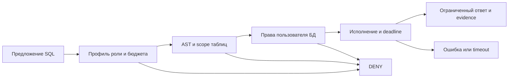

# 10 — Аналитический SQL и ограниченные data capabilities

## Цель и предварительные знания

[Лекция 09](LECTURE-0009-mcp-interface.md) объяснила, как host вызывает
инструмент через MCP, но не выводила право на чтение данных из факта
подключения. Здесь разберём следующий вопрос: **какое именно наблюдение
агенту нужно получить из аналитической базы и как ограничить цену и область
такого наблюдения?** Цель — построить модель *read capability*, а не
выучить синтаксис ClickHouse. Достаточно знать, что SQL-запрос может
фильтровать, группировать и агрегировать строки.

## От вопроса к минимальной поверхности чтения

Агенту, который выясняет, существует ли таблица заказов и пригодна ли
валюта заказа для расчёта, не обязательно сразу видеть каждую запись.
Есть три разных уровня наблюдения:

| Нужный ответ | Достаточная поверхность | Что из неё не следует |
| --- | --- | --- |
| Какие таблицы и поля доступны? | Метаданные каталога, например `list_tables` с детализацией столбцов | Что значения полей заполнены и корректны |
| Сколько значений отсутствует и каков диапазон дат? | Профиль: счётчики, доли, `min`/`max` | Какие именно строки ошибочны и почему |
| Как меняется показатель по допустимым группам? | Агрегат по явно выбранным измерениям | Определение показателя и качество каждого исходного события |

Это не линейная лестница, по которой агент обязан пройти все ступени.
Уровень выбирают по вопросу: метаданные не заменят профиль пропусков, а
сырые строки не нужны для простого счётчика. Такую **analytical query
scope** в общем случае задают ресурс (база, таблица, столбцы), операция,
детализация и временной интервал. Не все эти измерения ограничены в
нашем текущем профиле. «Read-only» описывает отсутствие разрешённой записи,
но ничего не говорит о том, какие данные допустимо раскрыть.

Anthropic в [статье об эффективных tools](https://www.anthropic.com/engineering/writing-tools-for-agents)
предлагает проектировать операции под задачи агента, а не механически
оборачивать каждый API endpoint. Отсюда наш вывод: специализированное
`profile_orders` с заранее выбранными полями может быть понятнее и уже,
чем универсальное `run_query(sql: string)`. Это проектный вариант, а не
утверждение, что такой отдельный MCP tool уже реализован. В текущем
проекте Analyst использует фиксированный профильный SQL через разрешённый
`clickhouse.run_query`; ограничения наложены на вызов и запрос, а не
выражены отдельным upstream tool.

## Read capability — пересечение разрешений

**Read capability** в этой лекции — конкретное право роли получить
ограниченное наблюдение из конкретного источника при заданном бюджете.
Схема аргументов инструмента описывает форму запроса, но не это право.
Практически разрешение получается лишь тогда, когда одновременно
выполнены условия нескольких слоёв:

1. Профиль роли допускает tool и базы, а оставшийся бюджет — ещё один
   вызов. Проверка производится кодом над типизированным запросом.
2. SQL проходит разбор и локальную политику: одна query expression,
   разрешённые ссылки на таблицы и функции, явно ограниченный результат.
3. Учётная запись БД имеет собственные права на нужные объекты. Она не
   должна наследовать DDL/DML только потому, что tool описан как read-only.
4. Исполнение и возвращаемое наблюдение контролируются бюджетами времени
   и объёма вывода. CPU, память и объём сканирования требуют отдельных
   server-side ограничений: локальный профиль их не задаёт.

Эти условия не взаимозаменяемы. Если AST-пропуск ошибочно допустил
таблицу вне разрешённых БД, grants БД остаются отдельной защитой; если grants
шире, синтаксическая проверка сама по себе не создаёт row-level privacy.
Пересечение здесь — **инженерная цель**, а не математическое доказательство
полной безопасности всех SQL-конструкций и функций движка. Права на
таблицу также не определяют, достаточен ли ответ для бизнес-вопроса:
доказательность фактов будет темой [лекции 12](../modules/module-12-analyst-provenance/README.md).

## Почему `SELECT` и `LIMIT` не равны безопасному чтению

Первое различие — **форма SQL против фактического источника**. В ClickHouse
табличная функция `url()` позволяет читать внешний HTTP-ресурс внутри
`SELECT`. Это пример, когда слово `SELECT` не означает «только локальная
таблица в разрешённой базе»; см. [документацию ClickHouse](https://clickhouse.com/docs/reference/functions/table-functions/url).
Другие функции и движки также требуют анализа фактических эффектов и
доступных прав. Нельзя объявлять любой `SELECT` свободным от сетевого
доступа или побочных действий только по первому токену.

Второе различие — **строки ответа против работы движка**. Запрос
`SELECT count() FROM raw.orders LIMIT 1` возвращает одну строку, но для
подсчёта может прочитать множество исходных строк. Даже более узкая
агрегация может сортировать, соединять или группировать большой объём.
Следовательно, верхний `LIMIT` и лимит байтов ответа ограничивают
*наблюдение*, а не сами по себе CPU, память, число прочитанных строк или
внешний трафик. Отдельный deadline, ограничения базы и мониторинг затрат
нужны, когда стоимость исполнения существенна; локальный timeout не
следует путать с доказанной отменой уже запущенной серверной операции.

Третье различие — **агрегат против приватности**. `GROUP BY` с малой
группой может фактически раскрыть значение одной записи. Агрегация
уменьшает детализацию ответа, но не является автоматически процедурой
обезличивания. Политика чувствительных полей, минимального размера группы
или разрешённых срезов должна быть отдельным решением. В нашем коде
такая универсальная privacy policy не реализована.

## Диаграмма: составная граница запроса

Как предложение SQL превращается в ограниченное наблюдение — или
останавливается до вызова БД?

Рисунок 1. Логическая модель нескольких барьеров, а не точный call graph
нашего gateway. Сплошные стрелки показывают продолжение или отказ; цвет
не кодирует решение. База может отказать уже при исполнении, а gateway
оформляет этот результат как ошибку. В частности, диаграмма **не** обещает
атомарную отмену SQL после timeout или предварительное ограничение памяти
движка локальным профилем.

Текстовый эквивалент: runtime получает SQL proposal; policy проверяет роль,
инструмент, бюджет и AST. При отказе до удалённого вызова запрос не попадает
в БД. После допуска учётная запись БД применяет собственные права.
Результат либо ошибка исполнения возвращается через gateway; объём
наблюдения ограничивается, исход фиксируется в evidence. Ошибка/timeout
не доказывают, что сервер не затратил ресурсы.

## Иллюстрация нашей системой: что проверено, а что нет

В [политике инструментов](../../policies/tool_policy.py) `sqlglot` разбирает
запрос в диалекте ClickHouse. Текущий gate требует ровно одно query
expression, запрещает query `SETTINGS`, распознанные AST table functions и перечисленные
в коде внешние/dictionary functions. Физические таблицы должны иметь
квалификатор разрешённой базы; top-level `LIMIT` должен быть целым
литералом от 1 до `max_query_rows`. Для `dbt.show` предел задаётся
отдельным аргументом, поэтому top-level SQL `LIMIT` там отклоняется.
Это точное описание проверок кода на 2026-09-17, не заключение о
полноте SQL-санитайзера для всех версий ClickHouse.

[Профиль Analyst](../../policies/profiles/analyst_v1.json) допускает
`clickhouse.list_tables` и `clickhouse.run_query` в `raw` и `analytics`,
не даёт записываемых файловых путей и ограничивает запрос 50 строками,
6 tool calls, 240 секундами суммарного wall-time и 400 000 байтами
вывода. [Профиль Data Engineer](../../policies/profiles/data_engineer_v1.json)
имеет другие бюджеты и, помимо чтения, отдельные dbt/workspace
capabilities; поэтому эти роли нельзя считать эквивалентными только по
совпадающему SQL tool. В [SQL grants](../../platform/clickhouse/security/001_mcp_users.sql)
`mcp_reader` получает `SELECT` на `raw.*` и `analytics.*`, а `dbt_agent`
имеет дополнительные write/DDL права в `analytics.*`. Это разные
database identities: [Compose-конфигурация](../../docker-compose.yml)
по умолчанию настраивает ClickHouse MCP на `mcp_reader`, не на dbt writer;
переменная окружения может переопределить это значение.

Например, [профильный запрос Analyst](../../runtime/analyst.py) считает
заказы, число валют, пропуски и диапазон дат в `raw.orders` и завершён
`LIMIT 1`. Одна строка результата достаточна для вопроса о заполненности
и диапазоне, но не удостоверяет смысл валюты или корректность каждого
заказа. `raw.orders` здесь — разрешённая область наблюдения, не вывод о
качестве источника. [Gateway](../../runtime/tools/mcp_gateway.py)
повторно авторизует вызов, учитывает накопленные бюджеты, ставит deadline
и проверяет размер уже полученного текстового результата. Последнее
**не** является server-side ограничением объёма формирования ответа.

Датированное [evidence STEP-0008](../../plan/evidence/STEP-0008-tool-policy-layer.md)
фиксирует, что DDL-попытка была отклонена до MCP execution, а
`mcp_reader` в том локальном grant probe мог выполнить `SELECT 1`, но
не `INSERT`. Это historical-live наблюдение 2026-09-11, а не
доказательство отсутствия всех SQL обходов, текущего состояния каждого
контейнера или качества LLM.

## Материализация меняет вид знания, а не право на вывод

Запрос к сырой таблице, вычисляемое представление и заранее сохранённый
аналитический результат могут отвечать на похожий вопрос, но отражают
разные моменты и правила формирования данных. В статье
[ClickHouse о materialized views](https://clickhouse.com/blog/using-materialized-views-in-clickhouse)
показано, как incremental materialized view при вставке в исходную
таблицу записывает вычисленный результат в target table. Мы используем
из статьи идею **наблюдаемого результата преобразования**: когда агент
читает готовый агрегат, он видит не те же исходные события, а данные,
подготовленные выбранной логикой и временем обновления. Это не утверждение,
что все materializations одинаково обновляются.

В нашем [dbt проекте](../../platform/dbt/dbt_project.yml) marts настроены
как `table`, а не как описанный в статье incremental ClickHouse materialized
view. Для решения «какому результату доверять» нужны знание определения,
момента сборки и проверок, но сама эта лекция не объясняет граф dbt,
`grain` и тесты: их primary owner — [лекция 11](../modules/module-11-dbt-semantics/README.md).
Read grant на готовую таблицу не доказывает её актуальность и не заменяет
provenance наблюдения.

## Контрпример и пределы подхода

Представим допустимый `SELECT count() FROM raw.orders LIMIT 1` на очень
большой таблице. Он проходит форму read-query, таблица разрешена, ответ
содержит одну строку. Но этот факт не гарантирует малую стоимость: сервер
может выполнить существенную работу до выдачи строки. В другом случае,
если ответ берут из ещё не обновлённой производной таблицы, даже дешёвое
чтение не делает его актуальным. Если счётчик группируется по уникальному
идентификатору клиента, «агрегат» может раскрыть индивидуальные данные.

Минимальная поверхность чтения уменьшает риск и объём контекста модели,
но остаются пределы: неполный parser policy, широкие grants внутри
разрешённых баз, цена исполнения до timeout и семантика производных
данных. Для более строгого production-контракта потребовались бы
дополнительные server-side resource constraints, ограничения объектов и
полей, проверки функций и чувствительности результатов; это возможное
усиление, **не заявленное как уже реализованное**. Вопросы identity и
защиты от враждебного содержимого принадлежат
[лекции 19](../modules/module-19-security-authority/README.md).

## Резюме

Аналитическое чтение следует проектировать от вопроса к минимально
достаточному наблюдению: metadata, профиль или выбранный агрегат.
Read capability возникает из сочетания scope инструмента, проверки SQL,
прав БД и бюджета, а не из слова `SELECT` или MCP schema. `LIMIT`
ограничивает число строк ответа, но не цену расчёта; materialization
влияет на смысл и свежесть видимых данных, а не сама по себе на их
истинность.

## Вопросы для самопроверки

1. Почему список таблиц, профиль пропусков и агрегат по группам отвечают
   на разные вопросы, хотя все являются read-only наблюдениями?
2. Что позволяет запросу с `SELECT` и `LIMIT 1` выйти за задуманный
   scope или потребить значительные ресурсы?
3. Какие разные отказоустойчивые границы дают AST policy и grants БД,
   и какую гарантию не даёт ни одна из них по отдельности?
4. Почему сохранённый агрегат не равен сырому источнику и какие сведения
   нужны для интерпретации его значения?
5. Что именно подтверждает исторический DDL denial из STEP-0008, а чего
   он не подтверждает?

## Что дальше

Мы ограничили доступ к аналитическому наблюдению, но ещё не разобрали,
как возникает сама таблица фактов и почему тесты dbt проверяют одни
свойства, а бизнес-смысл остаётся отдельным вопросом. Это тема
[лекции 11 — dbt, lineage и семантика аналитической модели](../modules/module-11-dbt-semantics/README.md).

## Источники и границы утверждений

- [Anthropic, *Writing effective tools for agents — with agents*](https://www.anthropic.com/engineering/writing-tools-for-agents):
  идея узкой полезной операции и ограниченного output; проверено
  2026-09-17, не количественный результат нашей платформы.
- [ClickHouse, *Using Materialized Views in ClickHouse*](https://clickhouse.com/blog/using-materialized-views-in-clickhouse):
  incremental view как insert-trigger с target table; проверено
  2026-09-17, не описание materialization нашего dbt mart.
- [ClickHouse, документация `url()` table function](https://clickhouse.com/docs/reference/functions/table-functions/url):
  пример внешнего источника в `SELECT`; проверено 2026-09-17.
- Локальные code/evidence anchors указаны в разделе «Иллюстрация нашей
  системой». Код относится к текущему checkout; STEP-0008 —
  датированный результат, не новая live проверка.
