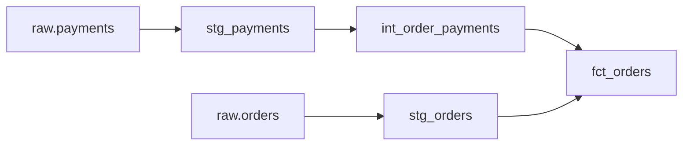

# 11 — dbt и семантика аналитической модели

## Цель и предварительные знания

В [лекции 10](LECTURE-0010-analytical-sql.md) мы ограничили право агента
читать аналитические данные. Но разрешённый и быстро выполненный запрос
может вернуть неверный бизнес-показатель. Теперь вопрос другой: **какую
единицу представляет строка аналитической модели, как она получена и какие
проверки действительно поддерживают её смысл?** Достаточно понимать
`JOIN`, `GROUP BY` и различие между исходным событием и агрегатом.

[dbt Labs описывает analytics engineering](https://www.getdbt.com/blog/what-is-analytics-engineering)
как создание пригодных для анализа наборов данных с помощью
преобразований, тестов и документации. Мы берём из этой статьи принцип:
аналитическая таблица — инженерный продукт с явно сформулированным
контрактом, а не просто SQL, который удалось исполнить. Ниже этот принцип
разобран на нашем проекте; роли и организационное устройство команд из
статьи не переносим в него автоматически.

## Grain: смысл одной строки

**Grain (зерно модели)** — что означает *одна* строка результата и при
каких условиях две строки считаются разными. Фраза «таблица заказов»
недостаточна: это может быть строка на заказ, позицию заказа, попытку
оплаты или заказ в каждый день его жизненного цикла. Перед расчётом
показателя нужно назвать и grain, и ключ, который должен его удерживать.

В [нашем проекте dbt](../../platform/dbt/models/models.yml) `stg_payments`
описана как одна строка на попытку оплаты (`payment_id`), а
`int_order_payments` — одна строка на заказ **с успешными попытками оплаты**
(`order_id`). Переход происходит в
[`int_order_payments.sql`](../../platform/dbt/models/intermediate/int_order_payments.sql):
фильтр оставляет успешные попытки, `GROUP BY order_id` считает их число
и сумму. Модель `fct_orders` имеет grain «одна строка на заказ», в том
числе заказ без успешной оплаты: `LEFT JOIN` промежуточной модели и
`ifNull(..., 0)` задают для неё нулевой компонент оплаты. Это
*спецификация нашего SQL*, а не всеобщее свойство dbt.

Формально желаемый инвариант финальной модели: для каждого выбранного
`order_id` существует не более одной строки `fct_orders`; отдельно
бизнес-требование может потребовать, чтобы каждый исходный заказ был
представлен ровно один раз. Первое проверяется парой `unique` и
`not_null` на ключе. Второе из них **не следует**: пустая таблица тоже
не содержит ни дублирующих, ни NULL-ключей. Поэтому проект добавляет
отдельный [сверочный тест числа заказов](../../platform/dbt/tests/assert_fct_orders_matches_source_count.sql),
но даже совпавшие количества без сверки ключей не исключают обмена
одних заказов на другие. Выбор проверок определяется тем, какой именно
инвариант нужен, а не желанием накопить больше зелёных индикаторов.

## Граф преобразований и lineage

В нашем dbt-проекте *модель* — SQL-узел, преобразующий входные данные
в отношение.
`source()` обозначает объявленный внешний источник, а `ref()` — ссылку
на другую модель и зависимость между узлами. По этим ссылкам dbt строит
порядок выполнения; [документация `ref()`](https://docs.getdbt.com/reference/dbt-jinja-functions/ref)
отдельно предупреждает, что скрытая при разборе ссылка может не попасть
в граф. Такой lineage отвечает на вопрос «от каких объявленных узлов
зависит результат?», но сам по себе не отвечает на вопросы «верна ли
формула?» и «свежи ли строки?».

Рисунок 1. Упрощённый фрагмент [фактического dbt-графа](../../platform/dbt/models/marts/fct_orders.sql).
Не показаны ветви клиентов и возвратов, которые тоже входят в
`fct_orders`. Стрелки идут от upstream к downstream; цвет и размещение
не кодируют качество или последовательность SQL-операторов внутри узла.

Текстовый эквивалент: `raw.payments → stg_payments → int_order_payments
→ fct_orders`; параллельно `raw.orders → stg_orders → fct_orders`.
Клиенты и возвраты на рисунке опущены. Наличие пути означает зависимость,
а не подтверждение корректности суммы.

В проекте каталоги `staging/`, `intermediate/`, `marts/` выражают три
задачи. Staging нормализует поля источника, например
[`stg_payments.sql`](../../platform/dbt/models/staging/stg_payments.sql)
приводит валюту к верхнему регистру и статус — к нижнему, сохраняя
grain попытки. Intermediate собирает переиспользуемые компоненты с
другим grain, например сумму успешных оплат по заказу. Marts представляют
потребительские факты и измерения, здесь `fct_orders` и
`dim_customers`. Это соглашение *данного* проекта, не обязательная
трёхслойная форма всякого dbt-проекта. В
[`dbt_project.yml`](../../platform/dbt/dbt_project.yml) staging и
intermediate материализуются как `view`, marts — как `table`.
Материализация определяет физическую форму и момент обновления, но не
автоматически смысл строк.

## Четыре проверки — четыре разных свидетельства

Ошибочно представлять `parse → compile → build → test` как четыре
синонима слова «валидно». Каждый шаг отвечает на более конкретный
вопрос, и его результат имеет область действия:

| Стадия | Что она подтверждает при успехе | Чего не подтверждает |
| --- | --- | --- |
| [`dbt parse`](https://docs.getdbt.com/reference/commands/parse) | dbt прочитал и разобрал проект, сформировал manifest и объявленный граф | SQL не обязательно скомпилирован; warehouse и данные не проверены |
| [`dbt compile`](https://docs.getdbt.com/reference/commands/compile) | Выбранный Jinja/SQL может быть скомпилирован для профиля и адаптера | Модель не обязательно материализована, данные и метрика не проверены |
| [`dbt build`](https://docs.getdbt.com/reference/commands/build) | Выбранные ресурсы выполнялись в порядке зависимостей, включая выбранные тесты по семантике команды | Не доказана полнота невыбранных узлов и правильность необъявленных бизнес-условий |
| [`dbt test`](https://docs.getdbt.com/reference/commands/test) | Выбранные тестовые утверждения прошли на доступном состоянии уже созданных ресурсов | Не доказана истинность всех фактов, актуальность источника и неизменность данных после проверки |

`parse` не подключается к warehouse и manifest после него не содержит
скомпилированного SQL. Напротив, `compile` **может выполнять
интроспективные запросы** к платформе данных для макросов вроде
`run_query`; поэтому его нельзя безусловно считать чистой локальной
операцией. `build` применим к выбранным ресурсам: выборка через
`--select` сужает доказанное покрытие. `test` ожидает существующие
отношения и проверяет именно объявленные тесты. Нельзя автоматически
считать `dbt test` обязательным отдельным шагом после `dbt build`:
последний способен включать тесты в свой цикл. Эти ограничения следуют
из [документации compile](https://docs.getdbt.com/reference/commands/compile),
[build](https://docs.getdbt.com/reference/commands/build) и
[test](https://docs.getdbt.com/reference/commands/test).

[Статья dbt Labs о тестировании](https://www.getdbt.com/blog/data-testing)
полезна здесь идеей тестов как записанных предположений о данных:
`unique` и `not_null` удерживают ожидаемый ключ, `accepted_values`
фиксирует допустимые статусы, `relationships` проверяет объявленную
ссылку. В [нашем `models.yml`](../../platform/dbt/models/models.yml)
эти проверки есть у `fct_orders`. Кроме того, в `tests/` лежат
предметные SQL-утверждения об оплатах и возвратах. Но ни встроенные,
ни предметные проверки не могут обнаружить условие, которое никто не
сформулировал. Успешный тест — свидетельство об указанном предикате
на момент исполнения, не сертификат всей бизнес-онтологии.

## Контрпример: граф верен, метрика ошибочна

Пусть один заказ на 100 условных единиц оплачен двумя *успешными*
попытками по 60 и 40. В модели попыток две строки, в агрегате по
`order_id` — одна строка с суммой 100. Если соединить `stg_payments`
напрямую с `stg_orders` и затем суммировать `order_total_cents`,
получится 200: grain соединения уже «заказ × попытка», а мера заказа
дублируется. SQL может успешно компилироваться и выполняться, `ref()`
создаст корректные зависимости, проверки допустимых статусов пройдут.
Семантическую ошибку обнаружит только утверждение, сопоставляющее
фактический grain и ожидаемую формулу, либо независимая сверка
результата. Именно поэтому промежуточный агрегат не является просто
«удобным слоем»: он делает границу grain видимой.

Есть и обратная ловушка. Наша текущая модель считает **все** попытки
со статусом `succeeded`. Если реальное бизнес-правило — учитывать
только окончательно проведённый платёж, а источник помечает повторную
успешную попытку без последующего сторно, `unique(order_id)` после
агрегации пройдёт, но сумма окажется неверной. Этот сценарий —
гипотетическое изменение смысла источника, не обнаруженный дефект
текущего набора данных. Его нельзя исправить добавлением ещё одного
синтаксического gate; нужен согласованный бизнес-контракт и проверка
соответствующих событий.

## Три графа, три вида ответственности

Сходство слова «граф» скрывает разные единицы управления:

| Граф | Узлы и рёбра | Главный вопрос |
| --- | --- | --- |
| dbt lineage | Источники, модели, тесты и объявленные зависимости | Из чего и в каком порядке строится отношение? |
| Airflow DAG | Операционные задачи и зависимости запуска | Когда выполняется pipeline и что делать при сбое задачи? |
| Multi-agent workflow | Роли, typed artifacts, gates и переходы состояния | Кто имеет право предложить, проверить и принять изменение? |

В [нашем Airflow DAG](../../platform/airflow/dags/cosmos_pipeline.py)
`load_raw` предшествует `DbtTaskGroup`, а `publish` идёт после него.
[Cosmos](https://astronomer.github.io/astronomer-cosmos/getting_started/core-concepts.html)
переводит dbt-проект в Airflow tasks/task group; здесь настроен
`TestBehavior.AFTER_ALL`, поэтому тесты сгруппированы после моделей,
а не после каждой из них
([документация поведения тестов](https://astronomer.github.io/astronomer-cosmos/guides/translate_dbt_to_airflow/testing-behavior.html)).
Это *интеграция графа преобразований в граф исполнения*, а не
тождество графов: Airflow добавляет `load_raw`, `publish`, расписание
и состояние задач. И ни один из этих узлов сам по себе не даёт агенту
права менять dbt-код или принимать бизнес-метрику. Это решает отдельный
контрольный workflow, рассмотренный в [лекции 06](LECTURE-0006-strict-workflow.md).

Историческое [evidence STEP-0004](../../plan/evidence/STEP-0004-airflow-cosmos.md)
фиксирует для снимка 2026-09-05 сборку восьми моделей, 68 тестов и
положительные 11-task Cosmos runs, а также failure probe, в котором
`publish` не выполнился после ошибки теста. Это подтверждение конкретной
конфигурации и запуска на дату, не постоянная гарантия текущего
warehouse, всех будущих входных данных или автономного принятия
агентских изменений.

## Итог и вопросы для самопроверки

Семантический контракт модели начинается с grain и ключа; lineage
объясняет зависимости, а тесты — лишь явно сформулированные свойства.
`parse`, `compile`, `build` и `test` дают разные, ограниченные
свидетельства. Cosmos соединяет dbt с операционным Airflow, но не
сливает data orchestration с управлением агентами.

1. Почему `unique(order_id)` у `fct_orders` не доказывает присутствие
   каждого исходного заказа?
2. Что изменится в grain, если до агрегации соединить заказ с двумя
   попытками оплаты, и какой показатель может удвоиться?
3. Почему успешный `dbt compile` нельзя называть ни полностью offline,
   ни подтверждением правильности метрики?
4. Какая зависимость видна в dbt lineage, но не выражает полномочия
   агента на изменение модели?

Следующая [лекция 12](../modules/module-12-analyst-provenance/README.md)
перенесёт вопрос с построения отношений на происхождение и достаточность
наблюдений Analyst: как зафиксировать, **на каких данных** основано
утверждение, не подменяя provenance одним зелёным тестом dbt.
