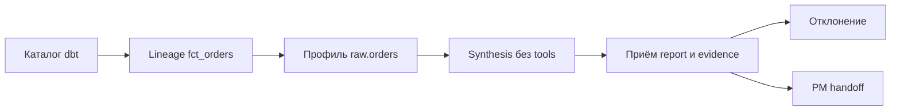

# 12 — Analyst: discovery и provenance фактов

## Цель и предварительные знания

[Лекция 11](LECTURE-0011-dbt-semantics.md) показала, откуда строится
аналитическая модель и что доказывают её проверки. Даже корректный граф
моделей не отвечает на вопрос нового требования: **какие сведения о
данных действительно наблюдал Analyst, что он только предполагает и чего
ему пока не хватает для PM specification?** Нам понадобится различать
схему данных, зависимость моделей и агрегированное наблюдение. Жизненный
цикл состояния из [лекции 04](LECTURE-0004-state-memory.md) здесь не
повторяется: нас интересует происхождение *конкретного утверждения*.

## Semantic discovery: найти данные — не определить показатель

**Semantic discovery** — поиск источников, полей, моделей и признаков их
смысла применительно к вопросу пользователя. Это не принятие бизнес-
определения метрики. Поле `currency` может существовать, но само его
название не говорит, хранится ли в нём валюта заказа, оплаты или
отчётности. Таблица с названием `orders` может быть доступна, но этого
недостаточно, чтобы решить, включать ли отменённые заказы в выручку.

У Analyst есть три разных типа наблюдения:

| Наблюдение | Что оно даёт | Типичный недопустимый вывод |
| --- | --- | --- |
| Каталог ресурсов; при наличии — схема | Какие источники и модели объявлены; схема отдельно раскрывает поля и типы | «Названия доказывают бизнес-смысл каждого поля» |
| Lineage модели | От каких объявленных узлов зависит результат | «Зависимость доказывает верность формулы или свежесть данных» |
| Профиль данных | Что показал конкретный агрегирующий запрос на доступном состоянии | «Одно число описывает все релевантные таблицы и будущие данные» |

[Zhamak Dehghani в статье о Data Mesh](https://martinfowler.com/articles/data-mesh-principles.html)
разделяет возможность *найти* данные и возможность *понять и использовать*
их как продукт. Отсюда наш вывод для Analyst: inventory — только вход в
исследование; требуется ещё проверить путь происхождения и свойства
наблюдаемого содержимого. Наша платформа не объявляется реализацией
Data Mesh: мы переиспользуем концептуальное различие, а не её
организационную архитектуру.

## Provenance: от наблюдения к ограниченному факту

**Provenance факта** — связь утверждения с конкретным наблюдением,
его источником, параметрами и временем получения, а также с областью,
в которой утверждение допустимо. Полезный «факт» в отчёте имеет форму:
«в ответе на такой-то запрос к такому-то источнику получено X», а не
«X навсегда истинно для бизнеса». Например, агрегат по `raw.orders`
может подтвердить, сколько строк запрос увидел *в момент выполнения*;
он не устанавливает правила признания выручки.

В нашей системе [контракт `AnalysisFact`](../../contracts/artifacts.py)
содержит `kind`, `statement` и `evidence_ids`. При принятии черновика
[`accept_analyst_drafts`](../../runtime/analyst.py) требует успешный
read-only tool outcome для каждой из трёх фаз, тот же task, допустимую
категорию факта и буквальное вхождение `statement` в текст именно её
tool output. Код создаёт fact ID и привязывает его к evidence этой
фазы; [контракт отчёта](../../contracts/artifacts.py) дополнительно
проверяет наличие и успешность указанных evidence. Tool evidence
содержит время начала/окончания, хеш аргументов и ссылку на сохранённый
вывод; доменное evidence удерживает эту ссылку. Это предотвращает приём *неподкреплённого текстом наблюдения*
нового факта, но не является доказательством истинности базы,
репрезентативности выборки или корректности интерпретации цитаты.
Буквально скопированная строка тоже может быть устаревшей или двусмысленной.

**Предположение** — объяснение или условие, ещё не подтверждённое
наблюдением в требуемой области. **Открытый вопрос** — недостающий выбор
или знание, без которого нельзя безопасно продолжить спецификацию.
**Риск** описывает возможное последствие этой неопределённости. Эти
категории не превращаются в факты от повторения в нескольких model calls:
если источник не наблюдался, synthesis должен сохранить вопрос, а не
выдать правдоподобную догадку как ответ. Само бизнес-определение и
решение о готовности требований принадлежат [PM в лекции 13](../modules/module-13-pm-specification/README.md).

## Как устроен наш ограниченный Analyst

Почему Analyst не получает сразу весь каталог, весь SQL и историю
обсуждений? Ограниченный контекст повышает различимость источника каждого
утверждения. [Anthropic описывает](https://www.anthropic.com/engineering/effective-context-engineering-for-ai-agents)
постепенное получение релевантного контекста по мере необходимости;
это идея отбора сигнала, а не основание считать любой поиск корректным.
Наша реализация намеренно уже: здесь порядок и аргументы запросов
задаются кодом, а не свободным поиском модели.

[`AutonomousAnalystExecutor`](../../runtime/analyst_workflow.py) выполняет
три отдельные tool-enabled model invocations:

1. Metadata: `dbt_list` только для объявленных моделей и источников.
   Возвращаемые факты могут иметь категории `SOURCE` и `MODEL`.
2. Lineage: `dbt_get_lineage_dev` для фиксированного
   `model.agentic_data_platform.fct_orders` с depth 2; разрешена
   категория `LINEAGE`.
3. Profile: фиксированный aggregate SQL к `raw.orders`, считающий
   число заказов, валют, пропуски валюты и диапазон `ordered_at`;
   разрешена категория `PROFILE`.

Каждый вызов получает свой короткий phase prompt и ровно один
кодом выбранный tool facade; runtime проверяет, что появился ровно один
tool evidence и что имя/хеш аргументов каждого вызова совпали с
ожидаемым планом. **Fresh phase** означает новый модельный вызов с
ограниченным инструментом, а не забвение прошлого: предыдущие
черновики передаются дальше как *untrusted prior findings*.
Четвёртый вызов — synthesis — не имеет инструментов и возвращает
предположения, вопросы, риски и следующие шаги без новых `facts`.
Затем trusted boundary создаёт отчёт и
[`PMRequirementsHandoff`](../../runtime/analyst.py) только из принятого
артефакта для того же workflow/task. Даже если модель красиво напишет
«проверено», несовпадение tool plan или отсутствие нужного evidence
не должно превратиться в принятый факт.

Рисунок 1. Логическая схема [текущего Analyst workflow](../../runtime/analyst_workflow.py),
стрелки показывают порядок трёх вызовов и финальной приёмки. Tool count
проверяется также после каждой отдельной фазы; `Отклонение` — отказ trusted boundary при нарушении
контракта, а не дополнительный этап анализа. Цвет не кодирует исход.

Текстовый эквивалент: Analyst последовательно читает каталог dbt,
lineage `fct_orders` и агрегированный профиль `raw.orders`; для каждого
наблюдения проверяется ровно один допустимый tool outcome. После трёх
фаз synthesis без инструментов формирует предположения и вопросы.
При приёмке report проверяются допустимые категории и привязка фактов
к успешному evidence; нарушение отклоняется, принятый report попадает
в typed handoff PM.

В датированном [STEP-0012 evidence](../../plan/evidence/STEP-0012-analyst-requirements-discovery.md)
записаны две успешные live-проверки на 2026-09-13: canonical и
ambiguous-metric. Вторая сохранила открытые вопросы вместо
самостоятельного выбора определения метрики. Это исторические
наблюдения двух случаев, а не статистическая оценка надёжности,
не текущий live status и не доказательство fully-live six-role READY.
В [`analyst_cases.json`](../../tests/fixtures/analyst_cases.json)
перечислены также ожидаемые сигналы для missing source, semantic
conflict, late-arriving data и metadata prompt injection; сам список
кейсов не является свидетельством живого успешного прогона каждого из них.

## Контрпример: доступный источник не равен достаточному ответу

Представим требование «рассчитать Net Revenue в единой валюте после
возвратов». Каталог находит `raw.orders`; lineage показывает связь
`fct_orders` с заказами, оплатами и возвратами. Профиль `raw.orders`
сообщает, что в увиденных строках одна валюта и нет пустых значений.
Можно ли считать определение готовым? Нет. Запрос
[`ANALYST_PROFILE_SQL`](../../runtime/analyst.py) вообще не анализирует
валюты оплат и возвратов, наличие FX-конверсии, полный охват
платежей и правила учёта частичного возврата. Он агрегирует только
`raw.orders`; даже если агрегат выполнен по всей доступной таблице,
его вывод ограничен этой таблицей и моментом чтения. Если бы вместо
полной таблицы брали выборку, к этим границам добавилась бы
репрезентативность отбора. Название `Net Revenue` не восполняет пробел.

Следовательно, корректный результат discovery — не выдуманное число и
не навязанная формула, а наблюдаемые факты с их provenance, явно
обозначенные предположения и вопрос к владельцу требования о валюте,
моменте признания и политике возвратов. Факт доступности модели и
**достаточность evidence для спецификации** — разные утверждения.
Текущий Analyst не имеет общего корпуса для расследования аномалий:
его три фиксированных probe не просматривают произвольные события
платежей, возвратов или позднего поступления. Если нужно глубже
исследовать эти области, требуется отдельное разрешённое расширение
плана наблюдений, а не незаметное повышение уверенности отчёта.

## Итог и вопросы для самопроверки

Analyst соединяет три вида чтения — каталог, lineage и профиль — с
конкретными evidence, но не подменяет PM. Provenance делает видимыми
источник и предел вывода каждого утверждения. Exact quote и успешный
tool call — необходимые элементы нашего контракта, а не гарантия
полной истинности или бизнес-достаточности.

1. Почему наличие поля `currency` в каталоге не доказывает его роль в
   расчёте выручки?
2. Какой предел остаётся у факта, текст которого буквально присутствует
   в успешном tool output?
3. Почему профиль заказов с одной валютой не закрывает требование о
   Net Revenue после возвратов?
4. Что означает «fresh» для трёх фаз Analyst, если предыдущие
   результаты передаются следующему вызову?
5. Какое решение нужно оставить PM или пользователю, даже если
   все три read phases прошли успешно?

В [лекции 13](../modules/module-13-pm-specification/README.md) этот
handoff станет входом в формальную спецификацию: там разберём, как
согласовать бизнес-смысл, проверяемые критерии и нерешённые вопросы,
не маскируя неопределённость статусом «готово».
