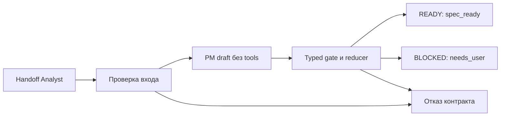

# 13 — PM: формальная спецификация и пределы знания

## Цель и предварительные знания

[Лекция 12](LECTURE-0012-analyst-provenance.md) отделила наблюдения
Analyst от предположений и открытых вопросов. Следующий шаг — не
«дописать красивое описание», а принять решение: **достаточно ли
согласованного бизнес-смысла, чтобы разрешить реализацию, и что делать,
если существенный выбор ещё не сделан?** Здесь PM означает роль,
отвечающую за перевод намерения пользователя в проверяемую
спецификацию. Код и ограничения этой роли не делают её всеведущей.

## От намерения к контракту показателя

Запрос «покажите Net Revenue каждый день» выражает *цель*, но оставляет
несколько несовместимых реализаций. Нужно решить, какие события входят
в сумму, когда они относятся к отчётному периоду, по каким измерениям
допустима разбивка, как обрабатываются валюты, пустые значения и
опоздавшие события. **Определение бизнес-метрики** — согласованное
правило, которое для заданных событий и разрезов однозначно задаёт
значение и его область применимости. Формула без правил времени,
единиц и исключений ещё не является полным определением.

Четыре вида утверждений нельзя подменять друг другом:

| Вид | Пример для Net Revenue | Кто и чем его обосновывает |
| --- | --- | --- |
| Намерение | «Нужна ежедневная чистая выручка для анализа каналов» | Владелец потребности задаёт цель и вопросы потребителя |
| Наблюдаемый факт | «В доступном каталоге есть модель `fct_orders`; профиль заказов вернул такой-то результат» | Analyst привязывает утверждение к конкретному evidence и его области |
| Нормативное правило | «Успешный возврат относится к UTC-дате исходного заказа» | Уполномоченный владелец бизнес-смысла подтверждает выбранное правило |
| Критерий приёмки | «На объявленном grain сумма равна успешным оплатам минус успешные возвраты» | Спецификация задаёт проверяемое свойство результата; тест проверяет реализацию |

Последние два пункта связаны, но не тождественны. Критерий приёмки
делает правило наблюдаемым в результате: он указывает условия
проверки, не создаёт само правило. Хорошая спецификация также
называет источники, измерения, временную атрибуцию, нефункциональные
ограничения и важные неопределённости. **Grain** как свойство одной строки
разобран в [лекции 11](LECTURE-0011-dbt-semantics.md); здесь PM
фиксирует выбранный grain как часть бизнес-контракта, а не повторно
объясняет механику `JOIN`.

[dbt Labs пишет о централизованных определениях метрик](https://www.getdbt.com/blog/build-centralize-and-deliver-consistent-metrics-with-the-dbt-semantic-layer):
одинаковые названия при разных формулах в инструментах подрывают
сопоставимость результатов; вместе с числом нужен контекст расчёта.
Мы переносим отсюда принцип **единого явного определения**, но не
утверждаем, что в нашем репозитории установлен dbt Semantic Layer или
MetricFlow. В [архитектурной статье Zhamak Dehghani](https://martinfowler.com/articles/data-mesh-principles.html)
потребители аналитических данных рассматриваются как пользователи
data product. Отсюда ещё один вывод для PM: критерии должны отвечать
на реальные вопросы потребителя, а не ограничиваться тем, что
существующие таблицы технически можно соединить. Это не утверждение,
что наша платформа реализует Data Mesh.

## Readiness — решение, а не количество заполненных полей

**Requirements readiness** — возможность передать контракт исполнителю
без необходимости угадывать существенные бизнес-правила. Для неё
нужны: согласованная цель, определение показателя, выбранные grain и
измерения, требования к источникам и проверяемые критерии приёмки.
Наличие всех полей в JSON — необходимая формальная проверка, но не
доказательство правильности решения. Если смысл спорного события
неизвестен, заполненное моделью поле может сделать документ *более*
опасным: неоднозначность станет незаметной.

**Material unknown** — вопрос, разные допустимые ответы на который
меняют показатель, состав данных или критерий приёмки. Он отличается
от детали реализации, которую исполнитель вправе выбрать сам.
Например, порядок SQL CTE обычно не меняет бизнес-контракт; выбор
относить поздний возврат к дню возврата или дню заказа меняет дневной
ряд. PM может формулировать альтернативы и последствия, но не должен
выводить предпочтение владельца бизнеса из имени столбца или
уверенного текста модели.

Полномочие PM здесь ограничено **формулировкой семантического
предложения** на основе принятого handoff. Оно не позволяет изменить
наблюдённый факт Analyst, назначить себе новые tool permissions или
выбрать за пользователя не подтверждённое им правило. Поэтому
спецификация — граница между тем, *что* должно означать изменение,
и тем, *как* Data Engineer впоследствии его реализует.

В нашей реализации
[`SpecificationExecutor`](../../runtime/agent_runtime.py) получает
типизированный `PMRequirementsHandoff` вместе с состоянием и событиями
для проверки и делает один структурированный вызов модели
**без инструментов**. До вызова код
проверяет accepted event chain, состояние `ANALYSIS_READY`, identity
workflow/task и то, что отчёт Analyst — принятый tip цепочки. Модель
получает task и сводку фактов, предположений, рисков и вопросов Analyst,
но не получает raw tool bodies, `ContextBundle`, filesystem или SQL
tool. Она предлагает содержимое `SpecificationDraft`; IDs, actor,
время, бюджет и переход состояния задаёт код, а не prompt.

Далее [`accept_specification_draft`](../../runtime/agent_runtime.py)
отклоняет `READY`, если в handoff остались вопросы Analyst, и требует
сохранить эти вопросы **точно и в том же порядке** в PM draft.
[Контракт `TaskSpecification`](../../contracts/artifacts.py) требует
для `READY` определение метрики, grain, измерения, источники,
критерии приёмки и отсутствие открытых вопросов. Для `BLOCKED`
необходимы открытые вопросы и причина `NEEDS_USER`;
[`reducer`](../../orchestrator/transitions.py) также проверяет
совпадение статуса артефакта с целевым состоянием. Код не устанавливает
самостоятельно, насколько вопрос существенен для бизнеса; он не даёт
стереть уже признанную неопределённость. Поэтому `NEEDS_USER` — не
«провал модели», а корректный результат, когда система не вправе
самостоятельно закрыть material unknown.

## Диаграмма: где заканчивается предложение PM

Как handoff превращается в разрешение на реализацию — или в явный
запрос уточнения?

Рисунок 1. Логическая граница текущего PM workflow. Стрелка означает
передачу входа или исход проверенного перехода, не право модели
изменять workflow. Ветка «Отказ контракта» — ошибка проверки, а не
нормальный `BLOCKED` с вопросом пользователю. Цвет не кодирует
результат; подписи ветвей содержат его явно.

Текстовый эквивалент: runtime проверяет, что handoff Analyst принят
для данного workflow/task. Если это не так, останавливается до
вызова модели. Иначе PM без tools предлагает draft; код проверяет
обязательные поля и сохранность вопросов. Формально полное
предложение без открытых вопросов может перейти в `SPEC_READY`;
при явном открытом вопросе допустим `BLOCKED/needs_user`.
Противоречивый draft отклоняется, а не молча исправляется.

## Наш Net Revenue: спецификация-образец и live gate

В [human-authored `specification.json`](../../scenarios/net-revenue/specification.json)
зафиксирован отдельный **сценарный baseline**, созданный человеком:
`net_revenue_cents` — сумма всех успешных событий оплаты минус сумма
всех успешных событий возврата. Возврат относится к исходной UTC-дате
заказа; grain — день заказа, страна клиента, канал привлечения и
валюта. Валюты не смешиваются без FX rates. Указаны обработки
множественных/частичных/поздних возвратов и missing attribution, а также
проверяемые свойства результата. Это пример того, как конкретные
решения превращают расплывчатое намерение в контракт. Файл не является
результатом автономного PM `READY`; загрузчик
[`runtime/specification.py`](../../runtime/specification.py)
проверяет managed workspace, версию сценария и hash исходного
`TASK.md` перед использованием этого заранее написанного контракта.

Но в реальном [STEP-0013 evidence](../../plan/evidence/STEP-0013-pm-specification-gate.md)
от 2026-09-13 связка Analyst → PM для canonical request завершилась
`BLOCKED/needs_user`: у Analyst остались девять вопросов, которые
PM не мог объявить решёнными. Это правильное различение двух
контекстов: наличие human-authored baseline для тестового сценария
не означает, что модель получила от пользователя разрешение выбрать
те же правила при live discovery. Датированный запуск подтверждает
один интеграционный путь, не частоту успешных решений или текущий
live статус каждого компонента.

## Контрпример и пределы gate

Пусть заказ оформлен 1 сентября, оплата 100 единиц прошла тогда же,
а успешный возврат 20 единиц пришёл 8 сентября. Правило «вычесть
успешные возвраты» допускает как минимум две дневные интерпретации:
для исходной даты это 80 на 1 сентября либо 100 на 1 сентября и
−20 на 8 сентября. За период, включающий обе даты, сумма одинаковая, но
дневные значения и ретроспективное изменение отчёта разные.
Ни dbt-тест ключа, ни наличие таблицы возвратов не выбирают за
пользователя временную атрибуцию. Если вопрос существенен и ответ
не согласован, `READY` с произвольно выбранной датой был бы ложной
готовностью; `NEEDS_USER` сохраняет границу знания.

Даже формально допустимый `READY` не доказывает, что выбранная формула
экономически правильна: gate проверяет структуру и сохранность
известных вопросов, не читает мысли владельца бизнеса и не сравнивает
все возможные трактовки. Исполнитель следующей роли получает
спецификацию как ограничение, а не полномочие менять её смысл.
Как именно он создаёт candidate-изменение, — тема
[лекции 14](../modules/module-14-data-engineer/README.md).

В текущем v1 `BLOCKED` — терминальное состояние
([таблица переходов](../../orchestrator/transitions.py)); in-place
цикл уточнения здесь **не реализован**. Новое пользовательское решение
потребовало бы явно связанного нового workflow/контракта, а не
заднего изменения уже принятого состояния. Такую будущую процедуру
нельзя обещать только потому, что причина названа `needs_user`.

## Итог и вопросы для самопроверки

PM формулирует *какое* поведение данных нужно потребителю, опираясь
на факты Analyst, но не подменяя их и не присваивая себе чужую
бизнес-власть. Readiness означает отсутствие существенных неизвестных
в пределах принятого контракта, а не просто заполненный JSON.
`NEEDS_USER` сохраняет неопределённость видимой и не разрешает
реализацию по догадке.

1. Какие части определения дневного Net Revenue не выражает одна
   формула «оплаты минус возвраты»?
2. Почему факт о поле или таблице не может сам установить нормативное
   правило атрибуции возврата?
3. Чем `BLOCKED/needs_user` отличается от ошибки валидации PM draft?
4. Почему human-authored `READY` baseline не является доказательством
   live `READY` агентного PM?
5. Какие свойства может проверить typed gate, а какие требуют
   согласования с владельцем бизнес-смысла?

Следующая [лекция 14](../modules/module-14-data-engineer/README.md)
покажет, как Data Engineer действует *внутри* утверждённой
спецификации: делает ограниченное candidate-изменение и предъявляет
его на независимую проверку, не переписывая контракт PM.
