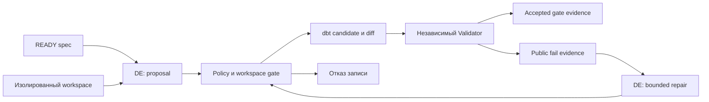

# 14 — Data Engineer: ограниченная автономия изменения данных

## Цель и предварительные знания

В [лекции 13](LECTURE-0013-pm-specification.md) PM отделил определение
показателя от открытого бизнес-вопроса: `READY` разрешает реализацию,
`NEEDS_USER` — нет. [Лекция 11](LECTURE-0011-dbt-semantics.md) уже объяснила
grain и границы dbt-проверок. Теперь вопрос иной: **какие решения может
самостоятельно принять Data Engineer, если смысл результата задан, но способ
его получения ещё не выбран?** DE здесь — агентная роль в нашем workflow,
не универсальное описание должности человека в любой data-команде.

## Спецификация фиксирует смысл, но оставляет пространство реализации

Пусть спецификация задаёт множество допустимых результатов: метрику,
единицы, временную атрибуцию, grain, источники и критерии приёмки. Обычно
существует больше одной программы, способной получить такой результат:
отдельные CTE или промежуточные модели, разные порядки соединений,
материализация или переиспользование уже существующего агрегата. **Implementation
authority** — право выбирать *внутри* этого пространства, а не право
переопределить само пространство. Два синтаксически корректных SQL-варианта
могут по-разному учитывать возврат; только вариант, сохраняющий spec,
остаётся свободным выбором DE.

Полезно различать три границы:

| Граница | Что фиксировано | Что DE вправе выбирать |
| --- | --- | --- |
| Семантическая | Одобренная метрика, grain, даты и критерии приёмки | Алгоритм преобразования, который сохраняет эти свойства |
| Изменения | Разрешённые файлы и инструменты, budget, исходный workspace | Конкретную правку внутри разрешённого поддерева |
| Доказательная | Независимые условия проверки и provenance измерений | Какие допустимые self-checks выполнить и как объяснить candidate |

Эти границы не заменяют друг друга. Корректная формула в запрещённом файле
остаётся недопустимым изменением; разрешённая запись в dbt-файл не делает
формулу верной. Самоотчёт агента «готово» не заменяет измеренный diff и
решение независимой проверки. [dbt Labs описывает analytics engineering](https://www.getdbt.com/blog/what-is-analytics-engineering)
как создание преобразованных, протестированных и документированных наборов
данных с инженерными практиками вроде version control. Мы переносим отсюда
идею *управляемого изменения аналитического продукта*, а не организационную
границу между профессиями из статьи.

## Candidate — ограниченное предложение, а не готовый релиз

**Candidate change boundary** — изолированное состояние исходного проекта
плюс разрешённый diff, привязанный к конкретной спецификации и проверкам.
Его удобно мыслить как тройку `specification + delta + evidence`:
спецификация говорит, *что* должно сохраниться; delta показывает, *что
изменилось*; evidence сообщает, *что действительно наблюдалось* после
изменения. Отсутствие любой части делает предложение трудным для проверки:
SQL без spec не имеет критерия правильности, spec без diff не является
реализацией, а diff без evidence оставляет результат неподтверждённым.

В нашем [сценарии Net Revenue](../../scenarios/net-revenue/manifest.json)
workspace создаётся из зафиксированного snapshot; редактируемы только
`platform/dbt/models/**` и `platform/dbt/tests/**`. Текущий
[DE capability profile](../../policies/profiles/data_engineer_v1.json)
разрешает запись в те же поддеревья, а
[`WorkspaceToolAdapter`](../../runtime/tools/workspace.py) пересекает
scope профиля со scope scenario manifest, проверяет путь/ссылки и
выполняет атомарную запись с evidence. Само наличие `workspace.write_file`
не даёт агенту права изменить Airflow DAG, policy, grader или `.env`.
Это *локальный disposable candidate*, не автоматическое изменение main
branch или production-таблиц.

Угроза здесь не только умышленный выход за каталог. Контекст файлов и
результат инструмента могут содержать инструкции, которых нет в
спецификации. DE должен использовать их как данные для исследования, а
не как делегированное право сменить роль или ослабить тест. Принудительная
граница — policy и workspace adapter, а не формулировка prompt. Подробно
механизм изоляции разобран в [лекции 08](LECTURE-0008-isolation.md),
а устройство tool-интерфейса — в [лекции 09](LECTURE-0009-mcp-interface.md).

## От намерения к candidate в нашей системе

Важное ограничение примера: [specification.json](../../scenarios/net-revenue/specification.json)
для автономного DE-сценария подготовлен **человеком** и помечен `READY`.
[Оболочка `ScenarioSpecification`](../../contracts/scenario_specification.py)
требует авторство `human` и формат версии/хеша; загрузчик
[`load_scenario_specification`](../../runtime/specification.py) сверяет
версию сценария и хеш `TASK.md` с текущим workspace. Это не выход PM из
исторического live прогона. Там PM остановился на `BLOCKED/needs_user`
([STEP-0013](../../plan/evidence/STEP-0013-pm-specification-gate.md)).
Подставлять один исход за другой — означало бы придумать несуществующий
сквозной успех.

В [текущем phased DE executor](../../runtime/data_engineer_workflow.py)
работа разбита на исследование `TASK.md`, запись SQL-модели и запись
singular dbt test. Для каждой фазы runtime выдаёт только нужный набор
tools; исходный prompt не наделяет модель правом запускать shell.
`DataEngineerDraft` — недоверенное предложение о результате. Код
проверяет привязку tool evidence к task, наблюдает изменённые файлы,
сам задаёт artifact IDs, расход бюджета и переход состояния. Если draft
говорит `COMPLETED`, но diff пуст, [`accept_data_engineer_draft`](../../runtime/data_engineer.py)
превращает исход в `FAILED`. При наличии candidate отдельный
[`validate_candidate`](../../runtime/validator.py) запускает четыре
code-owned gate: integrity workspace, public build, independent SQL и
repository policy. Это сильнее самопроверки DE, но всё ещё не доказательство
полной бизнес-истины за пределами заданных критериев и probes.

### Диаграмма: кто предлагает изменение и кто принимает его

Как не перепутать инструментальную автономию DE с правом утвердить
собственный результат?

Рисунок 1. Стрелка — передача spec, candidate или evidence, **не передача
полномочия**. `Accepted gate evidence` означает прохождение данного
validator, не публикацию в production. `Отказ записи` — результат policy
или integrity gate, не обычная ветка исправления семантической ошибки.

Текстовый эквивалент: одобренный spec и изолированный workspace поступают
DE; модель предлагает dbt-изменение; policy/adapter либо отклоняет
запись, либо формирует candidate с наблюдаемым diff. Validator отдельно
оценивает candidate. Публичный отказ может дать DE ограниченную возможность
исправить файл и снова пройти gate; успешный gate сам по себе не выполняет
merge или production deploy.

## Net Revenue: корректная формула требует корректного зерна вычисления

Спецификация требует сумму **каждого** успешного платежа минус сумму
**каждого** успешного возврата, приписанную UTC-дате исходного заказа;
валюты не смешиваются. Это уже не вопрос выбора DE. Его задача — найти
реализацию, сохраняющую правило на всех объявленных источниках, включая
частичные и поздние возвраты. Например, события оплаты и возврата
нужно агрегировать независимо до `order_id`, прежде чем соединять с
заказом и его атрибуцией. Это инженерный выбор, выводимый из grain и
кратности событий, а не новая бизнес-дефиниция.

Контрпример. У одного заказа две успешные оплаты на 700 и 300 центов и
два успешных возврата на 200 и 100 центов. Правильная чистая сумма —
`(700 + 300) − (200 + 100) = 700`. Если сначала соединить оплаты с
возвратами по `order_id`, получится четыре пары. Агрегирование уже
размноженных строк даст `2 × 1000 − 2 × 300 = 1400`: запрос может
компилироваться и возвращать число, но нарушает спецификацию. Если
добавить несколько строк marketing attribution без дедупликации,
размножение станет ещё сильнее. Отдельный тест `not_null` на сумму
этот дефект не обнаружит; нужен критерий, различающий правильный и
неправильный результат. Семантический смысл grain подробнее рассмотрен
в [лекции 11](LECTURE-0011-dbt-semantics.md), а власть над определением
метрики — в [лекции 13](LECTURE-0013-pm-specification.md).

## Semantic repair: исправлять причину, не сигнал проверки

**Semantic repair** — изменение candidate в ответ на evidence о нарушении
контракта так, чтобы устранить причину и сохранить исходные критерии.
Например, при завышенной выручке из-за fan-out исправление должно
изменить кратность соединения или предварительную агрегацию. Отключить
тест, ослабить условие или переименовать колонку ради зелёного результата
— не repair, а потеря способности обнаруживать дефект.

В нашем workflow [`_public_validation_feedback`](../../runtime/data_engineer_workflow.py)
читает ограниченный, hash-проверенный фрагмент сохранённого вывода
validator; скрытый grader не передаётся DE. При `REWORK` runtime
добавляет текущий candidate и public feedback как **недоверенный
контекст**, выбирает один разрешённый target по простому правилу и
требует ровно одну запись в фазе ремонта. После этого код снова
проверяет изменённые файлы и запускает validator. QA и Reviewer могут
дать дополнительные public findings, но их собственная роль и
независимость — тема [планов лекций 15](../modules/module-15-qa-evidence/README.md) и
[16](../modules/module-16-review-authority/README.md); маршрутизацию bounded rework
определяет код, см. [лекцию 06](LECTURE-0006-strict-workflow.md).

Ограничение важно: текущий phased executor привязан к `net-revenue`,
заранее известным двум write targets и эвристике выбора repair target.
Это не общий агент-планировщик и не обещание, что всякую семантическую
ошибку можно исправить одной записью. Если новое evidence показывает
противоречие самой бизнес-спецификации или новый существенный вопрос,
DE должен вернуть его владельцу смысла, а не незаметно выбрать другое
правило. [Anthropic описывает риск](https://www.anthropic.com/engineering/effective-harnesses-for-long-running-agents)
преждевременного «готово» в долгих агентных задачах и предлагает
инкрементальный прогресс с явными артефактами. Для нашего случая
полезен узкий принцип: промежуточное изменение остаётся candidate,
пока его критерии не проверены. Мы не переносим их экспериментальную
архитектуру harness в наш runtime автоматически.

Исторический [STEP-0009](../../plan/evidence/STEP-0009-autonomous-data-engineer.md)
зафиксировал конкретный live sample и один успешный repair после
публичной проверки. Это датированное свидетельство возможностей и
сбоев той конфигурации, не гарантия качества нового запуска, иной
модели или сквозного `Analyst → PM → DE` процесса.

## Итог и вопросы для самопроверки

DE автономен в выборе *реализации*, но не бизнес-смысла, разрешённых
путей и критериев приёмки. Изолированный candidate связывает spec,
наблюдаемый diff и evidence. Проверка и semantic repair создают цикл
улучшения, но не дают автору изменения права самому объявить релиз.

1. Почему `READY`-спецификация оставляет DE свободу, но не разрешает
   самостоятельно менять дату атрибуции возврата?
2. Чем различаются допустимость пути записи и правильность формулы в
   записанном файле?
3. Почему соединение двух payment и двух refund events до агрегации
   может удвоить рассчитанную чистую сумму?
4. В каком случае исправление теста действительно является repair,
   а в каком — сокрытием дефекта?
5. Что подтверждает успешный validator, а чего он не подтверждает?

Следующая [тема 15](../modules/module-15-qa-evidence/README.md) рассмотрит независимую
QA-проверку: как искать дефект, который не выявили автор candidate и
публичный validator.
