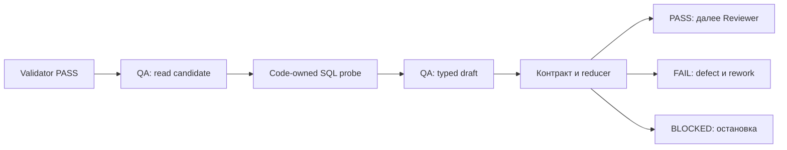

# 15 — QA: независимые проверки и доказательство дефекта

## Цель и предварительные знания

В [лекции 14](LECTURE-0014-data-engineer.md) Data Engineer создал ограниченный
candidate, а код передал его в публичный validator. Почему после успешного
validator нужен ещё один участник? Потому что «прошли проверки» означает
только «не найдено нарушений *проверенных* условий». QA отвечает на более
узкий и требовательный вопрос: **можно ли предъявить воспроизводимый
контрпример к бизнес-смыслу candidate, не полагаясь только на проверки
его автора?** Здесь QA — read-only агентная роль, а не синоним всего
тестирования или полномочия выпускать изменение.

## PASS публичного validator и независимость QA

Наш [validator](../../runtime/validator.py) последовательно проверяет
целостность workspace, public build, независимый SQL-контракт и политику
репозитория. Прошедший candidate получает состояние `VALIDATED`, но
публичные проверки могут не содержать случая, отличающего неверную
семантику от верной. Если формула и тест написаны с одной ошибкой,
зелёный результат теста лишь подтверждает их согласованность друг с
другом. [dbt Labs подчёркивает](https://www.getdbt.com/blog/data-testing),
что data tests фиксируют и проверяют предположения о данных; провал
может означать ошибку SQL или изменившееся предположение об источнике.
Мы берём этот принцип как основание проверять *явно названные*
бизнес-утверждения, а не считать количество зелёных тестов мерой истины.

**Independent probe** — проверка, чей вопрос, путь вычисления и право
на изменение отделены от проверяемого candidate. Независимость здесь
имеет несколько уровней, которые нельзя смешивать:

| Уровень | Что даёт | Чего не гарантирует |
| --- | --- | --- |
| Отдельная роль | QA не может переписать SQL или тест candidate | Та же модель может разделять ошибочное предположение DE |
| Отдельный oracle | Сравнение с расчётом, не взятым из candidate-модели | Общий upstream источник или неверное бизнес-правило всё ещё могут искажать оба пути |
| Измеренный результат | Defect ссылается на выполненный read/query и конкретный критерий | Probe покрывает только данные, правила и момент своего запуска |

Это не статистическое утверждение о независимости ошибок двух моделей.
Полезность QA возникает, когда дополнительные проверки имеют *другие
слепые зоны*, а не просто другого исполнителя. [Anthropic различает](https://www.anthropic.com/engineering/demystifying-evals-for-ai-agents)
несколько проверяющих аспектов результата — код, модель и человека — и
отделяет слова агента от итогового состояния среды. Мы переносим отсюда
идею разных свидетельств; наша QA не реализует всю описанную в статье
систему evaluation. Benchmark и статистическое измерение качества —
отдельная тема [лекции 21](../modules/module-21-evaluation/README.md).

## Мутация как тест способности обнаруживать ошибку

**Mutation** — намеренно изменённый candidate с заранее известным
дефектом. Смысл проверки не в том, что мутант компилируется, а в том,
сумеет ли QA после public-validator PASS отличить его от канонического
варианта. **False pass** в такой постановке — QA `PASS` на мутанте,
дефект которого известен эксперименту. Это не то же самое, что общий
процент ошибок QA в эксплуатации: корпус и распределение реальных
запросов могут существенно различаться.

Наш [corpus](../../tests/fixtures/qa_mutants/manifest.json) содержит пять
изолированных изменений: дата возврата, канал атрибуции, split payments,
дублированная атрибуция и ослабленный contract test. Первые четыре
меняют результат, пятое — способность собственного теста candidate
обнаруживать дефект. Поэтому только сравнивать итоговые таблицы
недостаточно: если таблица пока правильная, запрос с `where 1 = 0`
в candidate-тесте всегда «проходит», но ничего не проверяет. QA должна
уметь отделить отсутствие расхождения данных от отсутствия *полезной
проверки* в контракте.

Исторический [EXP-0003](../../plan/experiments/EXP-0003-qa-mutations.md)
зафиксировал `PASS` канонического варианта и `FAIL` всех пяти мутантов,
каждый из которых сначала прошёл полный публичный validator. Наблюдение
`0/5 false pass` относится **только** к тому corpus, модели, protocol и
дате 2026-09-12. Оно не доказывает нулевую вероятность false pass на
будущих задачах. Обобщающие показатели и дизайн benchmark принадлежат
лекции 21; здесь mutation нужен для проверки *механизма обнаружения*.

## Как QA получает evidence, но не право записи

Текущий [QA profile](../../policies/profiles/qa_v1.json) имеет пустой
`writable_paths` и не содержит `workspace.write_file` или dbt build/test.
[`AutonomousQAExecutor`](../../runtime/qa_workflow.py) начинает с
принятого `VALIDATED` state и verified event chain. Первая свежая фаза
читает ровно один файл candidate — `fct_net_revenue.sql`; вторая получает
только инструмент `qa_run_public_probe`. Он без аргументов исполняет
заданный кодом [SQL-probe](../../runtime/qa.py), а не запрос, сочинённый
моделью. Runtime требует по одному измеренному read и query evidence,
проверяет hash аргументов SQL и привязку task. Модель интерпретирует
результат и предлагает `QADraft`; код не вычисляет `PASS`/`FAIL` напрямую
из строк probe. Поэтому структурные gates предотвращают подмену запроса,
но не делают интерпретацию модели безошибочной.

Probe строит ожидаемые компоненты из `analytics.fct_orders`, отдельно
восстанавливает атрибуцию из `raw.marketing_attribution` и сравнивает
ожидаемые и фактические строки `analytics.fct_net_revenue` в обе стороны
через `EXCEPT DISTINCT`. Непустой результат содержит `missing` или
`unexpected` строки; пустой говорит только, что **на доступном состоянии
и в области этого сравнения** расхождений не найдено. Запрос ограничен
`LIMIT 100`; это потолок возвращаемых диагностических строк, не доказательство
полного покрытия всех возможных источников ошибок. Проверка разделяет
candidate-модель и oracle, но наследует риски общего upstream `fct_orders`
и выбранной логики атрибуции.

### Диаграмма: от измерения к решению QA

Где заканчивается наблюдение и начинается решение, которое можно
передать следующей роли?

Рисунок 1. Стрелки означают передачу accepted candidate, measured evidence
или typed decision; они **не** наделяют QA правом исправлять candidate.
`FAIL` и `BLOCKED` — разные исходы: первый заявляет подтверждённый дефект,
второй — недостаточность разрешённого evidence для решения.

Текстовый эквивалент: public-validator PASS допускает candidate к QA.
Read-only QA читает файл и исполняет неизменный probe. Модель предлагает
решение, но код принимает typed report только при корректной identity,
evidence и форме. `PASS` открывает путь Reviewer, `FAIL` с дефектом —
rework, `BLOCKED` — остановку. Public-validator FAIL в эту ветку не входит.

## Принятый defect — связь критерия и наблюдения

QA не должна возвращать просто «похоже, неправильно». В
[`QADraft`](../../runtime/qa.py) решение `FAIL` требует описание дефекта,
критерий приёмки и severity. Код добавляет IDs, автора, время и
измеренные evidence refs в [`QAReport`](../../contracts/artifacts.py).
Контракт не позволяет автору implementation быть QA и требует, чтобы
checks/defects ссылались на приложенные evidence. `PASS` требует только
успешных checks и отсутствия defects; `FAIL` — failed check и defect;
`BLOCKED` — blocked check. Затем reducer переводит `QA_PASSED`, `REWORK`
или `BLOCKED`. Это **структурная** проверка связи заявления с evidence,
не автоматическое доказательство правильности интерпретации моделью.

Например, [мутация `refund-date`](../../tests/fixtures/qa_mutants/manifest.json)
заменяет `orders.order_date` на дату последнего успешного возврата для
заказов с возвратами. Если заказ сделан 1 сентября, а возврат оформлен
4 сентября, спецификация требует учитывать его net-компоненты по
**1 сентября**; мутант переносит строку заказа на **4 сентября**.
Публичный validator в [историческом прогоне](../../plan/evidence/STEP-0010-qa-quality-loop.md)
пропустил этот candidate, а независимый QA-probe дал расхождение по
датам. Принимаемый defect указывает нарушенный критерий атрибуции
возврата и evidence выполненного сравнения. QA не меняет SQL; DE
получает public diagnosis и может предложить ограниченный repair,
после которого validator и QA выполняются заново. Механика маршрута и
лимита rework — [лекция 06](LECTURE-0006-strict-workflow.md), сам repair
— [лекция 14](LECTURE-0014-data-engineer.md).

Контрпример к чрезмерной уверенности: исторический
[PRB-0035](../../plan/problems/PRB-0035-null-attribution-argmax.md) описывает,
как candidate и первая версия oracle **одинаково** неверно обрабатывали
nullable channel в ClickHouse `argMax`. Semantic diff был пуст, хотя
инспекция SQL выявила дефект. После исправления обоих путей canonical
случай прошёл. Это показывает, почему «отдельный probe» не равен
«непогрешимый oracle». Текущая инструкция QA при пустом diff запрещает
придумывать гипотетический SQL-дефект; явное исключение предусмотрено
для отсутствующего или тавтологического обязательного candidate test.
Исторический PRB-0035 относится к прежней итерации проверки, а не
обещает такое же решение текущего protocol.

## Итог и вопросы для самопроверки

QA расширяет пространство проверяемых гипотез и не вправе переписать
candidate. Сильный `FAIL` соединяет конкретный acceptance criterion,
измеренное evidence и отдельную identity проверяющего. `PASS` означает
отсутствие найденного дефекта *в области текущих проверок*, а не
неограниченную гарантию правильности или разрешение на выпуск.

1. Почему public-validator PASS не делает semantic probe избыточным?
2. В чём разница между независимой ролью QA и независимым oracle?
3. Почему мутант `weakened-test` может не изменить итоговую таблицу,
   но всё равно должен быть обнаружен?
4. Что обязательно должно связывать `QAReport` с конкретным дефектом?
5. Какие общие предположения могут сделать candidate и probe одновременно
   неверными, несмотря на пустой diff?

Следующая [тема 16](../modules/module-16-review-authority/README.md)
рассмотрит роль Reviewer: оценку качества изменения и право принять
или отклонить его без self-approval.
