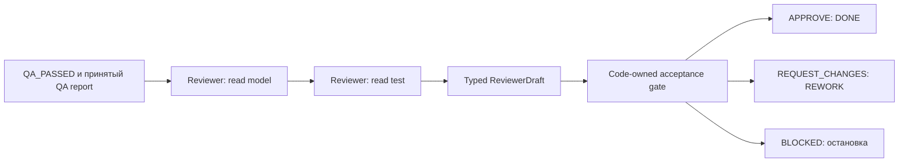

# 16 — Reviewer: качество изменения и право одобрения

## Цель и предварительные знания

После [лекции 15](LECTURE-0015-qa-evidence.md) candidate прошёл validator и
независимую QA-проверку. Достаточно ли этого для принятия изменения?
Прохождение проверенных функциональных условий — необходимое свидетельство,
но решение также требует оценки того, **как** изменение устроено и насколько
безопасно его сопровождать. Reviewer — отдельная read-only роль, которой
workflow поручает сформулировать обоснованное решение об одобрении или
возврате candidate. В нашей системе это решение завершает *локальный*
workflow, но не выполняет merge, deploy и не заменяет человеческое право
выпуска в production.

## Что проверяет Reviewer после QA PASS

QA ищет наблюдаемый контрпример к бизнес-смыслу. Reviewer рассматривает
изменение как будущую часть кодовой базы: читаемость, явность зависимостей,
детерминированность при равных событиях, честность названия и комментариев
теста, переносимость между окружениями. Эти вопросы частично пересекаются
с корректностью, но не сводятся к ещё одному запуску того же semantic probe.
Например, текущие данные могут не содержать одинаковых timestamps; тогда
публичный запрос проходит, а удалённый tie-break делает будущую атрибуцию
неоднозначной. Это **риск, видимый в SQL**, а не доказательство того, что
QA была ошибочной на проверенном наборе данных.

[Google Testing Blog](https://testing.googleblog.com/2017/04/code-health-googles-internal-code.html)
называет читаемость, поддерживаемость, стабильность и простоту аспектами
здоровья кода, которые не исчерпываются тестами и инструментами. Отсюда
не следует универсальный стиль SQL: Reviewer должен связать замечание с
конкретным фрагментом и критерием, а не отклонять работающий код из-за
личного вкуса. [Cognition](https://cognition.com/blog/multi-agents-working)
описывает продуктивную схему, в которой дополнительные агенты дают
интеллектуальную обратную связь, а запись остаётся у одного исполнителя.
Мы используем эту идею разделения анализа и записи, но не переносим
результаты Cognition на качество нашего Reviewer без собственного измерения.

| Вопрос | QA | Reviewer |
| --- | --- | --- |
| Главный объект | Проверяемое бизнес-утверждение и наблюдаемый результат | Candidate SQL, test intent и качество будущего изменения |
| Основное свидетельство здесь | Code-owned semantic probe и чтение candidate | Два bounded чтения model/test плюс принятый QA report |
| Типичный отрицательный вывод | `FAIL`: подтверждённое расхождение или дефект контракта | `REQUEST_CHANGES`: конкретный дефект реализации или сопровождаемости |
| Что роль не делает | Не исправляет candidate | Не повторяет QA-probe и не редактирует candidate |

Это разделение — не утверждение, что Reviewer вообще не способен найти
функциональную ошибку. Конкретное противоречие спецификации, заметное в SQL,
остаётся основанием для `REQUEST_CHANGES`. Но отсутствие в одном singular
candidate test всех проверок validator и QA само по себе не дефект: у этих
gates разные обязанности.

## Authority: кто может сказать «одобрено»

**Review authority** — ограниченное право передать решение о качестве в
следующий переход workflow. В нашем [`accept_reviewer_draft`](../../runtime/reviewer.py)
вход разрешён только из `QA_PASSED` с принятым `QAReport(PASS)` того же task,
workflow и автора implementation. `agent_id` Reviewer должен отличаться
и от Data Engineer, и от QA. Это не просьба в prompt, а проверка кода
до принятия отчёта. [Контракт `ReviewReport`](../../contracts/artifacts.py)
также запрещает self-review автора и требует, чтобы оценка каждого
критерия и каждое замечание ссылались на приложенное evidence.

Модель предлагает `ReviewerDraft`, но не меняет state напрямую. Код
сверяет список критериев с неизменной спецификацией: каждый критерий
должен встречаться ровно один раз, а finding — ссылаться на известный
критерий. `APPROVE` допустим, только если все критерии `PASS`, нет
`HIGH`/`CRITICAL` finding и приложенное evidence успешно; затем reducer
переводит `REVIEW → DONE`. `REQUEST_CHANGES` требует failed criterion или
finding и ведёт в `REWORK`; `BLOCKED` требует хотя бы одного
`NOT_ASSESSED`. Бюджеты и дальнейший маршрут принадлежат workflow,
как разобрано в [лекции 06](LECTURE-0006-strict-workflow.md).

### Диаграмма: предложение решения и кодовый gate

Где заканчивается суждение Reviewer и начинается право изменить state?

Рисунок 1. Стрелки до gate передают контекст, измеренные чтения и
предложение; стрелки после gate показывают допустимые переходы reducer.
Они не означают право Reviewer писать файлы или выпускать изменение.

Текстовый эквивалент: принятый QA PASS допускает candidate к Reviewer.
Он отдельно читает model и test, предлагает типизированное решение. Код
проверяет identity, связь с QA и спецификацией, полноту критериев и
evidence. Только после принятия отчёта `APPROVE` переводит локальный
workflow в `DONE`, `REQUEST_CHANGES` — в `REWORK`, `BLOCKED` — в остановку.

## Свежий контекст и пределы независимости

[`AutonomousReviewerExecutor`](../../runtime/reviewer_workflow.py) выполняет
две свежие фазы: ровно одно чтение `fct_net_revenue.sql`, затем ровно одно
чтение `assert_fct_net_revenue_contract.sql`. Код сверяет количество tool
evidence и hashes обоих путей. [Profile](../../policies/profiles/reviewer_v1.json)
не даёт записи, SQL/dbt или shell. Reviewer получает спецификацию и
принятый QA report, а также ограниченный candidate context: «свежий»
здесь означает новый акт анализа и измеренные чтения, **не** полное
отсутствие общего контекста. Вывод первой фазы передаётся второй как
недоверенное наблюдение, чтобы сохранить найденные как положительные,
так и отрицательные признаки model.

В статье Cognition чистый контекст reviewer представлен как полезный
приём, но это наблюдение авторов в их собственной системе. У нас
разделение identity и инструментов предотвращает self-approval и
неавторизованную запись; оно не делает ошибки суждения статистически
независимыми. DE, QA и Reviewer могут одинаково неверно понять
спецификацию или пропустить редкий случай. Даже два чтения правильных
файлов не гарантируют правильную интерпретацию их содержимого.

## False approval: контрпример к «зелёному» решению

**False approval** — `APPROVE` на candidate с известным существенным
дефектом, который должен был вызвать `REQUEST_CHANGES`. Для проверки
этого механизма наш [retained mutation corpus](../../tests/fixtures/reviewer_mutants/manifest.json)
содержит четыре изменения, сохраняющие прохождение public validator и QA:

| Мутация | Что должен заметить Reviewer |
| --- | --- |
| `hardcoded-relation` | Физическое имя `raw.marketing_attribution` вместо dbt `source`: переносимость зависит от окружения |
| `wildcard-dead-code` | Неиспользуемый CTE с `SELECT *`: лишняя логика и риск ненужного чтения при развитии модели |
| `nondeterministic-attribution` | Удалён tie-break event ID при равном `attributed_at` |
| `misleading-test-intent` | Комментарий обещает сверку каждого raw payment/refund, которой SQL-тест не делает |

Последняя мутация особенно показательна. Успешный test ничего не говорит
о проверке, которую обещает только комментарий; она может никогда не
исполняться. Reviewer сравнивает *заявленное намерение* с реальным SQL.
Это не требование дописать в singular test все возможные проверки: дефект
именно в ложном утверждении о его существующих возможностях.

Исторический [EXP-0004](../../plan/experiments/EXP-0004-reviewer-mutations.md)
зафиксировал для одной конфигурации `APPROVE` канонического candidate и
`REQUEST_CHANGES` для всех четырёх мутантов (`0/4 false approval`).
[STEP-0011](../../plan/evidence/STEP-0011-reviewer-approval-gate.md)
фиксирует тот же live sample и полный маршрут accepted change request
через DE, validator, новую QA и нового Reviewer. Это **датированное
свидетельство**, а не оценка вероятности ложного одобрения на реальных
изменениях: здесь один канонический случай, четыре заранее выбранных
мутанта и конкретная конфигурация модели. Методология обобщения
результатов — отдельная [лекция 21](../modules/module-21-evaluation/README.md).

Существует и противоположная ошибка — **false rejection**: отказ
каноническому candidate без конкретного дефекта. Исторический
[PRB-0037](../../plan/problems/PRB-0037-reviewer-canonical-false-rejection.md)
показал, как Reviewer принял один узкий singular test за единственный
oracle и потребовал от него проверок, уже выполненных validator и QA.
Протокол уточнили, сохранив положительные наблюдения первой фазы и
границы ответственности теста; при повторных попытках та же дешёвая
модель всё равно отклоняла canonical. Поэтому надёжный gate должен
сдерживать и поспешное одобрение, и необоснованный отказ, не ослабляя
проверяемый контракт ради зелёного результата.

## Итог и вопросы для самопроверки

Reviewer расширяет критерии принятия за пределы проверенного результата,
но обязан назвать конкретный дефект и опереться на доступное evidence.
Code-owned gate делает полномочие ограниченным: независимая identity,
accepted QA, точное покрытие критериев и допустимая форма решения.
`DONE` в нашем workflow — не production release, а `APPROVE` не является
гарантией качества вне области просмотренного candidate.

1. Почему QA PASS не делает architecture/maintainability review избыточным?
2. Чем замечание о ложном комментарии отличается от требования добавить
   в singular test все проверки validator и QA?
3. Какие проверки кода препятствуют self-approval и одобрению чужого task?
4. Почему два свежих чтения и другая identity не доказывают независимость
   ошибок Reviewer и DE?
5. Что именно подтверждает историческое `0/4 false approval`, а чего
   оно не позволяет утверждать?

Следующая [тема 17](../modules/module-17-recovery-idempotency/README.md)
покажет, как сохранять результат роли и восстанавливаться после сбоя,
не выдавая checkpoint за гарантию однократного внешнего эффекта.
