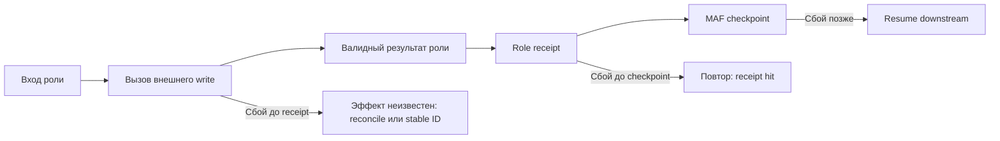

# 17 — Восстановление: checkpoint, receipt и пределы exactly-once

## Цель и предварительные знания

[Лекция 04](LECTURE-0004-state-memory.md) отделила состояние задачи от
контекста модели, а [лекция 06](LECTURE-0006-strict-workflow.md) определила
допустимые переходы. Но что произойдёт, если процесс оборвётся *между*
вызовом роли и сохранением следующего состояния? Эта лекция рассматривает
момент фиксации, повтор операции и пределы обещания «выполнить один раз».
Речь о контролируемом восстановлении нашей локальной системы, а не о
гарантированной работе при любых отказах инфраструктуры.

## Три разных результата, которые нельзя смешивать

**Checkpoint** — сохранённая граница возобновления runtime. В нашем
MAF-графе он фиксирует завершённый superstep и сообщение следующей роли;
после восстановления с этой границы уже завершённый executor не требуется
вызывать снова. Это свойство *порядка исполнения графа*, а не удалённой
базы данных или API.

**Role receipt** — локальная запись принятого результата конкретного
вызова роли. Её identity вычисляется из `workflow_id`, `executor_id`,
revision входного состояния и hash входного payload. При том же входе
повторный executor может взять сохранённый output вместо нового вызова
handler. Receipt закрывает окно *после принятия результата роли, но до
следующего checkpoint*; он не знает, что произошло внутри внешнего
инструмента до возврата handler.

**Operation idempotency** — свойство самого эффекта: повтор запроса с
той же намеренно заданной identity не создаёт дополнительный разрешённый
эффект. Identity должна обозначать логическую операцию, а не очередную
попытку транспорта; новый смысл требует новой identity. [AWS Builders’
Library](https://aws.amazon.com/builders-library/making-retries-safe-with-idempotent-APIs/)
разбирает timeout после запроса как неопределённость «выполнилось или нет»
и объясняет, зачем клиентскому намерению нужен явный request ID.
Хеш одинаковых аргументов без такого намерения недостаточен: два
идентичных запроса могут быть двумя желаемыми действиями.

В статье [Anthropic о Managed Agents](https://www.anthropic.com/engineering/managed-agents)
session log отделён от harness и sandbox: процесс или среду исполнения
можно заменить, не отождествляя их жизненный цикл с историей сессии.
Это полезная архитектурная аналогия, **не** описание нашего MAF storage:
мы используем локальные checkpoint/receipt файлы и не заявляем интерфейсы
или durability сервиса Anthropic.

## Что означает «один раз»

Гарантию следует формулировать относительно *наблюдаемого эффекта*, а
не числа вызовов функции. Если запрос создать ресурс завис после отправки,
вызывающая сторона не знает, создан ли ресурс. Из этого следуют три
разных политики:

| Политика | Поведение при неопределённом ответе | Цена |
| --- | --- | --- |
| At-most-once attempt | Не повторять запрос | Эффект может вовсе не произойти |
| Retry до подтверждения (цель at-least-once) | Повторять при неопределённом ответе | При доступном получателе эффект может произойти несколько раз; без него успех не гарантирован |
| Exactly-once observable effect | Повторять одну логическую операцию с тем же ID; получатель атомарно связывает ID с эффектом и дедуплицирует повтор | Нужны поддержка получателя, область/срок хранения ID и согласование ответа с эффектом |

Последняя строка **не** обещает однократного исполнения кода или
универсальной распределённой транзакции. Нужен контракт внешнего
получателя: как он связывает ID с результатом, сколько времени помнит
его и что делает при том же ID с другим содержимым. Если такого
контракта нет, возможна только проверка состояния получателя после
timeout (**reconciliation**) либо явный `BLOCKED` при неустранимой
неопределённости. Повтор с *новым* ID маскирует неопределённость, а не
решает её.

## Окна сбоя между результатом и checkpoint

Наш [`_RoleExecutor`](../../runtime/role_pipeline.py) сначала строит
детерминированный role operation ID и ищет receipt. При отсутствии
receipt он вызывает handler, валидирует snapshot, сохраняет receipt
с hash output и только затем возвращает результат MAF. Framework
фиксирует следующий checkpoint после принятия результата executor.
Порядок важен: переставив запись receipt и возврат, мы снова открыли
бы окно повторного выполнения готовой роли.

Где именно перезапуск может повторить работу?

Рисунок 1. Горизонтальные стрелки — нормальный порядок фиксации.
Ответвления — место сбоя и допустимая стратегия восстановления, а не
новые переходы бизнес-state. Стрелка от внешнего эффекта к неопределённости
включает ситуацию, когда ответ не дошёл до процесса.

Текстовый эквивалент: handler вызывает инструмент и получает либо
теряет ответ. После валидации output сохраняется role receipt, после
возврата executor — checkpoint MAF. До receipt новый запуск может
повторить handler; внешний эффект надо идентифицировать или сверить.
После receipt, но до checkpoint, новый запуск возвращает сохранённый
output. После checkpoint возобновление идёт со следующего superstep.

| Момент остановки | Что известно локально | Безопасное следствие |
| --- | --- | --- |
| До ответа tool/handler | Receipt нет; эффект мог совершиться | Не делать слепой новый side-effect ID; использовать прежний ID или reconciliation |
| После принятого output, до receipt | Result был в памяти, durable записи ещё нет | Handler может повториться; для внешнего write нужна его собственная idempotency |
| После receipt, до checkpoint | Проверенный output сохранён под тем же входом | При совпадении identity вернуть receipt без повторного handler |
| После checkpoint | Граница графа сохранена | Возобновить downstream; завершённую роль не запускать снова |

Таблица описывает *логические* окна роли с внешним write, а не атомарную
транзакцию между локальными файлами и внешним сервисом. Для read-only
вызова повтор может увеличить стоимость или изменить наблюдаемое
состояние данных, но не создать тот же дублированный write. Таблица не
обещает, что каждый
отказ завершится успешно: испорченный receipt, неподходящий вход или
недоступный получатель должны приводить к отказу, а не к тихому
переиспользованию чужого результата.

## Наш механизм и доказанная область

[`SecureRoleReceiptStore`](../../runtime/role_receipts.py) публикует
create-only JSON под owner-only директорией: временный файл имеет mode
`0600`, синхронизируется, затем hard link создаёт final path без
перезаписи; директория синхронизируется. При чтении проверяются тип
файла, права, размер, identity и hash output. Совпавший receipt
разрешает переиспользование; коллизия или повреждение — fail closed.
Это контроль целостности и локальной публикации, не доказательство
истинности результата роли или внешнего эффекта.

[`SecureCheckpointStorage`](../../runtime/checkpoints.py) оставляет
сериализацию MAF, но ограничивает path, UUID, размер, mode `0700/0600`
и symlinks. После [PRB-0052](../../plan/problems/PRB-0052-checkpoint-publication-permission-race.md)
MAF пишет во временную private директорию; файл получает `0600` и
`fsync` *до* create-only публикации в final path. Так читатель не должен
увидеть окончательное имя с временно широкими правами. Это
исправление гонки доступа, а не доказательство сохранности checkpoint
при внезапной потере питания: тесты проверяли процессные сбои, а
адаптер не заявляет полного power-loss протокола для директории.

Датированный [STEP-0018](../../plan/evidence/STEP-0018-checkpoint-resume-crash-recovery.md)
показал `SIGKILL` между двумя MAF стадиями и продолжение из checkpoint
без повторения первой. [STEP-0019](../../plan/evidence/STEP-0019-checkpointable-role-pipeline.md)
показал то же между DE и Validator в шестиролевом *offline* графе.
[STEP-0020](../../plan/evidence/STEP-0020-branching-rework-idempotency.md)
и [integration test](../../tests/integration/test_role_pipeline_recovery.py)
убили процесс после DE receipt, но до его следующего checkpoint;
возобновление из предыдущей границы дошло до `DONE`, а persisted
счётчик каждой роли остался равен одному. Это проверка **receipt-backed
restart на фиксированном offline сценарии**, не гарантия exactly-once
для произвольных GateLLM, ClickHouse, Airflow или других внешних вызовов.

Контрпример: внешний API успешно создал ресурс, но его ответ потерялся
до записи receipt. После перезапуска локальный store пуст. Если tool
повторит запрос с новым ID, появятся два ресурса — даже при идеальных
MAF checkpoints и корректных `0600` файлах. Стабильный operation ID,
понятный получателю, либо сверка по достаточно однозначному наблюдаемому
состоянию могут закрыть этот пробел при подходящем контракте; receipt
сам по себе его не закрывает. Применение
этой идеи к нашему контролируемому Airflow trigger — тема
[лекции 18](../modules/module-18-airflow-operations/README.md).

## Итог и вопросы для самопроверки

Checkpoint отвечает «откуда продолжить граф», receipt — «надо ли
повторять уже принятый результат роли», idempotency получателя —
«создаст ли повторный запрос ещё один эффект». Их нельзя заменять
друг другом. Доказанная область нашей системы — локальное
восстановление после процессного `SIGKILL` на фиксированных offline
сценариях, с fail-closed storage; внешние side effects требуют
отдельной operation identity или reconciliation.

1. Почему checkpoint после роли не защищает внешний write, выполненный
   до возврата handler?
2. Какой сбой закрывает role receipt и почему он не закрывает потерянный
   ответ внешнего API?
3. Чем at-most-once attempt отличается от exactly-once observable effect?
4. Почему hash одинаковых аргументов не всегда является правильным
   idempotency key?
5. Что реально доказали `SIGKILL` tests, а чего они не говорят о
   power loss и production-сервисах?

Следующая [лекция 18](../modules/module-18-airflow-operations/README.md)
применит operation identity к границе Airflow API: read-only наблюдение
и отдельный контролируемый dev-DAG trigger.
