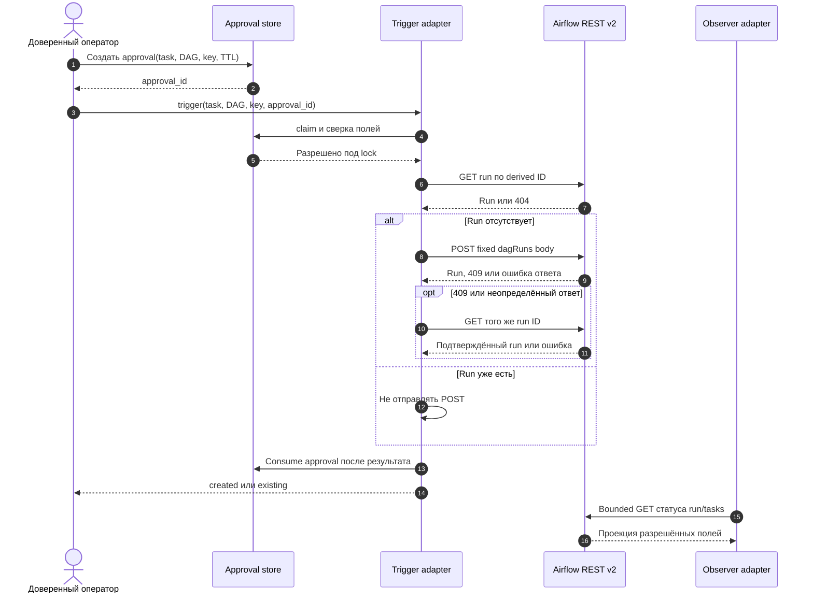

# 18 — Airflow API: наблюдение и контролируемые операции

## Цель и предварительные знания

[Лекция 09](LECTURE-0009-mcp-interface.md) показала, что интерфейс инструмента
сам по себе не выдаёт полномочий. [Лекция 17](LECTURE-0017-recovery-idempotency.md)
разделила восстановление роли и идемпотентность внешней операции. Теперь
применим эти различия к Airflow: как команда агентов узнаёт состояние
data pipeline и при каких условиях вправе запустить один dev-DAG?
Здесь Airflow — исполнитель data tasks, а не планировщик действий агентов.

## Два уровня оркестрации

Airflow DAG описывает зависимости задач обработки данных, расписание,
попытки выполнения и состояние DAG run. В нашем примере
[`ecommerce_hourly`](../../platform/airflow/dags/ecommerce_hourly.py)
задаёт почасовой data pipeline через Cosmos/dbt, а
[`ecommerce_acceptance`](../../platform/airflow/dags/ecommerce_acceptance.py)
использует ту же фабрику DAG без расписания для контролируемого запуска.
Агентский control plane решает *другое*: какая роль получает задачу,
какой artifact принят, нужен ли rework и достаточно ли approval для
внешнего действия. Успешный Airflow task не заменяет QA или Reviewer
агентского workflow; `DONE` агента не означает, что произвольный DAG
можно запустить.

| Система | Единица управления | Кто задаёт переход | Чего она не решает |
| --- | --- | --- | --- |
| Airflow | DAG run и task instance | Scheduler и DAG definition | Бизнес-readiness спецификации и полномочия агентной роли |
| Agent workflow | Typed role result и стадия задачи | Наш reducer и policy gates | Расписание, зависимости и retries внутри data DAG |

Это не запрет использовать Airflow в агентной архитектуре. Граница
означает, что чтение статуса и запуск DAG — *операции над внешней
платформой*, а не свободные переходы агентского state. Они требуют
своего интерфейса, identity и наблюдаемого результата.

## Не путать два API Airflow 3

[Airflow 3 release note](https://airflow.apache.org/blog/airflow-three-point-oh-is-here/)
описывает API server и Task Execution Interface как часть разделения
планировщика и исполнения задач. [Документация Task SDK](https://airflow.apache.org/docs/task-sdk/stable/)
уточняет: Task Execution API обслуживает взаимодействие выполняемой
задачи с Airflow runtime — состояние, heartbeats, XCom и ресурсы.
Этот интерфейс не равен клиентскому пути, по которому наш агент
запрашивает DAG runs.

Для внешнего управления и наблюдения мы используем **публичный REST
`/api/v2`** Airflow 3. Это отдельная поверхность API server с
ресурсами DAG, run и task instance. Слово «публичный» здесь означает
документированный клиентский интерфейс, **не** анонимный доступ или
разрешение на все endpoints. Наш код закреплён за Airflow 3.3.1;
открытая 2026-09-19 [страница документации](https://airflow.apache.org/docs/apache-airflow/stable/stable-rest-api-ref.html)
уже указывает 3.3.2, поэтому конкретные пути и ответы в этой лекции
сверены прежде всего с pinned adapter и датированными integration
evidence, а не объявлены вечными свойствами каждой версии Airflow.

Третий интерфейс — `airflow.sdk` для авторства DAG — тоже не следует
смешивать с REST-вызовом агента. Наши DAG-файлы импортируют фабрику,
которая строит Cosmos-граф; агент через MCP не переписывает активный
DAG и не получает Task Execution API credentials.

## Observer: видеть достаточно, но не всё

Наш [read-only MCP server](../../runtime/airflow_mcp_server.py)
публикует шесть семантических операций: list/get DAG, list/get DAG run,
list task instances и get bounded task log. [Adapter](../../runtime/tools/airflow_api.py)
преобразует запросы к ресурсам Airflow только в фиксированные `GET /api/v2`
пути; отдельный `POST /auth/token` нужен для получения Viewer JWT.
[Profile](../../policies/profiles/airflow_observer_v1.json)
ограничивает область тремя локальными DAG ID:
`ecommerce_hourly`, `ecommerce_acceptance` и `ecommerce_failure_probe`.
Список DAG фильтруется по allowlist; другие ответы проецируются на
явно разрешённые поля. Пагинация, размер ответа, время, число вызовов
и лог конкретной попытки ограничены. Поэтому вывод Observer —
**ограниченное наблюдение**, а не полный снимок Airflow metadata DB.

Аутентификация Airflow Viewer и JWT остаются внутри adapter/process:
модель получает результат выбранного tool, не credentials и не
произвольный URL. Права встроенного Viewer в [STEP-0014](../../plan/evidence/STEP-0014-read-only-airflow-mcp.md)
приняты лишь для локального loopback окружения; это не доказательство
готовности к production tenancy. Observer не имеет инструмента POST,
pause, clear, retry или чтения Airflow secrets. Read-only характер
обеспечивается и профилем, и closed tool schemas, и проверкой adapter;
одного описания в prompt было бы недостаточно.

## Trigger: отдельное полномочие на один dev-DAG

Запуск DAG — эффект, поэтому он вынесен в другой
[MCP server](../../runtime/airflow_trigger_mcp_server.py),
[profile](../../policies/profiles/airflow_trigger_v1.json) и Airflow
identity. Разрешён только `ecommerce_acceptance`; ни Observer, ни
обычная роль QA не получают этот tool автоматически. Модель/клиент
может предложить вызов, но
[`AirflowTriggerAdapter`](../../runtime/tools/airflow_trigger.py)
принимает его только с out-of-band approval, который связывает
`task_id`, DAG ID и `idempotency_key` с утверждающим лицом и временем
истечения. Локальный [approval store](../../runtime/tools/airflow_approval.py)
держит запись под owner-only правами, проверяет совпадение полей под
lock и после успешного результата помечает её использованной. Это
**локальный development gate**, а не универсальная служба согласований.

Три identity не взаимозаменяемы:

| Поле | Назначение | Почему нельзя заменить другим |
| --- | --- | --- |
| `approval_id` | Одно разрешение на конкретные task, DAG и key до expiry | Его повтор после consumption запрещён, даже если run уже существует |
| `idempotency_key` | Намерение выполнить одну логическую операцию | Новый key означал бы другой run, даже при том же DAG |
| `dag_run_id` | Имя результата в Airflow, детерминированно выведенное из DAG и key | Само имя без approval не даёт право выполнить POST |

Сначала adapter делает `GET` run по вычисленному ID. Если run найден,
возвращает его как `existing`, не делая POST. Если нет — отправляет
только фиксированный body: `dag_run_id`, `logical_date: null`, пустой
`conf`. При `409` или ошибке запроса POST он снова читает
run по тому же ID; если однозначного результата нет, вызов завершается
ошибкой, а не создаёт новый run с другим ID. Между удалённым POST и
локальным погашением approval нет распределённой транзакции: после
сбоя подтверждённый run может уже существовать при ещё не погашенном
approval. Поэтому повторная сверка по run ID обязательна. Эта операция не даёт
модели произвольные `conf`, endpoint, HTTP method или production DAG.

### Диаграмма: от разрешения к наблюдению

Какие проверки должны предшествовать POST и как после него отделить
создание run от повторного наблюдения?

Рисунок 1. Сплошные стрелки — вызовы/запросы, пунктирные — ответы.
Схема показывает **успешную** ветку и логические границы, не один
атомарный протокол: при несовпадении approval,
истечении срока или неразрешённой DAG операция прерывается до POST;
при неподтверждённом результате после сверки approval не считается
успешно использованным. Observer показан отдельно, потому что его
read-only identity не становится trigger identity.

Текстовый эквивалент: доверенный оператор заранее создаёт approval для
одной комбинации task/DAG/key. Trigger проверяет его и ищет run с
детерминированным ID. Только при отсутствии run посылает фиксированный
POST; 409 или потерянный ответ сверяет повторным GET. Подтверждённый
результат погашает approval и возвращает `created` либо `existing`.
Observer другим tool читает ограниченный статус. Недействительное
approval или непроверенный результат не открывают путь к новому run.

## Контрпример и доказанная область

Предположим, POST создал run, но ответ потерялся. Это тот же класс
неопределённости, который обсуждает [AWS Builders' Library](https://aws.amazon.com/builders-library/making-retries-safe-with-idempotent-APIs/)
для повторов клиентских запросов, но поведение ниже относится к нашему
adapter, а не является гарантией AWS или Airflow. Повтор с **новым**
`idempotency_key` даст другой `dag_run_id` и может создать второй run.
Повтор с тем же key и корректным approval сначала найдёт существующий
run; если первое approval уже consumed, для отдельного вызова нужно
новое разрешение на ту же комбинацию полей. Так operation identity
из лекции 17 и approval выполняют разные функции: первая удерживает
один эффект, второе санкционирует каждый разрешённый путь к нему.

Датированный [STEP-0014](../../plan/evidence/STEP-0014-read-only-airflow-mcp.md)
проверил Observer на локальном Airflow 3.3.1: bounded metadata/log
чтения и отсутствие изменения metadata. [STEP-0015](../../plan/evidence/STEP-0015-controlled-dev-dag-trigger.md)
проверил отдельный Trigger: `created`, затем `existing` для того же run,
с двумя разными одноразовыми approvals, и 11/11 успешных task instances.
Это **historical-live** local dev evidence, не свежий запуск в этой
лекции, не разрешение на production write и не доказательство, что
текущий шестиролевой граф автоматически вызывает trigger.

## Итог и вопросы для самопроверки

Airflow исполняет data DAG, агентский workflow решает судьбу typed
артефактов и полномочий. Public REST `/api/v2` — клиентская граница;
Task Execution API — граница выполнения Airflow tasks. Наш Observer
только читает ограниченные сведения; Trigger отдельно требует identity,
out-of-band approval и стабильный run ID. Ни один из этих механизмов
сам по себе не превращает агентный verdict в произвольный запуск DAG.

1. Почему Airflow DAG run и стадия агентского workflow — разные
   единицы управления?
2. Почему Observer работает через public REST `/api/v2`, а не через
   Task Execution API?
3. Чем отличаются `approval_id`, `idempotency_key` и `dag_run_id`?
4. Что должен сделать adapter, если POST мог создать run, но ответ
   потерялся?
5. Почему успешный historical-live smoke одного dev-DAG не разрешает
   запуск произвольного DAG в production?

Следующая [лекция 19](../modules/module-19-security-authority/README.md)
рассмотрит общую модель identity, authorization и недоверенного контента;
здесь мы ограничились конкретной операционной границей Airflow.
