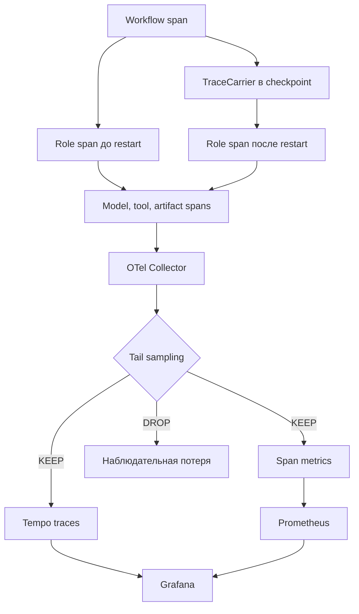

# 20 — Observability: trace causality и границы наблюдения

## Цель и предварительные знания

В [лекции 17](LECTURE-0017-recovery-idempotency.md) checkpoint позволил
возобновить workflow, но не объяснил оператору, где система потратила время
и какой вызов предшествовал ошибке. В [лекции 19](LECTURE-0019-security-authority.md)
policy ограничила действие, но сам факт `DENY` ещё нужно связать с ролью и
задачей. Здесь мы построим модель observability для цепочки
`workflow → role → model/tool → artifact` и определим, каких выводов из неё
делать нельзя.

Observability отвечает на вопросы о **наблюдаемом выполнении**: какие
инструментированные операции произошли, как они связаны, сколько длились и
какой status записали. Она не читает private reasoning модели, не доказывает
семантическую правильность результата и не превращает telemetry в
неоспоримый audit log.

## Четыре вида свидетельств

Похожие поля — timestamp, task ID, status — не делают сигналы
взаимозаменяемыми.

| Представление | Основной вопрос | Сильная сторона | Чего не доказывает |
| --- | --- | --- | --- |
| Event log | Что было зафиксировано как последовательность событий? | Воспроизведение истории по контракту журнала | Вложенную длительность всех внутренних операций |
| Trace | Как инструментированные операции причинно связаны в одном выполнении? | Parent/child структура, latency, status | Полноту событий, корректность решения или private reasoning |
| Metric | Как меняется агрегированная величина во времени? | Rates, totals, histograms и alerts | Траекторию отдельной задачи без exemplars/links |
| Artifact provenance | Кто создал конкретный typed результат и к чему он относится? | Проверяемая identity результата и его происхождение | Фактическую временную картину всего выполнения |

Trace состоит из **spans** — интервалов отдельных операций. В OpenTelemetry
span хранит собственный ID, trace ID, parent span ID, время, status и
атрибуты; propagation позволяет собрать spans, созданные в разных местах,
в одну трассу. Это соответствует общему принципу Dapper: небольшой набор
общих точек инструментирования и sampling делает распределённое выполнение
исследуемым без ручного логирования каждой строки программы.
[Статья Dapper](https://research.google/pubs/dapper-a-large-scale-distributed-systems-tracing-infrastructure/)
описывает опыт Google 2010 года; мы заимствуем архитектурные идеи
propagation и sampling, а не переносим их масштабы или показатели.

Слово «причинность» здесь ограничено. Parent/child означает, что
инструментатор объявил операцию дочерней относительно контекста родителя.
Это полезная **операционная модель зависимости**, но не философское
доказательство причины и не гарантия, что ни одна неинструментированная
операция не вмешалась.

## Иерархия trace в нашей системе

Наш [telemetry facade](../../runtime/telemetry.py) допускает только пять
имён span:

- `agentic.workflow` — корень выполнения и итоговая стадия;
- `agentic.role` — один запуск роли с input/output stage и operation ID;
- `agentic.model` — внешний вызов модели с model/schema, latency, usage и
  хешами request/response;
- `agentic.tool` — вызов bounded tool со status, duration, output size и
  ссылкой на evidence;
- `agentic.artifact` — публикация typed artifact с producer и event hash.

Role span является дочерним к workflow, а model, tool и artifact возникают
в активном контексте роли. В attrs нет prompt, ответа модели, SQL, содержимого
tool output или artifact. Закрытая allowlist не просто рекомендует не писать
контент: `SafeSpan` отклоняет неизвестный attribute, а локальный JSONL
exporter отклоняет неизвестные имена/поля. Ошибка сохраняется только как
ограниченный `error.type`, без exception message и stack trace. Такой
**content-free contract** снижает вероятность утечки, но хеш низкоэнтропийного
значения всё ещё может быть перебран по словарю; хеш — связующая identity,
не шифрование и не доказательство истинности.

Trace также не содержит chain-of-thought. Model span сообщает, что вызов
произошёл, сколько токенов учтено provider adapter и какие хеши связывают
его вход/выход. Даже полный текст ответа был бы лишь наблюдаемым output, а
не гарантированным отображением внутреннего процесса модели.

## Propagation через restart

Обычный in-process current context теряется при остановке процесса. Поэтому
typed snapshot хранит минимальный `TraceCarrier`: 128-bit trace ID и span ID
корневого workflow. При восстановлении новый role span создаётся с этим
remote parent context. Так role до и после process restart остаются в одной
логической трассе, даже если исходный root span уже завершён.

Carrier не является checkpoint состояния выполнения. Он не содержит stage,
artifact или receipt и не решает, какую роль повторить. Эту задачу выполняют
механизмы лекции 17. И наоборот, checkpoint без carrier способен восстановить
работу, но новая telemetry может оказаться отдельной трассой. Durable state и
observability context должны согласованно переноситься, оставаясь разными
контрактами.

[Anthropic Managed Agents](https://www.anthropic.com/engineering/managed-agents)
различает durable session log, сменяемый harness и sandbox; авторы отмечают,
что один event stream плохо различал отказ harness, потерю пакета и отказ
контейнера. Мы используем отсюда идею разделения наблюдательных границ, а не
утверждаем, что наш checkpoint равен их hosted session или что их продукт
участвует в нашей системе.

## От span к backend

Как trace context переживает роль, а затем превращается в ограниченные
операционные представления?

Рисунок 1. Стрелки показывают объявленную parent/data-flow связь, а не
security authority. Узел model/tool/artifact объединяет разные дочерние
операции; реально каждая роль создаёт только фактически выполненный набор
spans. В текущей конфигурации span-metrics connector стоит **после** tail
sampling, поэтому DROP отсутствует и в Tempo, и в производных метриках.

Текстовый эквивалент: workflow создаёт carrier и сохраняет его в snapshot.
Role до restart наследует живой context, роль после restart восстанавливает
тот же workflow parent из carrier. Их model/tool/artifact spans отправляются
в Collector. Tail sampler либо сохраняет всю наблюдаемую трассу в Tempo и
передаёт её в span-metrics, либо отбрасывает её. Span metrics поступают в
Prometheus; Grafana читает Tempo и Prometheus. Отброшенная трасса образует
намеренную потерю сигнала.

## Sampling: выбор того, чего оператор не увидит

[OpenTelemetry](https://opentelemetry.io/docs/concepts/sampling/) различает
head sampling — раннее решение без просмотра всей трассы — и tail sampling,
который ждёт все или большинство spans и может учитывать error, latency или
attributes. Tail decision богаче, но sampler должен временно удерживать
данные и сам становится stateful ресурсом с лимитами и failure modes.

Наш [Collector config](../../observability/otel-collector.yaml) задаёт
decision window, предел одновременно рассматриваемых traces и две политики:
оставить traces со status `ERROR`, а здоровые выбирать вероятностно с долей
25%. Это локальный operational trade-off, не универсальная рекомендация и
не статистическая оценка качества агентов. Если error span завершился позже
окна решения или trace оказался неполным, желаемое правило «сохранять
ошибки» не превращается в математическую гарантию наличия всех ошибок.

Контрпример: dashboard показывает 25 здоровых и 10 error traces. Нельзя
заключить, что частота ошибок равна `10 / 35`: здоровые трассы были
проредены, а error — отобраны по другой политике. Поскольку наши span metrics
строятся из уже sampled stream, их totals и latency distribution относятся
к сохранённой выборке. Для оценки reliability нужны определённые task/trial,
grader и denominator — это предмет [лекции 21](../modules/module-21-evaluation/README.md),
а не вывод из красивого графика.

## Cardinality: цена уникального label

Metric time series определяется именем и комбинацией labels. Если добавить
`workflow_id`, `task_id`, `request_id`, `operation_id` или `artifact_id`,
почти каждое выполнение создаст новую серию. Это помогает искать единичный
объект в trace, но разрушает агрегирующую роль metrics и увеличивает память,
storage и стоимость запросов. Поэтому trace attributes и metric dimensions
имеют разные допуски.

В нашей конфигурации span metrics используют только role name, model, tool,
workflow stage и receipt-hit, исключают collector instance ID и имеют общий
cardinality limit 1000. Уникальные IDs остаются в sampled trace, а не в
Prometheus labels. Limit защищает ресурс, но при достижении сам означает
потерю или агрегацию новых комбинаций; он не делает неудачный набор labels
правильным.

## Retention — часть смысла наблюдения

[Tempo config](../../observability/tempo.yaml) хранит локальные trace blocks
72 часа. Prometheus в Compose ограничен одновременно семью днями и 1 GB.
Разные сроки оправданы разными вопросами: подробная трасса дороже, а агрегат
может жить дольше. После retention expiry отсутствие записи означает лишь
«backend её больше не хранит», а не «операции не было». Для долговременного
provenance нужен собственный artifact/evidence контракт, а не надежда на
dashboard.

[STEP-0021](../../plan/evidence/STEP-0021-opentelemetry-trace-chain.md)
датированно подтвердил offline trace hierarchy и restart carrier на fake
transports. [STEP-0023](../../plan/evidence/STEP-0023-operational-observability-backend.md)
подтвердил single-host live Collector/Tempo/Prometheus/Grafana smoke и
сохранение trace. Это historical evidence: оно не доказывает нынешнюю
доступность контейнеров, HA, TLS, alerts, внешний object storage или полное
покрытие всех runtime paths. Локальный JSONL тоже не подписан и поэтому не
является tamper-evident audit record.

## Итог и вопросы для самопроверки

Trace связывает инструментированные spans через передаваемый context;
checkpoint сохраняет другой вид состояния. Metrics агрегируют sampled spans,
а artifacts/event log отвечают на собственные вопросы. Sampling, cardinality
и retention — не только настройки стоимости: они определяют, какую часть
реальности оператор сможет увидеть и какие выводы будут допустимы.

1. Чем trace отличается от event log и artifact provenance?
2. Что восстанавливает `TraceCarrier`, а чего он восстановить не может?
3. Почему status `ERROR` в span не доказывает семантическую ошибку результата,
   а отсутствие error span — отсутствие ошибки?
4. Почему нельзя вычислять общую error rate напрямую из наших span metrics
   после tail sampling?
5. Зачем уникальный task ID полезен в trace, но опасен как metric label?

Следующая [лекция 21](../modules/module-21-evaluation/README.md) формально
определит task, trial, grader и outcome, чтобы отделить наблюдаемую
траекторию от измерения качества и надёжности.
