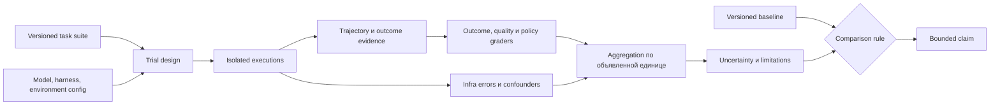

# 21 — Evaluation: outcome, baseline и статистическая неопределённость

## Цель и предварительные знания

В [лекции 15](LECTURE-0015-qa-evidence.md) QA искала доказуемый дефект
конкретного candidate, а в [лекции 16](LECTURE-0016-review-authority.md)
Reviewer принимал ограниченное решение о качестве. Один такой вердикт ещё
не отвечает на вопрос, насколько надёжна система на множестве задач и
повторных запусков. [Observability](LECTURE-0020-observability.md) сохраняет
наблюдаемое выполнение, но trace также не является оценкой качества.

**Evaluation** — спроектированный процесс измерения поведения системы на
определённой совокупности задач, при заданной конфигурации и правилах
оценивания. Его результат — не абсолютное свойство модели, а утверждение с
областью применимости: *что* измеряли, *какую систему* запускали, *в каких
условиях*, *сколько раз* и *каким grader* судили результат.

## Язык измерения: task, trial, outcome и grader

[Anthropic](https://www.anthropic.com/engineering/demystifying-evals-for-ai-agents)
предлагает полезное разложение agent evaluation. Здесь оно адаптировано к
нашей платформе.

- **Task** — один тестовый случай с входом, окружением и критериями успеха.
  Например: построить корректную модель net revenue, не меняя запрещённые
  пути.
- **Trial** — одна попытка системы решить task при зафиксированной
  конфигурации. Несколько trials нужны из-за вариативности модели и среды,
  но общий сбой инфраструктуры может сделать их зависимыми.
- **Trajectory** — наблюдаемая последовательность сообщений, tool calls,
  промежуточных состояний и действий внутри trial.
- **Outcome** — проверяемое конечное состояние: создан ли допустимый
  artifact, верны ли данные, соблюдены ли policy и gates.
- **Grader** — правило, которое отображает outcome, trajectory или оба
  представления в score/verdict. Это могут быть тест, SQL-oracle, policy
  check, rubric модели или экспертная оценка.
- **Harness** — инфраструктура, которая создаёт окружение, запускает trials,
  собирает evidence, вызывает graders и агрегирует результаты.

Такое разделение предотвращает распространённую ошибку: считать красивый
ответ доказательством результата. Агент может написать «pipeline создан»,
но outcome определяется состоянием репозитория, данными и независимыми
проверками. Обратная ошибка — потребовать единственную «правильную»
trajectory. Два агента могут прийти к одному допустимому outcome разными
путями. Поэтому для model-directed orchestration следует оценивать цель,
инварианты полномочий и бюджет, а не точное совпадение последовательности
tool calls. Проверять trajectory оправданно там, где сам путь нормативен:
например, запрещён production write или обязателен approval gate.

## До метрики нужно определить единицу успеха

Пусть для task `i` выполнено `k` trials, а бинарный grader возвращает
`xᵢⱼ ∈ {0, 1}`. Среднее всех `xᵢⱼ` оценивает долю успешных **попыток** в
данной выборке. Но продуктовый вопрос может быть другим:

- `pass@k`: получена ли хотя бы одна успешная попытка из `k`;
- `pass^k`: успешны ли все `k` попыток;
- task success: какую долю разных задач система решила по выбранному правилу;
- release gate: прошли ли все обязательные invariant checks по заранее
  объявленному правилу повторов в текущем build.

Эти величины нельзя подменять друг другом. Если независимая попытка успешна
с вероятностью `p`, то вероятность хотя бы одного успеха равна
`1 − (1 − p)^k`, а всех успехов — `p^k`. Но формулы требуют одинакового `p`
и независимости trials. Повторы на общем fixture, с одним rate limit или
остаточным state нарушают предпосылку. Кроме того, `pass@k` описывает продукт,
которому разрешены `k` попыток; его нельзя рекламировать как first-try
reliability.

Надёжная запись результата поэтому начинается не с процента, а с
**estimand** — точно названной измеряемой величины и популяции, к которой
она относится. «7 успешных trials из 10 на фиксированном сценарии и
конфигурации» честнее, чем «модель надёжна на 70%».

## Три режима evidence, которые нельзя смешивать

| Режим | Что запускается | Допустимый вывод | Недопустимое расширение |
| --- | --- | --- | --- |
| Offline regression invariants | Детерминированные tests/policies на фиксированных fixtures | Изменение не нарушило проверенные свойства в этом build | Модель качественна на реальных задачах |
| Dated live sample | Реальный model/provider/harness на объявленных tasks | Наблюдаемая частота исходов для этой конфигурации и выборки | Такая же частота сохранится после смены модели, prompt, среды или corpus |
| Fresh comparison | Сопоставимые новые trials вариантов A/B | Оценка различия при объявленном дизайне и неопределённости | Малое отличие доказывает превосходство независимо от условий |

Regression suite отвечает «не сломали ли мы уже проверенные свойства?».
Capability/quality suite отвечает «какие трудные задачи система способна
решать и насколько хорошо?». Первая закономерно стремится к почти полному
PASS и должна останавливать известную регрессию; вторая сохраняет запас
сложности, иначе насыщается и перестаёт различать улучшения. Один набор
может со временем перейти из capability в regression, но его прежний смысл
при этом нужно явно изменить.

## Измерительный pipeline

Рисунок 1. Стрелки обозначают поток условий и evidence, а не authority
агента. Baseline участвует только после фиксации задач, конфигурации,
единицы агрегации и неопределённости.

Текстовый эквивалент: версионированная suite вместе с конфигурацией модели,
harness и среды задаёт дизайн trials. Изолированные выполнения создают
trajectory и outcome evidence. Graders отдельно оценивают результат,
качество и policy. Агрегатор включает как вердикты, так и инфраструктурные
ошибки, применяет заранее объявленную единицу успеха и описывает
неопределённость. Только затем результат сравнивается с версионированным
baseline и превращается в ограниченный вывод.

## Baseline: порог, наблюдение или comparator

Словом *baseline* называют разные объекты.

1. **Acceptance threshold** — нормативный порог: например, все safety cases
   обязаны пройти. Он выражает риск-политику, а не оценку вероятности.
2. **Historical measurement** — датированный результат прежней
   конфигурации. Он полезен для ориентира, пока сохранены provenance и
   сопоставимость.
3. **Control/comparator** — вариант A, повторно измеренный вместе с вариантом
   B на согласованном наборе задач и условиях.

Если старый результат A сравнить со свежим B, разность одновременно включает
смену модели, prompt, code, grader, corpus, provider и инфраструктуры. Такая
разность описывает два snapshots, но не идентифицирует причинный эффект
одного изменения. Для убедительного сравнения фиксируют версию suite и
grader, budgets, temperature/seed policy, tool surface и ресурсы; варианты
запускают на одних tasks, предпочтительно попарно и в сбалансированном
порядке. Порядок не устраняет всю зависимость, но уменьшает смешение эффекта
варианта с изменением условий во времени.

Размер выборки определяет разрешение измерения. Результат `8/10` выше
`7/10`, но одна дополнительная удача при малом `N` ещё не доказывает
улучшение популяционной надёжности. До эксперимента задают practically
meaningful effect, допустимые ошибки решения и требуемую мощность; после —
публикуют denominator и интервал неопределённости, а не только округлённый
процент. Многократный подбор prompt по одному test set дополнительно делает
обычную оценку оптимистичной.

## Grader тоже является измерительным инструментом

Grader может ошибаться даже при детерминированном коде. **False pass** — он
принимает outcome с известным дефектом; **false rejection** — отвергает
допустимый результат. Для Reviewer аналог false pass — false approval.
Mutation corpus с заранее известными дефектами измеряет чувствительность к
конкретным классам ошибок, а canonical valid cases — склонность к ложному
отказу. Нулевой false-pass rate на пяти mutations означает только `0/5` на
этом corpus, не нулевую вероятность всех будущих пропусков.

Model-based grader добавляет недетерминизм и возможность разделять blind
spots с оцениваемым агентом. Его rubric, model/version и context входят в
конфигурацию эксперимента; оценки калибруют по экспертным решениям. Code
grader обычно воспроизводимее, но может закрепить неверную спецификацию или
наказывать допустимую вариативность. Несколько grader types уменьшают один
класс слепых зон, но общий ошибочный источник данных способен согласованно
обмануть их все.

## Contamination и адаптация к тесту

Suite перестаёт быть независимой оценкой, если её задачи, ответы или hidden
criteria попали в prompt, training corpus либо цикл ручной настройки. Даже
без утечки в обучение команда может много раз смотреть на один benchmark и
неявно оптимизировать harness под его особенности. Это аналог переобучения
на test set.

Поэтому полезно разделять development cases, regression cases из уже
известных дефектов и закрытый holdout. Новые production failures добавляют
в regression bank **после** того, как ими измерили текущую систему. Fingerprint
suite, graders, code и configuration делает изменение видимым, но сам по себе
не доказывает отсутствие contamination.

## Инфраструктура входит в объект измерения

Для agentic system среда — активный участник: агент запускает процессы,
обращается к tools и расходует CPU, RAM, сеть и время. Исследование
[Anthropic об infrastructure noise](https://www.anthropic.com/engineering/infrastructure-noise)
показывает на Terminal-Bench 2.0, что разные resource configurations при
неизменных model, harness и task set дали разницу до 6 процентных пунктов в
их эксперименте. Это результат конкретного benchmark, а не коэффициент для
нашей системы; переносим мы лишь принцип: ресурсы и enforcement являются
переменными эксперимента.

Timeout, OOM, provider 429 и неверный task outcome должны различаться в
сырых данных. Простое исключение infrastructure failures улучшает процент,
но скрывает end-to-end доступность; смешение их с semantic failures искажает
оценку способности модели. Правильный выбор зависит от estimand: model
capability при контролируемой инфраструктуре или надёжность всей системы,
которой пользуется оператор. Подробную причинную классификацию отказов
разберёт [лекция 22](../modules/module-22-failure-taxonomy/README.md).

## Что измерено в нашей системе

[Phase K benchmark](../../evals/phase_k/suite.json) содержит 17 offline
cases: 5 reliability, 5 quality-gate и 7 safety. Каждый case выполняется
трижды в свежем санитизированном pytest subprocess с timeout и ограничением
output. [`baseline.json`](../../evals/phase_k/baseline.json) требует долю
PASS `1.0` во всех категориях, ноль policy violations, model tokens и cost.
Это строгий **acceptance threshold** для repository regression harness, а
не эмпирическая вероятность успеха LLM.

Финальная запись [STEP-0024](../../plan/evidence/STEP-0024-phase-k-evaluation-benchmark.md)
содержит две совпавшие по смыслу post-fix выборки: в каждой `51/51 PASS`,
итого `102/102`. Но это не 102 независимые semantic tasks: это два запуска
одних 17 фиксированных cases по три повторения. Результат подтверждает
повторяемость проверенных offline-инвариантов при том fingerprint; он не
измеряет fresh model quality, а timing не объявлен SLO.

Отдельный [исторический live sample](../../plan/evidence/STEP-0009-reliability-sample.md)
Data Engineer зафиксировал `7/10` end-to-end successes для
`openai/gpt-5.6-luna`, одного сценария и configuration fingerprint. Это
датированная точечная оценка с малым `N`, не текущая гарантия и не
универсальная характеристика модели. Файл
[`historical_live_baseline.json`](../../evals/phase_k/historical_live_baseline.json)
индексирует 24 ранее выполненные попытки разных ролей, но они имеют разные
tasks, graders и denominators. Складывать их в «общие 24 trials» и вычислять
единый success rate методологически неверно.

Контрпример: вариант B получил `8/10`, а исторический A — `7/10`. Если B
запущен позже, с другим grader и большим memory limit, утверждение «B лучше
на 10 процентных пунктов» не следует из наблюдений. А если offline suite
дала `51/51`, сравнивать `100%` с live `70%` ещё хуже: режимы измеряют разные
объекты. Корректный следующий шаг — свежий сопоставимый A/B design, а не
арифметика над несопоставимыми числами.

## Итог и вопросы для самопроверки

Evaluation связывает определённую задачу, trial configuration, outcome и
grader, а затем формирует вывод через заранее выбранную единицу измерения.
Regression invariant, historical live rate и свежий comparator дают разные
виды знания. Baseline может быть порогом или измерением; малый `N`, grader
error, contamination и infrastructure confounders ограничивают любой score.
Хорошая evaluation-система публикует не только число, но и denominator,
fingerprint, failure accounting и границы допустимого вывода.

1. Почему успешный trial и успешный task — не обязательно одна единица
   измерения?
2. В каком случае нужно оценивать outcome, а в каком — также trajectory?
3. Почему `baseline.json` нашей Phase K нельзя интерпретировать как
   измеренную надёжность модели?
4. Какие дополнительные условия нужны, чтобы сравнение `8/10` и `7/10`
   поддерживало вывод об улучшении?
5. Чем contamination отличается от обычной ошибки grader и почему
   fingerprint не устраняет её автоматически?

Следующая [лекция 22](../modules/module-22-failure-taxonomy/README.md)
перейдёт от измеренного FAIL к его причине: разделит model, tool,
infrastructure, contract и orchestration failures и покажет, почему retry
может усиливать отказ.
