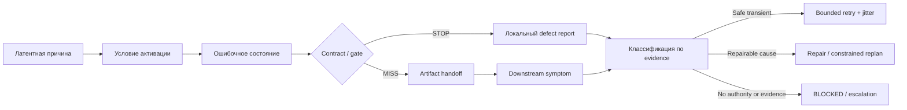

# 22 — Failure modes: причины, propagation и retry amplification

## Цель и предварительные знания

В [лекции 21](LECTURE-0021-evaluation.md) мы определили, как считать
успешные и неуспешные trials. Но одинаковый `FAIL` не означает одинаковую
причину: неверный SQL, исчерпанная память, запрещённое действие и ошибка
перехода требуют разных ответов. Здесь нас интересует не метрика отказов, а
их **каузальная структура**: где возникло нарушение, через какие границы оно
распространилось и почему повтор мог помочь, ничего не изменить или усилить
проблему.

Механизмы checkpoint, receipt и idempotency уже рассмотрены в
[лекции 17](LECTURE-0017-recovery-idempotency.md). Мы будем ссылаться на их
гарантии, но не повторять recovery protocol. Наша задача — сначала
классифицировать отказ, а уже затем выбирать recovery, repair, block или
эскалацию.

## Симптом, ошибочное состояние и причина

Полезно разделять четыре элемента:

- **нарушенное свойство** — ожидаемый outcome или invariant, который не
  выполнен;
- **ошибочное состояние** — внутреннее состояние, из которого нарушение
  становится возможным: stale artifact, потерянный receipt, исчерпанный
  resource pool;
- **условие активации** — concurrency, конкретные данные, timeout или ветка,
  при которых скрытая проблема проявилась;
- **симптом** — наблюдаемое сообщение или сигнал: `TIMEOUT`, `DENY`, пустой
  diff, `FAILED`, OOM, повторный side effect.

**Root cause** в операционной работе — наиболее ранняя подтверждённая
причина, исправление которой разрывает исследуемую цепочку. Это не обещание
найти единственную философскую причину. У отказа могут быть необходимые
совместные условия: например, общий mutable fixture **и** два конкурентных
процесса. Выбор «корневой» причины зависит и от границы системы: provider
429 внешнен для harness, но является частью end-to-end сервиса.

Симптом и причина связаны many-to-many. `TIMEOUT` может означать медленный
provider, зависший tool, network loss, слишком короткий deadline или
исчерпанный общий worker pool. Один дефект resource isolation, напротив,
может проявиться как timeout, OOM и падение unrelated test. Поэтому label
ошибки — начало диагностики, а не готовый диагноз. Trace из
[лекции 20](LECTURE-0020-observability.md) помогает восстановить наблюдаемую
цепочку, но сам не доказывает семантическую причину.

## Рабочая taxonomy для agentic data platform

Следующая taxonomy — инженерная модель этого курса, не универсальный
стандарт. Категория обозначает слой, на котором находится исправляемая
причина, а не место первого заметного симптома. Классы не обязаны быть
взаимоисключающими: provider timeout может сочетать infrastructure shortage,
неудачный tool deadline и workflow policy повторов.

| Класс причины | Типичные нарушения | Возможный симптом | Почему простой retry недостаточен |
| --- | --- | --- | --- |
| Infrastructure | CPU/RAM/disk, process crash, network, provider availability | OOM, timeout, 429, connection error | Постоянный лимит или общая перегрузка повторятся; синхронные retries увеличат нагрузку |
| Tool/integration | Неверный API adapter, SQL dialect, response truncation, несовместимая версия | Tool error, malformed result, пустой output | Повтор того же запроса через тот же adapter сохраняет дефект |
| Workflow/state | Недопустимый переход, stale artifact, потеря causal binding, несброшенный gate | Ложный `DONE`, цикл, downstream verdict для старой версии | Нужен repair состояния или графа, а не новый model call |
| Reasoning/semantics | Неверная гипотеза, grain, бизнес-правило или выбор evidence | Валидный JSON и зелёные tests при неверном результате | Повтор с тем же контекстом и blind spot коррелирован с первой ошибкой |
| Policy/authority | Ошибочный scope, deny/allow rule, identity binding или approval | `DENY` либо недопустимый side effect | Backoff не меняет полномочия; обход запрета был бы эскалацией |

**Contract** здесь является не шестым независимым источником, а границей
распространения. Schema может остановить malformed artifact от любого слоя.
Но корректный по schema объект способен нести ошибочную семантику, а дефект
самого контракта может одновременно затронуть producer и consumer. Поэтому
«validation error» описывает точку обнаружения, но ещё не владельца причины.
Аналогично, `DENY` часто является правильным containment недопустимого
запроса; failure возникает не из самого отказа, а из ошибочной policy,
неверной identity либо попытки выполнить запрещённое действие.

## Как локальный дефект становится системным

Рисунок 1. Схема показывает каузальные и информационные переходы, а не
гарантированный алгоритм diagnosis. `STOP` локализует наблюдаемое нарушение,
но defect report всё ещё может ошибиться в root cause. Retry допустим только
после отдельной проверки transient nature, idempotency и budget.

Текстовый эквивалент: латентная причина проявляется при условии активации и
создаёт ошибочное состояние. Contract или gate либо останавливает его с
локальным defect report, либо пропускает artifact в следующий handoff, где
возникает downstream symptom. Evidence из обоих путей поступает в
классификацию. Безопасный transient отказ допускает ограниченный retry с
jitter; исправимая причина требует repair или constrained replan; отсутствие
полномочий или достаточного evidence ведёт к `BLOCKED`/эскалации.

## Propagation через artifacts и handoffs

Multi-agent system размножает не только работу, но и предположения. Если
Analyst неверно определил grain, PM может формализовать внутренне связную,
но предметно ошибочную спецификацию; DE реализует её; QA проверит критерии,
которые уже наследуют исходную ошибку. Typed handoff сохраняет identity и
структуру, однако не превращает входную предпосылку в истину.

Два режима особенно опасны:

- **false completion** — control plane принимает сигнал завершения без
  достаточного outcome evidence. Текст «готово» или успешный model call не
  равен принятому artifact и пройденным gates;
- **stale-state propagation** — downstream verdict относится к прежней
  версии, но используется для новой. Например, DE изменил candidate, а
  система сохранила старый QA PASS.

Текущий [`RolePipelineSnapshot`](../../runtime/role_pipeline.py) ограничивает
второй режим: после `REWORK` только Data Engineer может создать новую
implementation; прошлые implementation/validation/QA/review artifacts
переносятся в `gate_history`, а текущие downstream поля сбрасываются. Новый
candidate снова проходит Validator, QA и Reviewer. Это code-level защита от
конкретной causal mismatch, но не доказательство правильности новых gates.

## Common-mode failure: много PASS с одной слепой зоной

Несколько проверок не являются независимыми, если разделяют источник,
fixture, библиотеку или предположение. Тогда один latent fault даёт
коррелированные исходы.

[PRB-0035](../../plan/problems/PRB-0035-null-attribution-argmax.md) — пример
semantic common mode. Candidate и первая версия независимого SQL-oracle
нормализовали nullable channel **после** `argMax`. Их diff был пуст, public
validator прошёл, но live QA заметила, что ClickHouse может пропустить NULL
в aggregate и выбрать старое значение. Причина была не в transport или
schema, а в общей ошибочной семантической предпосылке двух путей. Исправление
перенесло `ifNull` внутрь `argMax` и было подтверждено повторными checks;
оно не доказывает отсутствие всех будущих общих blind spots.

[PRB-0051](../../plan/problems/PRB-0051-concurrent-offline-scenario-fixtures.md)
показывает другой common mode: `make check` и benchmark конкурентно меняли
один workspace. Тест mutation installer упал так, будто повреждена логика
SQL, хотя причиной была shared-fixture race. Общий `flock` сериализовал эти
targets. Простое повторение могло случайно дать PASS, но лишь скрыло бы
условие активации и создало ложную уверенность в независимости trials.

Именно поэтому «три повтора» не означают три независимых свидетельства,
если все они используют один corrupted seed или одновременно конкурируют
за общий ресурс. [Лекция 21](LECTURE-0021-evaluation.md) определила единицу
измерения; здесь мы добавляем причинное требование — искать shared causes
до интерпретации частот.

## Race window: правильные шаги в опасном порядке

[PRB-0052](../../plan/problems/PRB-0052-checkpoint-publication-permission-race.md)
возник не из-за неверного конечного permission, а из-за порядка публикации:
delegate сначала делал checkpoint видимым под default mode, а wrapper менял
его на `0600` после возврата. Concurrent reader мог попасть в короткое окно
и корректно отказать на небезопасном файле.

Текущий [`SecureCheckpointStorage`](../../runtime/checkpoints.py) записывает
checkpoint в mode-`0700` staging directory, выставляет файлу `0600`, делает
`fsync` файла и лишь затем публикует его create-only hard link. Regression
test наблюдает границу до публикации. Это historical defect и текущая
code/test boundary: она подтверждает устранение обнаруженного process race,
но не обещает power-loss durability файловой системы или exactly-once
внешних effects.

Случай важен методологически: итоговый state «файл имеет 0600» был верен,
но invariant «видимый файл **всегда** имеет 0600» нарушался. При concurrency
нужно проверять не только начальное и конечное состояния, но и publication
boundary.

## Когда retry превращается в amplifier

Retry полезен, если причина transient, операция безопасна для повтора, а
число попыток и общий deadline ограничены. Без этих условий он способен:

- повторить необратимый side effect;
- удерживать worker и исчерпать общий pool;
- превратить локальную перегрузку в retry storm;
- умножить вызовы на вложенных слоях;
- скрыть воспроизводимый defect за случайным PASS.

Если верхний слой делает до `a` попыток, а каждый его вызов запускает до `b`
попыток нижнего слоя, worst-case число нижних вызовов равно `a × b`. Для
трёх вложенных слоёв с тремя попытками на каждом это уже `3³ = 27` вызовов
на один исходный запрос. Это верхняя граница для полностью исчерпывающегося
вложенного сценария, а не прогноз обычной нагрузки. Практический принцип —
назначать владельца retry, общий budget/deadline и не позволять каждому
слою независимо «быть надёжным».

[AWS Architecture Blog](https://aws.amazon.com/blogs/architecture/exponential-backoff-and-jitter/)
показывает на собственной simulation конкурентных OCC clients: capped
exponential backoff уменьшал частоту, но сохранял кластеры вызовов; добавление
jitter распределяло пики и при 100 clients более чем вдвое уменьшило число
calls относительно исходного contention case. Эти числа относятся к модели
статьи, не к нашей платформе. Переносимый вывод уже: jitter снижает
синхронизацию retries, но не исправляет permanent semantic, policy или
permission failure.

## Infrastructure failure или поведение системы?

Граница зависит от вопроса. Для исследования model capability OOM может
быть confounder, который нужно контролировать. Для оператора end-to-end
системы тот же OOM — настоящий отказ сервиса. Нельзя сначала исключить все
неудобные infrastructure outcomes, а затем назвать остаток общей
reliability.

В исследовании
[Anthropic](https://www.anthropic.com/engineering/infrastructure-noise)
одни и те же model, harness и Terminal-Bench 2.0 tasks при разных resource
configurations дали до шести процентных пунктов разницы. Статья также
показывает двойную роль ресурсов: headroom может устранить случайный OOM,
а после некоторой границы — реально дать агенту возможность применить более
тяжёлую стратегию. Следовательно, resource limit — не только фон, но иногда
часть спецификации задачи. Численный эффект исследования не переносится на
нашу платформу.

## Ошибочная ветка и ошибочный replan

В code-owned workflow ошибка маршрутизации воспроизводимо направляет
определённый state по неверному edge. Область поражения легче перечислить:
если state space и budgets действительно ограничены, typed snapshot и
terminal transitions можно систематически покрыть tests. Но системный дефект
router способен одинаково искажать каждый запуск.

В agent-orchestrator manager выбирает новые подзадачи по промежуточному
evidence. Ошибочная гипотеза может вызвать **ошибочный replan**: отменить
нужное исследование, разветвить множество бесполезных workers или объявить
цель достигнутой. Такой путь труднее перечислить заранее, а ошибочное
сводное evidence может распространяться на ещё не существовавшие ветви.
Преимущество — manager способен изменить стратегию вместо повтора заведомо
неработающего шага.

В обоих случаях внешние policy, capability, budget и acceptance gates
должны оставаться code-owned. Наш dynamic manager — только архитектурная
альтернатива из [лекции 07](LECTURE-0007-agent-orchestrator.md), а не
реализованный runtime. Поэтому сравнение описывает failure surface, но не
является результатом локального benchmark.

## Итог и вопросы для самопроверки

Failure label сообщает наблюдение, но не root cause. Причина может лежать в
infrastructure, tool integration, workflow state, reasoning или policy, а
contract определяет границу, на которой ошибка остановится или пройдёт
дальше. Handoffs распространяют предположения; shared fixtures и oracles
создают common-mode correlation. Retry допустим лишь для классифицированного
transient отказа при idempotency, budget и deadline; backoff с jitter
уменьшает синхронизацию, но не заменяет repair.

1. Почему `TIMEOUT` нельзя сразу классифицировать как infrastructure root
   cause?
2. Как typed contract способен остановить propagation, не гарантируя
   semantic correctness?
3. Что общего у PRB-0035 и PRB-0051, хотя один дефект семантический, а
   второй инфраструктурный?
4. Почему retry на каждом вложенном слое способен усилить исходную
   перегрузку?
5. Чем ошибочный edge fixed workflow отличается по failure surface от
   ошибочного manager replan?

Следующая [лекция 23](../modules/module-23-cost-performance/README.md)
переведёт число model/tool attempts, parallel branches и retries в budgets,
critical path и полную стоимость выполнения.
