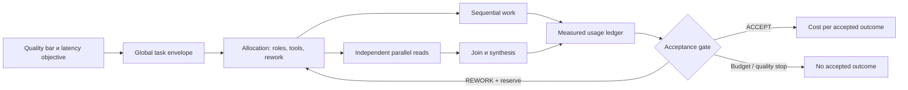

# 23 — Cost/performance: budgets, critical path и эффективность

## Цель и предварительные знания

В [лекции 21](LECTURE-0021-evaluation.md) мы отделили успешную попытку от
надёжности на множестве задач, а в [лекции 22](LECTURE-0022-failure-taxonomy.md)
увидели, как retries умножают работу. Теперь сформулируем экономический
вопрос: сколько ресурсов система расходует, чтобы получить **принятый
outcome** с требуемым качеством и временем ответа?

Минимальная цена одного model call не отвечает на этот вопрос. Agentic
execution включает context, tool calls, проверки, rework, coordination,
хранение evidence и неуспешные попытки. Parallelism может уменьшить время
до результата, одновременно увеличив tokens и инфраструктурную нагрузку.
Поэтому cost, latency, throughput и quality — разные оси, а не одно число
«эффективности».

## Цена токена — только один член полной стоимости

Для вызова модели с `I` input tokens, `O` output tokens и catalog prices
`pᵢ`, `pₒ` за миллион токенов оценка provider charge имеет вид:

`C_model_call = (I × pᵢ + O × pₒ) / 1 000 000`.

Для всего workflow model cost — сумма по фактически выполненным calls,
включая capability probes и неуспешные ответы, если provider их тарифицирует
и usage доступен. Но **total cost** шире:

`C_total = C_model + C_tools + C_compute + C_storage/network + C_coordination + C_human + C_failure`.

Это аналитическая декомпозиция, а не утверждение, что наша платформа умеет
измерить каждый член. `C_failure` обозначает ресурсы незавершённых попыток,
cleanup и повторов; он может пересекаться с предыдущими категориями, поэтому
при бухгалтерском расчёте нельзя суммировать одно потребление дважды.
Human review и opportunity cost также требуют собственной границы учёта.

Полезная продуктовая метрика — **cost per accepted outcome**:

`C_accepted = Σ C_total всех attempts / N_accepted`.

В denominator входят только outcomes, прошедшие объявленные acceptance
gates, а в numerator — также стоимость отказов. При `N_accepted = 0` метрика
не равна нулю и не определена; нужно отдельно сообщить расход и отсутствие
принятого результата. Сравнивать варианты допустимо лишь на одной задаче,
quality bar и accounting boundary.

## Work, latency, throughput и critical path

**Work** — суммарный объём выполненных операций. **Latency** — время от
начала одного запроса до его результата. **Throughput** — число завершённых
запросов за интервал при заданной нагрузке. Они меняются по-разному.

Для последовательных стадий latency примерно складывается. Если после
подготовки одновременно выполняются независимые ветви `A`, `B`, `C`, то в
идеальных условиях участок critical path занимает
`max(T_A, T_B, T_C)`, а не `T_A + T_B + T_C`. Полное время всё равно
включает serial setup, scheduling/queue delay, join и synthesis:

`T_total ≈ T_setup + max(T_branches) + T_join + T_synthesis`.

**Critical path** — самая длинная причинно необходимая цепочка операций,
определяющая минимально возможную latency данного execution graph. Это не
обязательно самая дорогая ветвь. Ускорение операции вне critical path не
уменьшит end-to-end latency, пока она не станет частью нового bottleneck.

Формула выше требует реальной независимости и достаточных ресурсов.
Общий connection pool, provider rate limit, CPU, memory или filesystem lock
добавляет queueing и может сериализовать «параллельные» ветви. Одновременные
writes создают conflicts и rework. Поэтому безопасный кандидат для
parallelism — bounded read-only investigation по независимым вопросам;
изменения общей dbt-модели чаще требуют координации и одного владельца записи.

## Поток бюджета через workflow

Рисунок 1. Стрелки показывают allocation и accounting flow, а не права
модели. Parallel reads сходятся в join; их work суммируется, даже если
latency определяется самой медленной ветвью. Gate не возвращает бюджет уже
выполненных операций.

Текстовый эквивалент: quality bar и latency objective задают общий envelope,
который распределяется между roles, tools и reserve для rework. Операции
выполняются последовательно либо как независимые параллельные чтения.
Результаты параллельных ветвей требуют join/synthesis; всё потребление
поступает в usage ledger. Acceptance gate принимает outcome, разрешает
ограниченный rework при наличии резерва или завершает работу без принятого
результата. Cost per accepted outcome вычисляется только для принятого
результата, но учитывает расход всех attempts.

## Budget — исполняемая граница, а не прогноз

Forecast отвечает «сколько, вероятно, потребуется», budget — «сколько
разрешено потратить». Их смешение приводит либо к неожиданному отказу, либо
к фактически неограниченному execution.

Полезна иерархия:

1. **Task envelope** ограничивает весь workflow по tokens, tool calls,
   wall time, attempts и при необходимости деньгам.
2. **Role allocation** выдаёт долю envelope и reserve, не позволяя ранней
   роли поглотить ресурс независимых quality gates.
3. **Operation limit** ограничивает один call: timeout, output bytes,
   rows, tokens или число tool iterations.
4. **Rework reserve** тратится только после принятого defect evidence, но
   остаётся частью общего envelope.

При последовательном workflow достаточно проверять накопленный usage перед
новым переходом. При параллельном fan-out одной проверки «остаток ещё есть»
недостаточно: несколько workers могут одновременно получить один и тот же
остаток. Нужны атомарная reservation или разделённые sub-budgets, затем
reconciliation фактического расхода. Reservation защищает верхнюю границу,
но временно снижает доступность ресурса другим ветвям.

Наш [`BudgetState`](../../orchestrator/state.py) code-owned и fail-closed:
он накапливает `tool_calls`, `model_tokens`, `wall_time_seconds` и
`rework_attempts`, а превышение limit отклоняет charge. Это контракт
переходов, не scheduler reservation для параллельных roles и не денежный
ledger. Текущий шестиролевой business path последователен; manager/fan-out
не реализованы.

## Cost-first capability gate

Выбирать исключительно минимальный catalog price ошибочно: дешёвая модель,
которая не поддерживает нужную schema/tool semantics, имеет нулевую
полезность. Более строгая стратегия:

1. определить минимальные capabilities и context boundary;
2. отфильтровать несовместимые модели;
3. проверить capability на ограниченном probe;
4. среди прошедших сравнить ожидаемые cost/latency;
5. подтвердить качество свежей evaluation на целевых tasks.

Текущий [`select_cheapest_available_chat_model`](../../runtime/model_provider.py)
сортирует candidates по `prompt_price + completion_price`, затем выполняет
минимальный live schema probe. Это **cost-first capability gate**, но не
оптимизатор полной стоимости. Простая сумма цен предполагает одинаковый вес
input/output, не использует task-specific token mix, reliability, tool
behavior или cost of retries. Probe подтверждает узкую совместимость, а не
качество на dbt-задаче.

Контрпример: модель A стоит условно `0.02` за attempt и успешно решает
задачу с вероятностью `0.25`; модель B стоит `0.05` и успешна с вероятностью
`0.9`. При одинаковой цене каждой попытки и независимых повторах грубая
ожидаемая стоимость первого успеха составляет `0.02 / 0.25 = 0.08` для A и
`0.05 / 0.9 ≈ 0.056` для B. Более дорогой call может дать более дешёвый
accepted outcome. Это учебная модель: реальные attempts имеют разную цену,
ограниченный retry budget, корреляцию и не только бинарное качество.

## Tool context тоже имеет цену

Tool use расходует как минимум два разных ресурса:

- execution resource внешнего tool;
- context resource модели: definitions, arguments, results и история
  промежуточных turns.

[Anthropic](https://www.anthropic.com/engineering/code-execution-with-mcp)
описывает два источника overhead прямого tool calling: загрузку множества
definitions и передачу промежуточных results через model context. В их
иллюстрации on-demand discovery и обработка данных в code environment
снизили context с 150 000 до 2 000 tokens. Это демонстрационный пример
статьи, не измерение нашей платформы и не бесплатная оптимизация: code
execution добавляет sandboxing, resource limits, monitoring и security cost.

Переносимый принцип — progressive disclosure и ранняя фильтрация данных.
Модель должна видеть только нужные contracts и ограниченный результат,
если полная выборка не требуется для reasoning. Но фильтр сам становится
частью correctness boundary: слишком ранняя агрегация может удалить
исключение, необходимое для верного вывода.

Наши role profiles ограничивают tool surface, calls и output, однако не
реализуют описанный в статье filesystem catalog/code-execution слой и не
ведут денежный учёт tool infrastructure. Byte bounds из
[лекции 03](LECTURE-0003-harness-context.md) также нельзя автоматически
перевести в точные provider tokens.

## Цена multi-agent parallelism

Полная стоимость dynamic team включает manager planning, контекст каждого
worker, их tool calls, передачу результатов, synthesis и возможный replan:

`C_team = C_manager + Σ C_workers + C_synthesis + C_coordination + C_rework`.

Параллельность меняет расположение работы во времени, но не обнуляет сумму
`Σ C_workers`. Иногда она даже повышает её: workers дублируют search,
возвращают несовместимые assumptions или создают больше материала для
synthesis.

В статье о своей
[multi-agent research system](https://www.anthropic.com/engineering/multi-agent-research-system)
Anthropic сообщает, что их multi-agent executions использовали примерно в
15 раз больше tokens, чем chat interactions, а параллелизация сокращала
время сложного research до 90% в их условиях. Эти показатели нельзя
переносить на data engineering: article одновременно подчёркивает, что
архитектура оправдана для ценных breadth-first задач с независимыми
направлениями, но хуже подходит для тесно связанных действий с общим
контекстом.

Следовательно, fan-out должен иметь **marginal value test**: какую новую
информацию даёт ещё один worker, какова вероятность изменить решение и
сколько стоит его branch плюс synthesis. Если ответ заранее известен или
подзадачи сильно связаны, один bounded agent либо обычная функция могут
быть и быстрее, и дешевле. Матрицу выбора архитектуры построит
[лекция 24](../modules/module-24-orchestration-comparison/README.md).

## Что действительно измерено у нас

`MAFModelProvider` сохраняет provider-reported input/output/total tokens,
model-call latency и hashes без prompt/response content. Live runners
оценивают ₽ по token usage и ценам **полученного тогда** GateLLM catalog
snapshot. Это estimated model charge: он не включает compute инструментов,
Docker, storage, human review и opportunity cost; неизвестный usage не
становится нулевой стоимостью.

Датированный [EXP-0001](../../plan/experiments/EXP-0001-pm-structured-model-selection.md)
зафиксировал для успешного Llama 3.1 8B PM-run `992 + 423` tokens, `3710 ms`
и около `0.02583 ₽` вместе с probe при ценах того catalog. До него дешёвые
candidates давали 504, не проходили schema probe или Pydantic validation:
стоимость order не предсказала full-call reliability.

Историческая [STEP-0009 sample](../../plan/evidence/STEP-0009-reliability-sample.md)
для Data Engineer содержит 10 runs одной конфигурации: `7/10` end-to-end
success; у public-success runs median `17 330.5` tokens, `34 843 ms` model
latency и `1.940130 ₽`. Два budget failures не имеют полного usage/cost,
поэтому `17.535120 ₽` явно назван known lower bound, а не total spend.
Ceiling `42k` сделал две repair attempts исполнимыми, но historical evidence
оценивал worst-case run близко к `4 ₽`.

Эти числа показывают масштаб различий между ролью PM и DE, но не текущие
цены, SLO или сравнение моделей: сценарии, даты, prompts и acceptance gates
различаются. Свежая оптимизация требует нового versioned experiment.

## Quality-constrained optimization

Цель «снизить tokens на 30%» неполна. Уменьшение context, model class,
числа tools или rework может снизить cost и одновременно увеличить false
completion. Практическая постановка выглядит так:

> минимизировать expected cost per accepted outcome и latency percentile
> при нижней границе task success, обязательном quality/safety PASS и
> верхних resource budgets.

Это многокритериальная задача. Решение A может быть дешевле, B — быстрее,
C — надёжнее; без приоритетов они образуют Pareto frontier, а не единого
победителя. Cost-first selection допустим только **после** capability и
safety constraints. Любое изменение budget/prompt/tool exposure меняет
configuration fingerprint и требует повторной evaluation; прежний score
нельзя механически сохранить.

## Итог и вопросы для самопроверки

Цена model tokens — измеримый, но неполный компонент. Total cost включает
tools, infrastructure, coordination, human work и неуспешные attempts;
сравнивать варианты следует по accepted outcomes при одинаковом quality
bar. Parallelism уменьшает critical path лишь для независимой работы и при
доступных shared resources, тогда как суммарный work обычно сохраняется или
растёт. Budgets должны быть иерархическими, исполняемыми кодом и иметь
reserve/reconciliation; снижение бюджета всегда перепроверяется evaluation.

1. Почему cheapest successful model call может не давать минимальный cost
   per accepted outcome?
2. Чем суммарный work параллельных branches отличается от critical-path
   latency?
3. Зачем параллельным workers reservation, если общий budget проверяется
   до их запуска?
4. Какие расходы отсутствуют в локальном `estimated_cost_rub`?
5. Почему уменьшение tool output требует проверки качества, даже если
   token usage гарантированно снизилось?

Следующая [лекция 24](../modules/module-24-orchestration-comparison/README.md)
объединит authority, adaptivity, evaluation, failure surface и экономику в
сценарную матрицу выбора fixed workflow, agent-orchestrator, hybrid,
single-agent или обычной функции.
