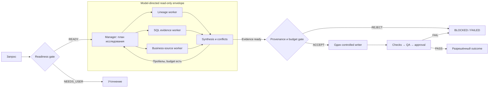

# 24 — Workflow vs agent-orchestrator: сценарии, trade-offs и гибрид

## Цель и предварительные знания

В [лекции 06](LECTURE-0006-strict-workflow.md) разобран code-owned workflow,
а в [лекции 07](LECTURE-0007-agent-orchestrator.md) — model-directed manager.
Теперь вопрос не в том, как устроен каждый механизм, а **какому классу задач
передать право выбирать следующий шаг**. Ошибка выбора проявляется либо как
дорогая негибкость, либо как непредсказуемая свобода именно там, где нужен
контроль.

Цель лекции — построить rubric для архитектурного выбора между обычной
функцией или одним агентом, жёстким workflow, agent-orchestrator и bounded
hybrid. Потребуются также понятия полномочий из [лекции 19](LECTURE-0019-security-authority.md),
evaluation из [лекции 21](LECTURE-0021-evaluation.md) и critical path из
[лекции 23](LECTURE-0023-cost-performance.md). Здесь мы применяем их, но не
повторяем внутреннюю механику.

## Сначала разделим четыре независимых решения

Спор «workflow или multi-agent» часто смешивает разные оси:

1. **Topology** — последовательность, ветвление, цикл или параллельные ветви.
2. **Control ownership** — код или модель выбирает следующую подзадачу.
3. **Authority** — кто вправе читать данные, изменять артефакт и подтверждать
   side effect.
4. **Transport** — локальный вызов, очередь, MCP, A2A или другой протокол.

Из topology нельзя вывести остальные свойства. Жёсткий граф может ветвиться,
повторять этап и запускать независимые проверки параллельно. Manager может
работать последовательно и вызывать workers как tools в одном процессе.
A2A между сервисами не означает model-directed planning, а динамический план
не даёт модели право обходить approval gate.

Эта декомпозиция устраняет ложную дихотомию: можно сделать адаптивное
read-only исследование внутри статической оболочки полномочий и приёмки.

## Четыре кандидата, а не два

**Обычная функция или один bounded agent** подходит, когда задача мала,
границы известны, а специализация нескольких ролей не добавляет независимой
проверки или контекста. Это базовая альтернатива, относительно которой нужно
оправдать orchestration overhead.

**Code-owned workflow** фиксирует допустимые стадии, переходы и gates.
Содержимое артефакта может создавать LLM, но множество допустимых маршрутов
задаёт программа. Сильная сторона — стабильная причинная цепочка и
воспроизводимая политика; слабая — заранее нужно знать значимые классы
состояний и реакций.

**Agent-orchestrator** динамически декомпозирует цель, выбирает workers и
перепланирует работу по observations. Сильная сторона — исследование
неизвестного пространства; слабая — planner может выбрать неверную ветку,
потерять контекст или потратить непропорциональный бюджет.

Термины у авторов различаются: например, LLM-managed pattern может называться
`orchestrator-workers workflow`. В этой лекции классификация основана не на
слове *workflow*, а на владельце решения: если новые subtasks во время запуска
выбирает модель, это model-directed область управления.

**Bounded hybrid** оставляет модели выбор исследовательских read-подзадач,
но код сохраняет budgets, permissions, write serialization, quality gates и
terminal outcomes. Это не «лучшее из двух миров бесплатно»: появляются два
уровня управления, два вида telemetry и необходимость проверить их
композицию.

## Rubric выбора

Архитектуру следует выбирать по свойствам задачи, а не по числу названных
агентов.

| Свойство задачи | В сторону workflow | В сторону manager | Почему |
| --- | --- | --- | --- |
| Декомпозиция | Стадии известны заранее | Подзадачи появляются из observations | Код хорошо обеспечивает известный порядок; manager исследует неизвестное |
| Coupling | Общие решения и последовательные зависимости | Независимые направления поиска | Параллельные workers могут принять несовместимые скрытые решения |
| Side effects | Записи, release, production impact | Read-only discovery | Чем выше цена ошибки, тем меньше должна быть model-owned область |
| Acceptance | Формализуемый контракт и deterministic checks | Открытый критерий достаточности | Формальный gate проще закрепить кодом; открытый поиск требует synthesis |
| Изменчивость пути | Повторяющийся регламент | Каждый запрос создаёт новый search tree | Часто меняющийся граф дорого кодировать полностью |
| Parallelism | Ветви заранее известны | Независимость обнаруживается во время поиска | Dynamic fan-out полезен только при реальной независимости |
| Audit/replay | Нужны ожидаемый маршрут и сравнимые стадии | Допустимы разные валидные trajectories | Fixed graph упрощает модель аудита, но обоим подходам нужны сохранённые события |
| Ценность задачи | Низкая или массовая операция | Редкая задача высокой ценности | Coordination и model calls должны окупаться |

Это не формула с весами. Например, высокая изменчивость пути не оправдывает
manager, если каждая ветка может удалить production data. Тогда разумнее
динамически собирать гипотезы, но выполнять изменения только через статический
change workflow.

## Причинная граница: независимость информации и связанность решений

Anthropic определяет workflow как заранее заданные code paths, а agents — как
системы с model-directed process. В их инженерном описании orchestrator-worker
подходит задачам, где необходимые subtasks нельзя предсказать заранее.
Отдельная исследовательская система показала ценность breadth-first поиска по
нескольким независимым направлениям, но авторы одновременно ограничивают
применимость для работ с общим контекстом и множеством зависимостей.

Cognition рассматривает другую сторону той же границы. Параллельные workers,
которые одновременно принимают связанные write-решения, могут независимо
выбрать несовместимые соглашения. Более поздний материал выделяет узкий
паттерн: несколько агентов добавляют анализ, тогда как запись остаётся
single-threaded. Здесь «один writer» означает сериализованное владение
согласованным изменением, а не обязательный один процесс на все задачи. Это
observations конкретных систем, а не универсальный закон.
Для нашего rubric важен причинный механизм:

> Параллелить безопаснее получение независимых evidence, чем принятие
> взаимозависимых необратимых решений.

Read-only не означает автоматически independent: два исследования могут
опираться на разные определения метрики. Поэтому synthesis должен выявлять
конфликт assumptions, а не механически склеивать ответы.

## Bounded hybrid: где именно проходит оболочка

Как совместить адаптивное расследование с контролируемой записью?

Рисунок 1. Собственная архитектурная модель bounded hybrid. Внутренний
subgraph обозначает владельца выбора read-подзадач, а не отдельную trust
zone. Стрелки к workers — назначения, к synthesis — evidence; они не дают
права записи. Это `not-implemented` вариант, не схема текущего runtime.

Текстовый эквивалент: код проверяет readiness. При неопределённости процесс
останавливается для уточнения; иначе manager выбирает read-only исследования
lineage, SQL evidence и business sources. Synthesis либо назначает новые
исследования в пределах бюджета, либо передаёт evidence в программный gate.
После проверки provenance только один controlled writer предлагает изменение.
Checks, QA и approval принимают или отклоняют эффект. Manager не может
перескочить через эти границы.

В этой конструкции **hybrid orchestration envelope** — явный набор решений,
которые разрешено принимать модели: тип read-подзадачи, worker, порядок и
момент остановки исследования. За оболочкой остаются identity, allowlist,
лимиты, write ownership и release. Если эти границы существуют только в
system prompt, оболочка не является принудительной.

## Матрица data-engineering scenarios

Ниже — проектные выводы по единой rubric, не результаты эксперимента нашей
платформы.

| Сценарий | Начальный выбор | Почему | Цена/недостаток | Когда сменить выбор |
| --- | --- | --- | --- | --- |
| Регулярная ingestion и типовые schema checks | Обычный scheduler/workflow без LLM | Путь и verdict формализуемы | Код правил нужно сопровождать | Agent нужен лишь при открытой диагностике неизвестного сбоя |
| Net Revenue по принятой спецификации | Fixed role workflow | Общие semantics, последовательные gates и risky write | Новую категорию отказа надо моделировать явно | Добавить manager только перед spec для неизвестного discovery |
| Неизвестная причина падения revenue | Read-only manager | Следующая гипотеза зависит от найденных anomalies | Variable cost и риск ложной ветки | Перейти к fixed remediation после подтверждённой причины |
| Неясный business request и неполный lineage | Hybrid discovery + fixed PM readiness | Источники можно искать динамически, смысл метрики нельзя угадывать | Synthesis может скрыть противоречия | `NEEDS_USER`, если evidence не разрешает semantic conflict |
| Миграция связанных dbt models | Hybrid reads + один writer | Lineage analysis параллелится, design decisions связаны | Single writer ограничивает speedup | Параллельные writes допустимы лишь после доказанного разбиения ownership |
| Сравнение независимых source systems | Manager с read workers | Направления естественно разделяются и затем сводятся | Дублирование поиска и дорогая координация | Один agent лучше при двух малых заранее известных источниках |
| Регламентное изменение с audit/release policy | Fixed acceptance workflow | Обязательные стадии и полномочия стабильны | Меньше свободы для исключений | Dynamic analysis допустим внутри read-only подготовки change |
| Incident diagnosis с опасным remediation | Dynamic investigation + fixed approval | Hypotheses path-dependent, эффект высокорисковый | Медленнее из-за handoff между discovery и action | Никогда не переносить remediation authority manager только ради скорости |
| Поиск regressions по нескольким независимым failures | Fixed checks + optional manager | Non-zero checks остаются фактами, причины могут быть разными | Manager может переобъяснить, но не исправить failure | Escalate к человеку при конфликте evidence или исчерпании бюджета |
| Небольшая bounded SQL-классификация | Функция или один agent | Management не создаёт новой информации | Меньше specialization | Workflow оправдан, если появляются независимый gate или side effect |

Матрица задаёт **начальную гипотезу архитектуры**, а не окончательный ответ.
Её нужно проверять evaluation: сравнить accepted outcome rate, нарушения
инвариантов, стоимость и latency на репрезентативных задачах. Нельзя
приписывать выигрыш orchestration тому, что в одной ветке использовалась
более сильная модель или больший token budget.

## Сравнение operational properties

| Свойство | Code-owned workflow | Agent-orchestrator | Bounded hybrid |
| --- | --- | --- | --- |
| Кто строит plan | Разработчик до запуска | Manager во время запуска | Код задаёт envelope, manager — read plan |
| Routing/stopping | Versioned predicates и budgets | Model judgement внутри hard limits | Dynamic discovery, статические boundary outcomes |
| Предсказуемость пути | Высокая для известных классов | Ниже; trajectories различаются | Средняя и зависит от ширины envelope |
| Audit | Сравнимые стадии и причины переходов | Нужны task/decision/tool ledgers | Оба вида telemetry и correlation |
| Replay | Можно повторить control decisions; LLM output всё равно stochastic | Точный путь не гарантирован | Outer path повторимее inner investigation |
| Адаптивность | Ограничена предусмотренными ветвями | Высокая при качественном planning/context | Ограничена разрешённой областью |
| Основной риск | Неизвестный случай не помещается в граф | Planner error и compounding coordination | Ошибка на стыке двух control planes |
| Cost/latency | Обычно проще ограничить и прогнозировать | Variable fan-out и synthesis overhead | Дополнительные gates плюс dynamic work |
| Лучший fit | Регламент, writes, compliance, стабильный contract | Open-ended valuable read discovery | Discovery, после которого нужен controlled change |

`Replay` здесь не означает битовую идентичность model output. Для workflow
можно воспроизвести versioned policy и входы; для manager чаще проверяют
инварианты и outcome при допустимо разных trajectories. Подход к метрикам
принадлежит [лекции 21](LECTURE-0021-evaluation.md).

## Что подтверждено нашей системой

Текущий путь `Analyst → PM → DE → Validator → QA → Reviewer` —
**offline-proven code-owned baseline**. В
[`ALLOWED_TRANSITIONS`](../../orchestrator/transitions.py) код задаёт
допустимые переходы, а [`role_pipeline.py`](../../runtime/role_pipeline.py)
маршрутизирует типизированные snapshots между заранее известными executors.
Датированное [STEP-0020 evidence](../../plan/evidence/STEP-0020-branching-rework-idempotency.md)
подтверждает ветвление, bounded rework и receipt-backed recovery для
тогдашнего graph v2; это не доказательство model-directed manager.

[ADR-0035](../../plan/decisions/ADR-0035-dual-orchestration-lecture-boundaries.md)
явно оставляет manager теоретической альтернативой. В репозитории нет
исполняемого planner, dynamic worker queue или гибридного scheduler. Поэтому
схема и scenario matrix выше имеют статус `not-implemented`. Они также не
доказывают fully-live six-role execution, autonomous merge или production
readiness.

## Два контрпримера против простого правила

**«Всё повторяемое делаем workflow».** Причина ежедневного падения одного и
того же pipeline может каждый раз находиться в новом источнике, schema drift
или upstream policy. Расписание повторяемо, но diagnosis path неизвестен.
Рациональна композиция: fixed incident intake и terminal policy, dynamic
read-only investigation, fixed remediation approval.

**«Всё сложное отдаём manager».** Изменение одной dbt-модели может быть
технически сложным, но иметь точную спецификацию, одного владельца записи и
детерминированный набор tests. Dynamic decomposition добавит передачу
контекста, но не новую полезную степень свободы. Сложность задачи сама по
себе не критерий; важна неизвестность её пути.

## Практическое правило архитектурного решения

Решение удобно принимать в таком порядке:

1. Проверить, нужна ли LLM вообще. Если verdict полностью формализуем,
   оставить обычную программу.
2. Выделить side effects и обязательные gates; закрепить их за кодом до
   выбора модели orchestration.
3. Определить, известны ли subtasks заранее и меняется ли следующий шаг от
   observations.
4. Оценить coupling: разделяются ли evidence и decision ownership без потери
   значимого контекста.
5. Выбрать минимальную архитектуру, сформулировать контрфактическую
   альтернативу и сравнить их на одном evaluation set.
6. Расширять dynamic envelope только если измеримый выигрыш качества или
   времени превышает coordination cost и не нарушает invariants.

Такой порядок не запрещает agent-orchestrator. Он требует назвать конкретную
неопределённость, которую manager разрешает лучше фиксированного пути.

## Типичные ошибки

- Выбирать manager из-за большого числа ролей, хотя маршрут полностью известен.
- Считать fixed workflow линейным и неспособным к циклам или parallelism.
- Параллелить writers по файлам, игнорируя общие semantic decisions.
- Называть prompt с просьбой «ничего не менять» security boundary.
- Сравнивать подходы с разными моделями, budgets и acceptance criteria.
- Механически принимать synthesis, который не показывает provenance и conflicts.
- Строить hybrid без единого владельца terminal outcome.

## Резюме

Главное различие — не количество агентов и не форма графа, а владелец
решения о следующей подзадаче. Workflow предпочтителен для известных
контрактов, связанных writes и обязательных gates. Agent-orchestrator полезен
для ценных открытых read-задач, где search tree возникает из observations.
Bounded hybrid помещает динамическое исследование внутрь code-owned budgets,
permissions, single-writer и acceptance boundaries, оплачивая это
дополнительной сложностью композиции. Иногда правильный ответ — один agent
или вовсе обычная функция.

## Вопросы для самопроверки

1. Почему параллельный fixed graph не становится agent-orchestrator?
2. Какие свойства migration нескольких dbt-моделей делают parallel writes
   опаснее parallel reads?
3. Где проходит model-directed envelope в приведённом hybrid и что остаётся
   code-owned?
4. Почему сложность задачи не является достаточным аргументом в пользу manager?
5. Каким evaluation можно опровергнуть выбранную архитектурную гипотезу?

## Что дальше

[Лекция 25](../modules/module-25-architecture-synthesis/README.md) соберёт
реализованные слои Agentic Data Platform в единый сквозной разбор и отделит
доказанные свойства от оставшихся integration gaps.

## Источники

- Anthropic, [*Building effective agents*](https://www.anthropic.com/engineering/building-effective-agents), 2024. Использованы различие predefined workflow/model-directed agent и принцип минимально достаточной сложности; статья сама предупреждает об изменившемся tooling landscape. Проверено 2026-09-19.
- Anthropic, [*How we built our multi-agent research system*](https://www.anthropic.com/engineering/multi-agent-research-system), 2025. Использованы условия breadth-first independent research и ограничения связанных задач; внутренние quality/token/time observations не перенесены на Data Platform. Проверено 2026-09-19.
- Cognition, [*Don’t Build Multi-Agents*](https://cognition.com/blog/dont-build-multi-agents), 2025. Использована причинная критика context loss и конфликтующих неявных решений; позиция автора не выдана за общий benchmark. Проверено 2026-09-19.
- Cognition, [*Multi-Agents: What’s Actually Working*](https://cognition.com/blog/multi-agents-working), 2026. Использована идея нескольких аналитических contributors при single-threaded writes; product observations и численные claims не перенесены. Проверено 2026-09-19.
- Локальная граница реализации: [ADR-0035](../../plan/decisions/ADR-0035-dual-orchestration-lecture-boundaries.md), [transition reducer](../../orchestrator/transitions.py), [role pipeline](../../runtime/role_pipeline.py), [STEP-0020 evidence](../../plan/evidence/STEP-0020-branching-rework-idempotency.md).
