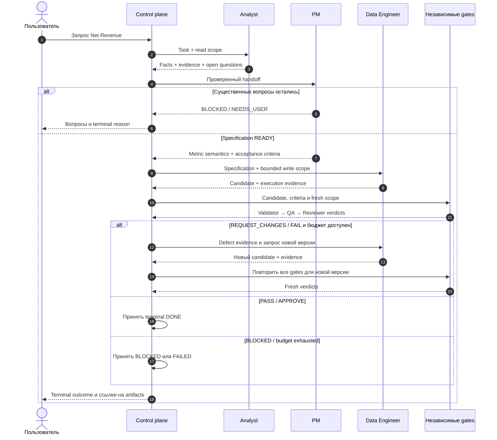

# 25 — Итоговый синтез: наш мультиагент как система

## Цель и предварительные знания

Предыдущие лекции по отдельности рассмотрели контракты, роли, workflow,
capabilities, quality gates, recovery, security, observability и evaluation.
Финальная core-лекция отвечает на другой вопрос: **почему их композиция
образует управляемую Agentic Data Platform, а не просто набор LLM-вызовов?**

Нам понадобятся formal specification из [лекции 13](LECTURE-0013-pm-specification.md),
граница candidate из [лекции 14](LECTURE-0014-data-engineer.md), причинный
анализ failures из [лекции 22](LECTURE-0022-failure-taxonomy.md) и rubric
оркестрации из [лекции 24](LECTURE-0024-orchestration-comparison.md). Здесь
эти понятия не определяются заново: мы проверяем связи между ними.

Цель — научиться читать архитектуру как цепочку ограниченных утверждений:
что системе известно, кто вправе принять решение, какой эффект разрешён,
какие evidence подтверждают outcome и чего из них заключать нельзя.

## Архитектура — это композиция обязательств

Название роли не создаёт гарантию. `QA Agent` не обеспечивает качество,
если он видит только резюме автора; `Reviewer` не независим, если использует
identity Data Engineer; `checkpoint` не делает внешний эффект exactly-once.
Свойство системы появляется только тогда, когда несколько обязательств
соединены без разрыва:

1. утверждение связано с наблюдением;
2. наблюдение принадлежит той же задаче и версии candidate;
3. переход принимает только допустимый тип артефакта и автора;
4. действие проходит permission и resource checks;
5. новый candidate заново проходит обязательные проверки;
6. terminal outcome имеет точный, не маркетинговый смысл.

Назовём это **architectural closure**: для каждого важного claim существует
непрерывный путь от источника evidence до code-owned решения, а на каждой
границе известны scope, identity и версия. Это аналитическая модель данной
лекции, не новый runtime-компонент.

## Четыре слоя платформы

Слои разделяют виды ответственности, а не обязательно процессы или сетевые
сервисы.

| Слой | Главный вопрос | Что ему принадлежит | Чего он не доказывает |
| --- | --- | --- | --- |
| Intent и evidence | Что известно и чего хочет пользователь? | Task, Analyst facts, provenance, open questions, PM readiness/specification | Что найденные данные истинны вне их evidence scope |
| Control и contracts | Какой переход допустим? | Typed artifacts, state/reducer, budgets, event chain, checkpoints/receipts | Что принятый артефакт предметно правильный |
| Execution и capabilities | Как получить наблюдение или candidate? | Role executors, harness, model provider, runner identity, MCP/policy, dbt/Airflow/ClickHouse boundary | Что разрешённое действие полезно или достаточно |
| Assurance и operations | Почему outcome можно принять и сопровождать? | Validator, QA, Reviewer, grader/evaluation, traces/metrics, recovery evidence | Production deployment или отсутствие неизвестных дефектов |

Identity, provenance, budgets и correlation проходят через все четыре слоя.
Если хранить их только в одном, соседний слой вынужден доверять тексту.
Например, policy проверяет identity вызова, reducer — автора артефакта,
telemetry — correlation, а evaluation — configuration fingerprint. Это
разные применения одной идеи связывания, не один взаимозаменяемый ID.

Anthropic на примере long-running coding harness описывает, как structured
progress artifacts и проверка состояния помогают следующей сессии не
угадывать прошлое и не объявлять задачу завершённой преждевременно. Мы
заимствуем принцип **оставлять проверяемое состояние между шагами**, но не
переносим их web-app harness или результаты на нашу платформу. В нашей
архитектуре эту функцию разделяют typed artifacts, event chain, receipts и
tests, а не один progress-файл.

## Сквозной путь Net Revenue

Как четыре слоя взаимодействуют на одной задаче?

Рисунок 1. Синтетическая проекция code-owned пути. Участник «Независимые
gates» сокращает три разные стадии — Validator, QA и Reviewer — и не сливает
их authority. Пунктирные стрелки обозначают возвращаемые artifacts/verdicts,
сплошные — запрос или принятое control-действие. Схема не изображает merge,
deploy и полностью live прогон, потому что они не доказаны.

Текстовый эквивалент: пользователь создаёт task; control plane выдаёт
Analyst ограниченный read scope. Analyst возвращает facts, provenance и
вопросы. PM принимает только проверенный handoff: при существенной
неопределённости завершает путь `NEEDS_USER`, иначе формирует specification.
DE получает specification и bounded write scope, затем возвращает candidate.
Validator, QA и Reviewer последовательно оценивают свежую версию. FAIL или
REQUEST_CHANGES возвращает defect evidence DE и инвалидирует старые
downstream verdicts. PASS/APPROVE ведёт к локальному `DONE`; отказ или
исчерпание бюджета — к `BLOCKED/FAILED`. Control plane возвращает outcome и
ссылки на артефакты, но не утверждает, что изменение развернуто.

## Walkthrough как цепочка claims

Рассмотрим не команды исполнения, а смысл каждой границы.

| Шаг | Новый ограниченный claim | Что его связывает | Корректная альтернатива успеху |
| --- | --- | --- | --- |
| Task intake | Этот запрос принадлежит конкретной задаче | `task_id`, artifact identity, original description | Отклонить malformed request |
| Analyst | Эти facts наблюдались разрешёнными reads | Evidence IDs, tool status, source scope | Сохранить assumption/open question |
| PM | Semantics достаточно определены для реализации | Matching handoff, grain/sources/criteria, readiness invariants | `BLOCKED/NEEDS_USER` |
| DE | Эта версия candidate реализует выбранный approach | Changed files, producer, tests/evidence, isolated scope | `BLOCKED` или `FAILED` |
| Validator | Детерминированные public gates этой версии прошли | Candidate identity и non-zero evidence | `REWORK` или `FAILED` |
| QA | Независимые probes не нашли принятого дефекта | Другая identity, checks/defects и fresh evidence | `REWORK` или `BLOCKED` |
| Reviewer | Criteria и quality допускают локальное принятие | Separation from author, assessments/findings | `REQUEST_CHANGES` или `BLOCKED` |
| Terminal reducer | Допустимая цепочка дошла до terminal state | Event chain, budgets, accepted artifact ledger | Честный `BLOCKED/FAILED` |

Каждая строка утверждает меньше, чем следующая. Analyst не принимает business
semantics; PM не подтверждает корректность SQL; public validator не заменяет
QA; Reviewer не означает production release. Именно ограниченность claims
позволяет найти владельца ошибки и не превращать уверенный текст одной роли
в сквозную гарантию.

## Evidence-bounded system claims

Утверждение о системе должно включать как минимум объект, configuration,
режим проверки, дату и предел вывода. Для нашей платформы полезна следующая
лестница.

| Статус | Что подтверждено | Локальный anchor | Чего утверждать нельзя |
| --- | --- | --- | --- |
| Code-enforced | Schemas/invariants артефактов, reducer transitions, deny-by-default tool checks | [`contracts/artifacts.py`](../../contracts/artifacts.py), [`orchestrator/transitions.py`](../../orchestrator/transitions.py), [`policies/tool_policy.py`](../../policies/tool_policy.py) | Что вся интеграция когда-либо исполнялась успешно |
| Offline-proven | Typed role routing, bounded rework, receipts/recovery и regression invariants на фиксированных cases | [STEP-0020](../../plan/evidence/STEP-0020-branching-rework-idempotency.md), [STEP-0024](../../plan/evidence/STEP-0024-phase-k-evaluation-benchmark.md) | Model quality на новых задачах или live platform readiness |
| Historical-live | Отдельный Analyst→PM run завершился ожидаемым `NEEDS_USER`; отдельный QA loop нашёл и исправил semantic defect | [STEP-0013](../../plan/evidence/STEP-0013-pm-specification-gate.md), [STEP-0010](../../plan/evidence/STEP-0010-qa-quality-loop.md) | Что эти результаты воспроизводятся сейчас или образуют один full six-role run |
| Not implemented / not proven | Model-directed manager, dynamic worker queue, autonomous merge/deploy, полностью live шестиролевой READY path | [ADR-0035](../../plan/decisions/ADR-0035-dual-orchestration-lecture-boundaries.md) и отсутствие execution evidence | Любое заявление о production автономности этих функций |

STEP-0020 относится к датированному graph v2; текущий
[`role_pipeline.py`](../../runtime/role_pipeline.py) называет граф v3 и
проверяется текущим offline suite. Это позволяет говорить о проверяемом
code-owned маршруте, но не превращает старое evidence в новый live run.

Даже полный repository gate подтверждает согласованный набор offline
assertions, а не такое же число независимых бизнес-задач. Аналогично,
исторический live PASS сохраняет значение как датированное наблюдение, но не
становится текущим SLO. Полную методику разграничения измерений задаёт
[лекция 21](LECTURE-0021-evaluation.md).

**Evidence-bounded system claim** — это формулировка, область которой не
шире подтверждающего evidence. Если evidence относится к graph v2, claim не
должен молча описывать все свойства текущего v3. Если live QA loop не включал
Reviewer, его PASS не доказывает reviewer gate. Это не редакторская
осторожность, а часть архитектурной корректности.

## Почему локальные PASS не складываются автоматически

Пусть contracts tests, dbt tests, policy tests и role workflow tests проходят
отдельно. Из этого ещё не следует end-to-end correctness. Между слоями может
быть несовпадение:

- specification и grader используют разные определения refund date;
- DE пишет допустимый файл, но Airflow запускает другой dbt selector;
- QA и hidden grader наследуют общий ошибочный fixture;
- receipt устойчив к process restart, но внешний trigger не поддерживает ту
  же operation identity;
- trace связывает spans, но потерялся provenance конкретного факта.

Это **composition gap**: каждое локальное свойство истинно в своей области,
но предпосылки соседних компонентов не совпали. Поэтому integration evidence
должно проверять не только компоненты, но и handoff assumptions. Исторический
STEP-0010 особенно показателен: QA обнаружил ранее неучтённое поведение
nullable `argMax`, а слишком широкое первое исправление остановил validator.
Это подтверждает ценность разных gates в той конфигурации, но не доказывает,
что их общий oracle свободен от всех blind spots.

## Cross-layer change impact

Архитектурное изменение определяется не количеством затронутых файлов, а
тем, какие claims и evidence оно инвалидирует.

| Изменение | Прямой слой | Какие соседние области пересмотреть | Почему прежний PASS может устареть |
| --- | --- | --- | --- |
| Новое определение Net Revenue | Intent/evidence | Specification, dbt grain, validator SQL, QA probes, grader cases | Все проверки могли подтверждать старую семантику |
| Новый artifact field или schema version | Control/contracts | Producers, consumers, checkpoint codec, receipt digest, telemetry | Старые snapshots/receipts могут означать другой contract |
| Новый MCP tool или аргумент | Execution/capabilities | Policy allowlist, identity, budgets, prompt/tool docs, adversarial tests | Разрешённая поверхность и threat paths изменились |
| Перестановка ролей или новая ветка | Control/contracts | Artifact ownership, invalidation, max iterations, trace topology, eval suite | Прежняя causal chain больше не соответствует маршруту |
| Замена модели или prompt | Execution | Structured capability probe, live evaluation, cost baseline, failure sample | Offline control tests не измеряют новое stochastic behavior |
| Обновление Airflow/dbt/ClickHouse | Execution/platform | Adapter contracts, selectors, SQL semantics, integration smoke, operations docs | API или фактическое выполнение может измениться без ошибки schema |
| Изменение grader/fixture | Assurance | Baseline fingerprint, historical comparability, mutation coverage | PASS может стать несопоставимым или разделить blind spot candidate |
| Новая identity/permission | Сквозная граница | Runner profile, MCP auth, filesystem/network scope, audit attributes | Authenticated субъект может получить иной разрешённый эффект |

Практический вывод: изменение считается завершённым не тогда, когда новый
компонент компилируется, а когда восстановлена architectural closure —
обновлены зависимые contracts, invalidated evidence заменено свежим и
remaining gaps названы явно.

## Прогресс, завершение и право записи

Anthropic подчёркивает incremental progress и явное состояние между
контекстными сессиями; Cognition — риск несовместимых неявных решений у
parallel writers и пользу дополнительных интеллектуальных contributors при
сериализованной записи. Вместе эти идеи дают полезное, но не универсальное
правило синтеза:

> Масштабировать можно число источников анализа, но прогресс должен сходиться
> в versioned artifacts, а связанное изменение иметь однозначного владельца.

В нашей code-owned архитектуре это выражается через один принятый snapshot
на границе роли, один текущий candidate и перенос старых gate results в
history при rework. Это локальный design rationale, а не доказательство того,
что всякая multi-agent система обязана иметь ровно одного writer. Выбор
оркестрации остаётся предметом [лекции 24](LECTURE-0024-orchestration-comparison.md).

## Контрпример: формально зелёная, но недоказанная платформа

Представим отчёт: contracts валидны, все offline tests зелёные, dashboard
показывает spans, а reviewer выдал `APPROVE`. Команда объявляет систему
production-ready. Но фактически Analyst→PM live run завершался
`NEEDS_USER`, полный шестиролевой READY path не запускался, merge/deploy не
реализован, а current model configuration не проходила fresh reliability
sample.

Каждый локальный факт может быть верен, но итоговый claim ложен из-за
расширения области вывода. Правильное заключение уже: «code-owned invariants
и offline path проверены; существуют отдельные датированные live slices;
full live READY и release integration остаются gaps». Такая формулировка не
уменьшает инженерный результат — она делает следующий эксперимент точным.

## Критерии целостной системы

Перед сильным архитектурным claim полезно проверить шесть вопросов:

1. **Semantic continuity:** одна ли metric definition проходит от task до
   grader и потребителя?
2. **Identity continuity:** можно ли связать producer, operation и
   permission decision без доверия к prompt?
3. **Version continuity:** относятся ли specification, candidate и verdicts
   к одной версии?
4. **Failure closure:** имеет ли каждый отказ bounded route к rework,
   `BLOCKED` или `FAILED`?
5. **Evidence continuity:** можно ли от terminal outcome пройти назад до
   конкретных наблюдений без raw secrets и private reasoning?
6. **Claim discipline:** совпадает ли формулировка результата с режимом,
   датой и configuration доказательства?

Ни один вопрос не заменяет остальные. Полная трасса без semantic continuity
подробно документирует неправильный результат; правильная SQL-модель без
identity continuity не объясняет, кто и с каким правом её изменил.

## Резюме

Agentic Data Platform состоит из четырёх взаимозависимых слоёв: intent и
evidence, control и contracts, execution и capabilities, assurance и
operations. Её основное свойство — не автономность модели, а непрерывная
связь ограниченных claims с identity, версией, policy и evidence.

Текущий репозиторий подтверждает code-enforced и offline свойства, а также
несколько отдельных historical-live slices. Он не подтверждает полностью
live шестиролевой READY path, dynamic manager или autonomous merge/deploy.
Изменение любого слоя требует пересмотра зависимых claims и повторной
проверки тех evidence, чьи предпосылки изменились.

## Вопросы для самопроверки

1. Почему набор успешных component tests не доказывает end-to-end
   architectural closure?
2. Какой слой владеет решением `NEEDS_USER` и какие другие слои обеспечивают
   его достоверность?
3. Почему новый field артефакта может потребовать обновления checkpoint,
   receipts, telemetry и evaluation?
4. Чем historical-live claim отличается от текущего SLO?
5. Как сформулировать результат платформы, не выдав локальный `DONE` за
   production deployment?

## Что дальше

Core-маршрут курса завершён. [Опциональная лекция 26](../extensions/module-26-deployment-theory/README.md)
рассмотрит deployment theory: Kubernetes, tenancy и operational boundaries.
Она не превращает описанную здесь локальную evidence base в production
certification.

## Источники

- Anthropic, [*Effective harnesses for long-running agents*](https://www.anthropic.com/engineering/effective-harnesses-for-long-running-agents), 2025. Использованы идеи incremental progress, durable progress artifacts и проверки состояния между сессиями; web-app experiment не перенесён как результат Data Platform. Проверено 2026-09-19.
- Cognition, [*Multi-Agents: What’s Actually Working*](https://cognition.com/blog/multi-agents-working), 2026. Использована идея дополнительных analytical contributors при single-threaded writes; product observations и численные claims не перенесены. Проверено 2026-09-19.
- Локальная evidence base: [contracts](../../contracts/artifacts.py), [reducer](../../orchestrator/transitions.py), [role pipeline](../../runtime/role_pipeline.py), [tool policy](../../policies/tool_policy.py), [telemetry](../../runtime/telemetry.py), [STEP-0010](../../plan/evidence/STEP-0010-qa-quality-loop.md), [STEP-0013](../../plan/evidence/STEP-0013-pm-specification-gate.md), [STEP-0020](../../plan/evidence/STEP-0020-branching-rework-idempotency.md), [STEP-0024](../../plan/evidence/STEP-0024-phase-k-evaluation-benchmark.md).
