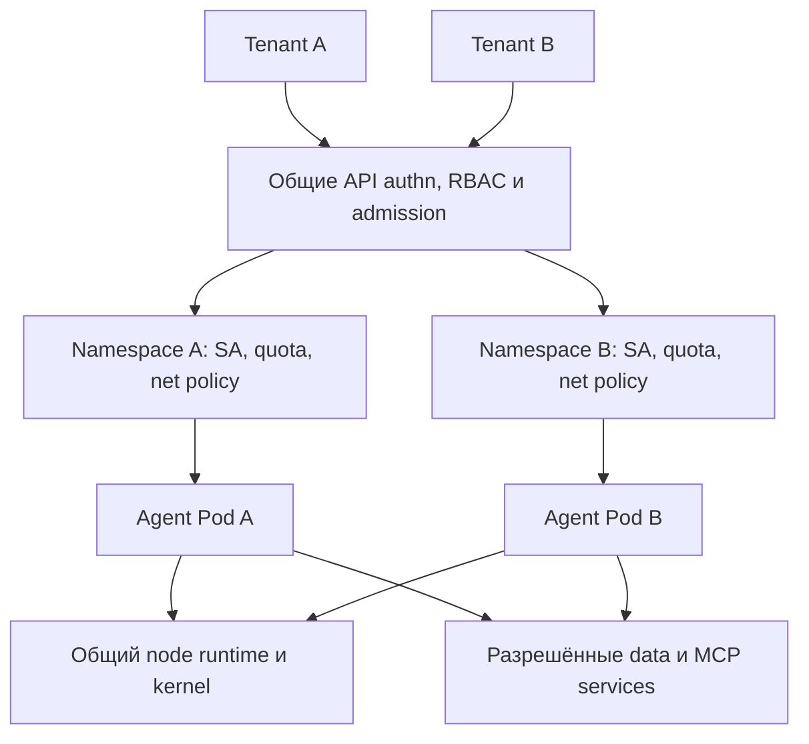

# 26 — Kubernetes, tenancy и границы развёртывания

## Цель и предварительные знания

В [лекции 08](LECTURE-0008-isolation.md) мы ограничили один role process, а
в [лекции 19](LECTURE-0019-security-authority.md) разделили identity,
authorization и approval. Теперь поднимемся на уровень deployment: **какие
части инфраструктуры могут совместно использовать разные команды или
клиенты и где должна проходить tenant boundary?**

Цель лекции — научиться выбирать между namespace-per-tenant в общем
Kubernetes cluster, отдельным virtual control plane и отдельным cluster,
исходя из модели угроз, blast radius, стоимости и операционной сложности.
Kubernetes здесь — предмет теории. В нашей Agentic Data Platform он не
реализован, поэтому мы не будем писать manifests или выдавать локальные
проверки Compose за cluster evidence.

## Сначала определить tenant, затем выбирать primitive

**Tenant** — субъект или группа workloads, между которыми разрешено
совместное использование некоторого состояния и полномочий, но от других
таких групп требуется изоляция. Tenant может быть внутренней командой,
внешним заказчиком, окружением или отдельным запуском агента. Это не синоним
namespace: namespace — один из механизмов Kubernetes, а tenant — понятие из
модели доверия.

До выбора topology нужно ответить как минимум на четыре вопроса:

1. Доверяют ли tenant’ы друг другу и кто управляет их workload-кодом?
2. Нужен ли tenant’у доступ только к namespaced API или к cluster-scoped
   объектам, admission и add-ons?
3. Какой общий отказ допустим: API server, node, kernel, сеть, storage,
   observability backend?
4. Какая цена отдельного lifecycle — upgrades, policy distribution,
   capacity reserve и incident response — приемлема?

При **soft multi-tenancy** tenant’ы принадлежат одной доверенной организации,
а основная цель — ownership, fairness и защита от ошибок. При **harder
multi-tenancy** workloads частично недоверены и компрометация одного tenant’а
не должна давать доступ к другому. Это шкала требований, а не сертификат:
отдельный cluster усиливает некоторые границы, но не доказывает абсолютную
изоляцию облачного account, storage backend или supply chain.

## Deployment substrate не заменяет orchestration policy

Kubernetes решает placement, lifecycle и часть resource/security policy для
workloads. Он не решает, вправе ли Reviewer принять артефакт, какой MCP tool
разрешён Analyst или достаточно ли evidence для `DONE`. Эти инварианты
остаются в contracts, reducer и policy gateway. Обратное тоже верно:
идеальный capability profile не мешает процессу исчерпать память node или
прочитать ошибочно смонтированный secret.

Полезно разделять две независимые оси:

- **application authority** — роли, artifacts, transitions, tool scope,
  approvals и budgets;
- **deployment containment** — API identity, namespace/control plane,
  network, storage, resources, runtime и kernel boundary.

Сильная система требует обеих. Перенос процесса в Pod меняет substrate, но
не превращает prompt в authorization и не исправляет неверный workflow.

## Три основные модели tenancy

Рабочая группа Kubernetes описала три распространённых варианта:
Namespaces as a Service, Clusters as a Service и Control Planes as a
Service. Актуальная документация формулирует два способа **делить один
cluster** — namespace-per-tenant или virtual control plane — и отдельно
оставляет dedicated clusters как более дорогую границу. Это taxonomy для
решения, а не лестница зрелости.

### Namespace-per-tenant в shared cluster

Каждый tenant получает один или несколько namespaces, но tenant’ы делят API
server, scheduler, cluster-scoped ресурсы и обычно worker nodes. Namespace
задаёт область имён и удобную точку привязки RBAC, quotas и policies, но сам
по себе не изолирует сеть, node или kernel. CRD, StorageClass и webhook —
примеры объектов, которые не укладываются в обычную namespaced boundary.

Поместить недоверенные tenant’ы в **один общий namespace** ещё слабее:
становятся сложнее least privilege, ownership, quotas и безопасные selectors.
Поэтому далее shared-cluster вариант означает namespace-per-tenant, а не
один namespace для всех.

Модель подходит доверенным внутренним командам и workloads с одинаковым
platform lifecycle, когда высокая плотность и простое взаимодействие важнее
административной автономии. Для недоверенного кода она требует defense in
depth и честного принятия shared-control-plane/shared-node риска.

### Virtual control plane per tenant

Tenant получает собственные API server, controller manager и state store,
а специальный слой согласует их с host или super-cluster. Это отделяет
cluster-scoped API и уменьшает blast radius ошибок admission, CRD или
control-plane policy. Tenant может видеть интерфейс отдельного cluster, хотя
физический data plane остаётся общим.

Критическое ограничение: virtual control plane не отделяет worker kernel,
network fabric и capacity автоматически. Актуальная документация Kubernetes
прямо требует решать data-plane isolation отдельно. Поэтому virtual cluster
полезен для административной автономии, но не равен VM boundary.

### Cluster per tenant

У каждого tenant свой Kubernetes control plane и набор cluster resources.
Так проще разрешить разные CRD, add-ons, upgrade cadence и cluster-admin
полномочия, а ошибка одной control-plane policy не меняет соседний cluster.
Если worker nodes или VM также раздельны, уменьшается node-level blast
radius.

Цена — больше control planes, capacity fragmentation, upgrades, inventory,
telemetry pipelines и recovery procedures. Кроме того, два cluster могут
по-прежнему делить cloud account, IAM root, registry, KMS или storage. Поэтому
`cluster per tenant` — более сильная Kubernetes boundary, но не конец threat
model.

| Модель | Что делится | Сильная сторона | Главный остаточный риск | Цена |
| --- | --- | --- | --- | --- |
| Один namespace для нескольких tenant’ов | API scope, control plane, nodes | Минимальный overhead | Слабое ownership/policy разделение | Низкая, но риск быстро растёт |
| Namespace-per-tenant | Control plane, cluster-scoped objects, обычно nodes | Плотность и простая platform governance | Misconfiguration и shared node/kernel | Низкая–средняя |
| Virtual control plane per tenant | Обычно worker data plane | API autonomy и isolation cluster-scoped state | Shared nodes, network и capacity | Средняя–высокая |
| Cluster per tenant | Возможно только fleet services/cloud substrate | Отдельный control plane и lifecycle | Общие cloud/IAM/storage dependencies | Высокая |

Таблица не ранжирует варианты универсально. Для trusted engineering teams
dedicated cluster может быть неоправдан; для внешних недоверенных workloads
namespace-only может не удовлетворять модели угроз.

## Изоляция — композиция разных enforcement layers

Нельзя проверить tenancy одним вопросом «есть ли namespace?». Требуется
последовательно пройти несколько слоёв.

### Identity и API authorization

Kubernetes **ServiceAccount** даёт workload отдельную non-human identity в
пределах namespace. Сам ServiceAccount не определяет право читать Secret или
создавать Job: минимальные API permissions задаются Role/ClusterRole и
bindings. Identity Pod также не заменяет identity конечного пользователя,
MCP credential или approval record. Автоматически смонтированный чрезмерно
широкий token превращает компрометацию workload в API capability.

### Admission и workload shape

Authorization отвечает, можно ли отправить API request; admission проверяет,
какой объект допустимо создать. Для недоверенного agent runner важны запрет
privileged режима и host namespaces/mounts, запуск без root, отсутствие
privilege escalation, read-only filesystem там, где возможно, и сокращённые
Linux capabilities. Эти настройки ограничивают форму workload, но не
проверяют бизнес-смысл выполняемого кода.

**seccomp** фильтрует доступные syscalls. `RuntimeDefault` использует профиль
container runtime и должен быть явно или централизованно обеспечен в
соответствующей конфигурации. Сужение syscall surface уменьшает возможности
процесса после компрометации, но не создаёт отдельный kernel: обычные
containers на одном node используют общий kernel. При более строгой модели
угроз нужны sandboxed runtime, VM или отдельные nodes, а не только seccomp.

### Network и egress

NetworkPolicy выражает разрешённые L3/L4 connections для выбранных Pods.
По умолчанию Pod не изолирован по ingress и egress, пока применимая policy не
включит соответствующее направление. Более того, объект NetworkPolicy не
имеет эффекта без network plugin, который умеет его применять. Следовательно,
наличие YAML и фактическое enforcement — разные claims.

Default-deny с узкими allow rules полезен для межtenantного трафика и egress
к data/MCP endpoints. Но NetworkPolicy не выдаёт application identity, не
проверяет SQL scope и не решает все L7, TLS, DNS или host-network сценарии.
Для разрешённого endpoint всё равно нужны scoped credentials и server-side
authorization.

### Storage и secrets

Namespaced Secret или PersistentVolumeClaim удобен как объект управления,
но его backing store и ключи могут быть общими. Изоляция требует проверить,
какие volumes можно монтировать, кто создаёт StorageClass/PersistentVolume,
как шифруются данные, где живёт KMS authority и может ли tenant запросить
host path. Скрытый от Pod secret безопаснее лишь при условии, что его значение
не приходит через разрешённый tool или общий log.

### Capacity, fairness и cgroups

У deployment resource governance три разных механизма:

- **request** сообщает scheduler требуемую capacity и влияет на placement;
- **limit** передаётся runtime и на Linux применяется kernel cgroups: CPU
  throttling и memory enforcement имеют разную динамику;
- **ResourceQuota** ограничивает aggregate consumption и количество объектов
  в namespace, а LimitRange может задавать defaults и допустимые диапазоны.

Quota без requests/limits не образует полный per-workload envelope; limit без
namespace quota не мешает tenant’у создать много допустимых Pods. Оба слоя
снижают noisy-neighbor и exhaustion risk, но не обеспечивают
confidentiality. Также они не заменяют application budgets из
[лекции 23](LECTURE-0023-cost-performance.md): token/tool/rework budget и CPU
quota измеряют разные ресурсы и должны сходиться в общей policy.

## Диаграмма: где заканчивается namespace boundary

Как один API gate приводит к двум workloads и где они снова встречаются на
общей инфраструктуре?

Рисунок 1. Синтетическая схема namespace-per-tenant. Стрелки обозначают
API placement или разрешённый data path, но не доверие. Namespace A и B
разделяют API scope и политики; общий node подчёркивает сохранённый kernel
risk. Внешний endpoint остаётся собственной security boundary.

Текстовый эквивалент: tenant A и B проходят общий API authentication,
authorization и admission. Их workloads попадают в разные namespaces с
разными ServiceAccounts, quotas и NetworkPolicies. Pods могут оказаться на
общем runtime/kernel. Разрешённый egress ведёт к data/MCP services, которые
повторно проверяют собственную identity и operation scope. Поэтому ни
namespace, ни NetworkPolicy не дают сквозного полномочия.

## Контрпример: «два namespace — значит два sandbox»

Предположим, Analyst и Data Engineer разнесены по namespaces. У каждого свой
ServiceAccount и ResourceQuota, а в Git лежит default-deny NetworkPolicy.
Команда объявляет tenant isolation завершённой.

Утверждение ложно, если network plugin не применяет NetworkPolicy; RBAC
binding даёт DE cluster-wide чтение Secrets; admission разрешает `hostPath`
или privileged Pod; оба workload работают на общем node без подходящей
runtime boundary; внешний MCP server доверяет лишь адресу namespace, а не
scoped credential. Quota при этом может честно ограничивать CPU и число Pods,
но не исправит ни один из перечисленных authority paths.

Этот пример показывает принцип: **конфигурационный объект доказывает только
намерение, пока не подтверждены enforcement point и наблюдаемое отрицание**.
Для tenancy нужны не только positive tests «Pod запустился», но и negative
tests: запрещённый API call, cross-namespace connection, mount, egress и
resource overrun действительно дают заявленный bounded outcome в выбранной
конфигурации.

## Как наш локальный baseline отображается на Kubernetes

Текущая платформа следует [ADR-0001](../../plan/decisions/ADR-0001-hybrid-runtime.md):
Python control plane работает в host `.venv`, Data Platform — в Docker
Compose. По [ADR-0031](../../plan/decisions/ADR-0031-bubblewrap-runners-and-local-mcp-auth.md)
пять role runners получают разные logical identities и namespace UIDs,
ограниченные mounts, отдельное network namespace без настроенного egress,
resource limits и
request-bound local MCP authentication. [STEP-0022](../../plan/evidence/STEP-0022-runner-and-mcp-isolation.md)
зафиксировал offline tests этих свойств. Это evidence локального launcher,
не Kubernetes deployment.

| Локальный механизм | Возможная Kubernetes проекция | Почему это не эквивалентность |
| --- | --- | --- |
| Runner/actor ID и namespace UID | ServiceAccount, labels и workload identity | ServiceAccount относится к cluster API; actor/task binding всё ещё нужен приложению |
| Explicit read/write mounts | Volumes, security context и admission policy | Ошибочный volume или privileged workload меняет boundary |
| Bubblewrap network namespace без raw egress | Default-deny NetworkPolicy и узкие egress rules | Нужны CNI enforcement, DNS/L7 design и server-side authorization |
| RLIMIT для одного процесса | Requests, limits и cgroups | Семантика и lifecycle различаются; namespace fairness требует quota |
| Request-bound MCP bearer и capability profile | Workload credential плюс MCP policy gate | Kubernetes RBAC не понимает tool, SQL, DAG или artifact semantics |
| Docker Compose platform на loopback | Stateful platform services в выбранной topology | Stateful tenancy, storage, backup и credentials потребуют отдельного design |

Проекция полезна как checklist миграции, но не как доказательство готовности.
В repository нет Kubernetes manifests, Helm chart, cluster integration tests
или evidence NetworkPolicy/RBAC/seccomp enforcement. Следовательно, статус
Kubernetes-варианта — **`not-implemented`**. Более того, текущий Bubblewrap
launcher и обычный container используют host kernel. Простой перенос каждой
роли в Pod поэтому не усиливает kernel boundary автоматически, а mount,
network и resource restrictions нужно воспроизвести и проверить заново.
Отдельный kernel требует sandboxed runtime, VM или соответствующего node
design.

## Как выбрать boundary без магического ответа

Решение удобно строить от самого сильного unacceptable failure:

1. Если tenant не должен управлять cluster-scoped API, workloads доверены, а
   общий control plane и node приемлемы, начните с namespace-per-tenant и
   полного набора policies.
2. Если нужна cluster-like API autonomy и независимые CRD/admission, но
   shared worker risk приемлем и data plane отдельно защищён, рассмотрите
   virtual control plane.
3. Если control-plane compromise, lifecycle coupling или shared-node blast
   radius неприемлемы, двигайте boundary к dedicated cluster, nodes или VM.
4. Независимо от topology сохраняйте application contracts, scoped tool
   authorization, evidence, quotas, observability и recovery. Deployment
   boundary ограничивает последствия, но не определяет правильный outcome.

На практике fleet может сочетать модели: общий cluster для доверенных
development teams, virtual control planes для платформенных потребителей и
dedicated clusters для регулируемых или недоверенных workloads. Это не
непоследовательность, если критерии выбора и residual risks явны.

## Итог и вопросы для самопроверки

Tenant определяется моделью доверия, а не наличием namespace. Namespace,
ServiceAccount/RBAC, admission, NetworkPolicy, storage controls,
requests/limits/quotas, seccomp и kernel boundary закрывают разные угрозы.
Virtual control plane усиливает API isolation, но не отделяет общий data
plane; dedicated cluster усиливает lifecycle и control-plane boundary ценой
операционного overhead. Kubernetes не заменяет contracts и tool policy
агентной системы, а наша локальная реализация не является Kubernetes
evidence.

1. Почему ServiceAccount без RBAC и operation-level policy не задаёт полное
   полномочие агента?
2. Как virtual control plane может изолировать CRD и одновременно оставить
   cross-tenant kernel risk?
3. Почему ResourceQuota, container limit и application budget нельзя считать
   взаимозаменяемыми?
4. Какие проверки нужны, чтобы NetworkPolicy была evidence, а не только YAML?
5. При каких предпосылках cluster-per-tenant оправдывает дополнительный
   lifecycle overhead?

Эта опциональная лекция завершает deployment extension. Следующий шаг уже не
новая тема syllabus, а применение общей архитектурной рамки: сначала threat
model и system claims, затем выбор topology и проверяемых enforcement points.

## Источники и границы переноса

- [Kubernetes: Multi-tenancy](https://kubernetes.io/docs/concepts/security/multi-tenancy/) —
  control/data plane, namespace-per-tenant и virtual control plane; проверено
  2026-09-19. Документация задаёт mechanics/trade-offs, но не выбирает модель
  угроз за владельца платформы.
- [Kubernetes WG: Three Tenancy Models For Kubernetes](https://kubernetes.io/blog/2021/04/15/three-tenancy-models-for-kubernetes/) —
  taxonomy namespace, cluster и control-plane models; статья 2021 года
  сверена с актуальной документацией 2026-09-19, устаревающие project details
  не используются.
- [Kubernetes: Service Accounts](https://kubernetes.io/docs/concepts/security/service-accounts/) —
  workload identity и отдельная роль RBAC; проверено 2026-09-19.
- [Kubernetes: Network Policies](https://kubernetes.io/docs/concepts/services-networking/network-policies/) —
  направления isolation, default behavior и зависимость от enforcement
  plugin; проверено 2026-09-19.
- [Kubernetes: Resource Quotas](https://kubernetes.io/docs/concepts/policy/resource-quotas/)
  и [Resource Management](https://kubernetes.io/docs/concepts/configuration/manage-resources-containers/) —
  aggregate namespace constraints, requests/limits и cgroups; проверено
  2026-09-19.
- [Kubernetes: Restrict a Container's Syscalls with seccomp](https://kubernetes.io/docs/tutorials/security/seccomp/) —
  `RuntimeDefault` и syscall filtering; проверено 2026-09-19. Tutorial не
  доказывает hard isolation конкретного cluster.
- [Kubernetes: Linux kernel security constraints](https://kubernetes.io/docs/concepts/security/linux-kernel-security-constraints/) —
  scope seccomp, privileged-container caveats и рекомендация sandbox для
  более сильной изоляции; проверено 2026-09-19.
- [Anthropic: Beyond permission prompts](https://www.anthropic.com/engineering/claude-code-sandboxing) —
  совместная filesystem/network containment как общий design principle;
  проверено 2026-09-19. Product claims и измерения Claude Code на нашу
  платформу не переносятся.
- [Наш launcher](../../runtime/runner_isolation.py),
  [ADR-0031](../../plan/decisions/ADR-0031-bubblewrap-runners-and-local-mcp-auth.md)
  и [STEP-0022](../../plan/evidence/STEP-0022-runner-and-mcp-isolation.md) —
  граница offline claims о host runner. Они не подтверждают Kubernetes,
  production hardening или устойчивость к kernel escape.
