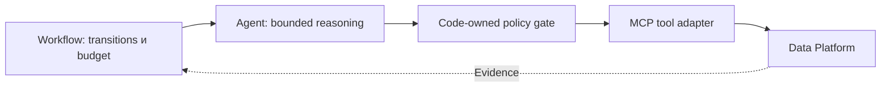
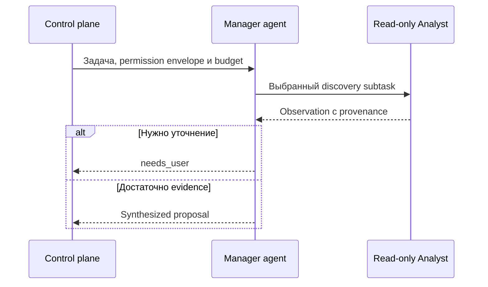

# Прототип: схемы multi-agent системы

Это проверочная страница сборщика, не лекция и не лабораторное задание.
Схемы показывают выбранные модели взаимодействия, а не полностью live execution result.
[Полный tool loop](../technical-requirements.md#диаграмма-bounded-tool-loop).

## Архитектура и границы полномочий

Как отделить reasoning от authority? Переходы и разрешения принадлежат control plane,
модель работает только внутри стадии, tool adapter связывает запрос с Data Platform.

Рисунок: сплошные стрелки — разрешённый маршрут запроса, пунктир — возвращаемое evidence.
Текстовый эквивалент: workflow → agent → policy → tool adapter → platform; evidence принимает
control plane. Prompt не расширяет permissions. Это обзор; runner/process детали опущены.

## QA FAIL и повторная проверка

Какие переходы допустимы после дефекта? Исправление не наследует старый validator PASS.

```mermaid
stateDiagram-v2
    accTitle: Ограниченный цикл quality gates
    accDescr: QA FAIL ведёт в DE rework, затем обязательны новый Validator и QA; exhaustion заканчивается BLOCKED.
    [*] --> DE
    DE --> Validator: candidate
    Validator --> QA: PASS
    Validator --> DE: FAIL
    QA --> DE: rework
    QA --> Reviewer: QA PASS
    Reviewer --> DONE: approved
    DE --> BLOCKED: exhausted
    DONE --> [*]
    BLOCKED --> [*]
```

Рисунок: упрощённый quality lifecycle; стрелки — code-owned переходы, а не свободная delegation.
Текстовый эквивалент: candidate → Validator → QA → Reviewer; принятому дефекту соответствует
DE rework с новым Validator/QA, исчерпание repair budget приводит в BLOCKED.
Стрелки FAIL/rework разрешены только при доступном repair budget; exhausted обозначает его исчерпание.
Reviewer rework и все error branches опущены: это не полная state machine нашей реализации.

## Агент-оркестратор: теоретическая альтернатива

Кто выбирает следующую подзадачу? Здесь manager определяет delegation после observation,
но внешний policy и budget остаются code-owned. Такой manager у нас не реализован.

Рисунок: сплошные стрелки — bounded запросы, пунктир — observations/proposals.
Текстовый эквивалент: внешняя policy ограничивает manager, он выбирает чтение, после результата
возвращает proposal или needs_user. Схема гипотетическая, не execution evidence.

## Что проверяет этот прототип

Несколько SVG на странице, русские labels, sequence/flow/state, independent figure IDs,
static image без JavaScript и shared viewer. Источники: авторская модель нашего control plane
и явно гипотетический manager; подробная теория останется в отдельных лекциях.
