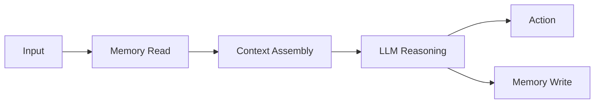

# Technical Markdown Lectures

## Purpose

Use this skill to turn a lesson plan into a complete technical Markdown lecture. Prefer clear conceptual explanation, system-design framing, diagrams, terminology, examples, and concise summaries over low-level implementation detail.

## Lecture Workflow

1. Read the source lesson plan and any adjacent course files that define scope, sequence, or style.
2. Preserve the lesson's title, module number, and intended learning outcome.
3. Expand the plan into a coherent lecture, not a loose list of bullets.
4. Keep the depth appropriate for a "101" technical guide unless the user asks for implementation.
5. Add at least one structural visual explanation when useful: Mermaid diagram, ASCII diagram, table, or layered architecture map.
6. End with a short summary and 3-5 self-check questions.
7. Update related todo files when the user asks to track progress.

## Recommended Lecture Structure

Use this structure unless the existing file or user request implies a better one:

```markdown
# Урок X.Y. Название

## Зачем это нужно
## Основная идея
## Ключевые термины
## Как это устроено
## Схема
## Пример
## Типичные ошибки
## Краткое резюме
## Вопросы для самопроверки
## Что дальше
```

## Writing Style

- Write primarily in Russian for Russian course materials.
- Keep technical English terms where they are standard: `retrieval`, `context window`, `memory layer`, `RAG`, `reranking`.
- Use professional, direct, technical prose.
- Prefer short paragraphs and meaningful headings.
- Explain concepts horizontally and broadly before going deep.
- Avoid marketing language, vague enthusiasm, and filler.
- Avoid unnecessary code unless the user explicitly asks for implementation.
- Do not expose hidden chain-of-thought; summarize reasoning as concise design rationale.

## Diagrams And Tables

Prefer Mermaid for flows, lifecycles, state transitions, and system architecture:



Use ASCII diagrams when they are easier to read in plain Markdown. Use tables for comparisons, trade-offs, taxonomies, and failure modes.

## Quality Checklist

Before finishing a lecture, verify:

- The lesson answers "what it is", "why it matters", and "how it fits the system".
- Terms are defined before being used heavily.
- Diagrams match the text.
- Examples are concrete and relevant to AI agents.
- The lecture does not duplicate large sections from neighboring lessons.
- The ending gives a clean transition to the next lesson.
