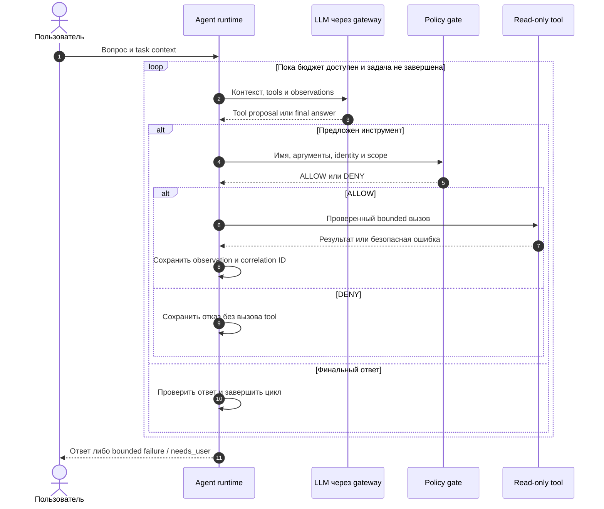

# Технические требования к лекциям

Status: requirements accepted; publication gate implemented in STEP-0030; per-lecture verification required

Updated: 2026-09-15

Применяются ко всем лекциям. Источники — Markdown; публикация — статический HTML.
Решение: [ADR-0036](../plan/decisions/ADR-0036-markdown-diagrams-static-svg.md).
Это требования к авторству и будущему сборщику, не лабораторная инструкция.

## Файлы и Markdown-профиль

- Тексты: `course/lectures/LECTURE-NNNN-<topic>.md`; планы: `plan/steps/lections/`.
- UTF-8, LF, завершающий newline. Русская проза; стандартные английские термины определяются
  при первом использовании и согласуются с будущим glossary.
- База: CommonMark с согласованными GFM tables и fenced code blocks. Mermaid — расширение
  сборки, не встроенная возможность Markdown. Parser/версии закрепить при реализации.
- Один `#`, последовательные `##`/`###`, без пропуска уровней. Пустые строки вокруг заголовков,
  списков, таблиц и code blocks. Каждый code block имеет язык: `python`, `sql`, `json`, `text`, `mermaid`.
- Без MDX/JSX, inline scripts/styles, iframe, raw SVG и theme-specific shortcodes в лекциях.
  Выноски — переносимые blockquotes с текстовой меткой.
- `course/manifest.json` — canonical ID/title/path/order/prerequisites/outcomes/status;
  не дублировать изменяемые статусы в YAML. Planning map — `plan/steps/lections/lecture-map.json`;
  checker контролирует topic/order drift между картами.
- Ссылки относительные и с понятными labels; ссылка на рисунок ведёт к его заголовку,
  а не к нестабильному generated SVG ID.

## Содержательный контракт

Лекция содержит цель, prerequisites, определения, модель, причинное объяснение, условия
применимости, ограничения/контрпример, пример, резюме, 3–5 концептуальных вопросов и источники.
Глубина — глубокая теория, не обзор «101». Нет labs, student setup или обязательных запусков.
Повторное объяснение заменять ссылкой на primary owner из [карты](../plan/steps/lections/README.md).

Планировать хотя бы одну содержательную схему/диаграмму на лекцию; исключение обосновать в review.
Не задавать искусственную норму слов/картинок. Пример нашей системы подписывать
`offline-proven`, `historical-live` или `not-implemented`, с code/evidence provenance.

## Диаграммы в Markdown

Canonical source — fenced block `mermaid` прямо в лекции. SVG — производный build artifact,
не второй редактируемый источник. Выбор формата:

| Вопрос | Формат | Пример |
| --- | --- | --- |
| Кто кому что передаёт и в каком порядке | `sequenceDiagram` | Tool loop, delegation, approval |
| Как связаны компоненты/ветки | `flowchart LR` / `flowchart TD` | MCP, control plane, rework |
| Какие состояния и переходы допустимы | `stateDiagram-v2` | BLOCKED, checkpoint recovery |
| Как различаются свойства | Markdown table | Workflow vs agent-orchestrator |

Sequence diagrams поддерживают participants, сообщения, ветви и циклы:
[синтаксис Mermaid](https://mermaid.js.org/syntax/sequenceDiagram.html).
Другие типы — после проверки pinned renderer. ASCII допускается для простой схемы с обоснованием.

Для каждого рисунка:

- Перед ним сформулировать вопрос; дать уникальный заголовок, подпись и содержательный вывод.
- Имена согласованы с прозой. Стрелки обозначают запрос/proposal/artifact/evidence/verdict;
  data flow не смешивается с authority. Пунктир, цвета и trust boundaries имеют легенду.
- Латинские локальные IDs, короткие русские labels. Ориентир: до 6 участников sequence
  или 12 основных узлов flowchart; превышение требует визуальной проверки, обычно делить схему.
- `accTitle` и `accDescr` обязательны, как и текстовый эквивалент существенных шагов рядом:
  [доступность Mermaid](https://mermaid.js.org/config/accessibility.html).
- Цвет не единственный носитель смысла. Кириллица, light/dark palette и контраст проверяются.
- Запрещены `click`, HTML labels, init directives и внешние картинки. Конфигурация/стиль — общие.
- LLM предлагает действие, runtime проверяет и выполняет. Обозначать denial/failure/budget,
  если они существенны. Не изображать private chain-of-thought.

## Пример полного цикла взаимодействия

На [странице DataTalks](https://datatalks.ru/ai-agents/modules/02-agent-core/tool-calling/how-llm-calls-functions.html)
диаграмма сделана вручную через SVG с zoom/pan/fullscreen. Ниже — собственный provider-neutral
Markdown-пример. Это не копия чужой графики и не точная схема нашего runner/MCP.
Render этого примера проверен в STEP-0026; это не проверка всех будущих лекций.

### Диаграмма: bounded tool loop



Рисунок: последовательный упрощённый agent loop; сплошные стрелки — запросы,
пунктирные — возврат результатов. Parallel calls и transport-specific message roles опущены.

Текстовый эквивалент: runtime отправляет контекст → получает предложение → проверяет кодом →
выполняет разрешённый tool → сохраняет observation → делает следующий ход. DENY не вызывает
tool; final answer завершает цикл после проверки; исчерпание бюджета даёт bounded outcome.
Correlation ID связывает предложение с наблюдением. Точные поля проверяются для конкретного API.

## Контракт static HTML сборки

```text
Markdown + manifest + diagram config
  → metadata/link checks → Mermaid blocks → validated SVG + diagram index
  → staged Markdown/assets → static generator → HTML/CSS/local JS
  → render/accessibility/link checks
```

- Основной путь — build-time SVG, не browser-time Mermaid. CLI умеет превращать Mermaid blocks
  в SVG и ссылки в Markdown: [официальный Mermaid CLI](https://github.com/mermaid-js/mermaid-cli).
  Нужен repository adapter для stable figure IDs, подписей и metadata; extraction — Markdown AST.
- Generator выбирается при scaffold implementation. Требования не привязаны к MkDocs/Hugo;
  parser, URL mapping, SVG и CSP сначала проверить prototype, затем закрепить версии.
- Исходные `.md` не перезаписываются. Staged Markdown/assets/HTML — в отдельном ignored build
  directory. Figure key: lecture ID + номер блока; input/config hash — в generated diagram index.
- Pin generator, Mermaid CLI/library, Node/Chromium, fonts/extensions через lockfiles/image digest.
  Нормализовать нестабильные SVG IDs/metadata. Заявлять воспроизводимость только после двух сборок.
- Публикация без backend/CDN. Базовые тексты, навигация и SVG доступны при выключенном JS.
- `.md` links преобразуются в HTML URLs с сохранением anchors. Code/evidence links отображаются
  через repository browser URL или опубликованный evidence index; весь checkout/`plan/` не
  копируется в public output автоматически. Секреты/private artifacts исключаются.
- Central `securityLevel: strict`: [официальная конфигурация](https://mermaid.js.org/config/schema-docs/config.html).
  Дополнительно валидировать SVG: без scripts, event handlers, external refs и foreignObject;
  текстовые labels проверить на pinned toolchain. Strict сам по себе не является sanitizer.
- Embedded SVG IDs и references префиксуются figure key; sanitizer сохраняет markers/title/desc/
  ARIA. Проверить final CSP: не разрешать `unsafe-inline` молча ради рисунков.

## Просмотр диаграмм в HTML

Общий компонент сайта оборачивает validated SVG в `figure`/`figcaption`; не вставлять UI-код
в каждую лекцию. Для pan/zoom нужен embedded SVG; ссылка на отдельный SVG остаётся no-JS fallback.
Кнопки масштаба и fullscreen — возможности HTML-компонента, не самого Markdown/Mermaid.

- Увеличение/уменьшение, fit/reset, fullscreen с fallback на расширенную область.
- Wheel zoom — после явной активации, без перехвата обычной прокрутки страницы.
- Drag/touch pan, клавиатурная альтернатива, понятные labels/focus и bounded scale.
  Escape закрывает fullscreen, focus возвращается к инициатору.
- Проверять 360 px/mobile и desktop. Допустим локальный horizontal scroll большой схемы,
  не всей страницы. Zoom не оправдывает мелкие/наложенные labels.
- Локальные шрифты с кириллицей, light/dark, смысл без цвета. Print показывает полную схему
  без controls/clipping. Анимация не обязательна; reduced motion учитывается.
- Сбой JS enhancement не скрывает базовую схему/подпись.

## Проверка и публикационный gate

Заимствованные идеи — собственными словами с attribution рядом с claim; источники включают
название, автора/организацию, URL и дату проверки. Измерения/версии имеют дату. Схема не доказывает
runtime behavior. Не копировать чужой SVG, полный текст статьи или JS сайта-примера.

После каждой лекции обязательны полная редакторская вычитка, technical verification и recheck.
Review receipt связывается с hash Markdown/assets, diagram config и toolchain fingerprint;
изменение влияющих inputs делает соответствующую проверку stale.

- [ ] Markdown lint, metadata, prerequisites, links/anchors и contained paths проходят.
- [ ] Все Mermaid blocks парсятся/рендерятся pinned CLI; ошибка останавливает build.
- [ ] Нет secrets/private artifacts в output; SVG проходит allowlist validation.
- [ ] Каждый рисунок визуально проверен: labels/стрелки/ветки соответствуют тексту,
  кириллица читаема, нет clipping/overlap.
- [ ] Проверены mobile/desktop, light/dark, no-JS, keyboard, print и screen-reader доступность.
  Несколько рисунков на странице не конфликтуют IDs/handlers.
- [ ] Final URL/subpath/CSP работают без обязательных внешних запросов.
- [ ] Нет unresolved существенных findings; review актуален для публикуемой версии.

`make course-check` реализован как offline gate; `make course-build` рендерит ограниченный
STEP-0026 prototype, включая приведённый tool loop. Публикационный gate всех лекций остаётся отдельным.
Build/lint не заменяет вычитку, фактчекинг и визуальную проверку.

STEP-0030 / ADR-0039: основной reader выбирает полный текст только при `reviewed`
и актуальных content/publication receipts. Кандидат собирается отдельной командой
`uv run python -m course.build --candidate 0 --output build/course-review-0000`.
Publication digest включает builder/templates/CSS/JS/lockfiles и content review.
Изменение этих inputs требует повторной browser/visual проверки.

Автоматическая проверка screen-reader разметки включает AX tree, accessible
names/descriptions, landmarks и текстовые альтернативы при выключенном JS.
Она не подменяет реальную AT-навигацию:
[Chrome accessibility reference](https://developer.chrome.com/docs/devtools/accessibility/reference).
Фактическое взаимодействие с Orca/NVDA/VoiceOver записывается отдельно, без fake PASS;
непроверенная interoperability остаётся явно указанным deployment risk.
